# mprpc项目

> 分布式 网络通信  框架
>
>
> 基于muduo+protobuf
>
> 业界优秀的RPC框架：**baidu的brpc(大,牛)，google的grpc(小)**

## **项目概述**：

本课程将使用 C/C++ 编写**分布式**网络通信框架项目，重点讲解从单机服务器到集群服务器，再到项目模块化分解与分布式部署的过程。

## 深入学习到什么

希望 可以 对 **单机----集群-----分布式**  有更好的理解

## **前置学习建议**：

学习本项目前，建议先完成 C/C++ 项目集群的网络聊天通信项目，以便更好地理解服务器集群概念及其优势，为学习分布式知识打下基础。

技术选型

- **网络库**：采用 **muduo** 高性能网络库（底层基于 I/O 线程池模型） 。
- **序列化 / 反序列化**：使用 **protobuf** 处理数据序列化和反序列化，以及远程调用方法的识别、参数处理。
- **命名**：基于 muduo 库和 protobuf 首字母，将项目命名为 mprpc。

## 核心内容

- 讲解集群与分布式的概念及原理。
- 剖析 rpc 远程过程调用的原理与实现。
- 阐述服务注册中心（如 ZooKeeper）在分布式环境中的作用。

## 其他技术与工具

- 涉及 C++11 和 C++14 的新语法（如线程级别的本地变量、绑定器与函数对象等）。
- 使用 VS Code 进行跨平台开发，在 Linux 环境下远程开发项目。
- 介绍 muduo 库网络编程、conf 配置文件读取、cmake 构建集成编译环境及 GitHub 项目托管。

## **项目特点与要求**：

项目代码量虽比集群聊天项目少，但对技术栈的理解深度和广度要求更高，更注重对集群和分布式的理解 。

## **环境准备**：

开发前需掌握 Linux 环境下 muduo 网络库（依赖 boost 库）的安装，相关安装步骤可参考博主博客，且 muduo 库网络编程示例、cmake 构建编译环境在集群聊天服务器项目中已详细讲解。

# 技术栈

1. **集群和分布式**概念以及原理
2. **RPC远程过程调用**原理以及实现
3. **Protobuf**数据序列化和反序列化协议
4. **ZooKeeper分布式**一致性协调服务应用以及编程
5. muduo网络库编程
6. **conf**配置文件读取
7. 异步日志
8. CMake构建项目集成编译环境
9. github管理项目

> 代码没有集群多, 但是 知识更深入


# 集群和分布式理论

## 单机聊天服务器案例分析

**服务器模块与业务**：以单机聊天服务器为例，其包含用户管理、好友管理、群组管理、消息管理和后台管理五个模块。每个模块对应多项特定业务，如用户管理包括登录、注册、注销；好友管理涉及添加、删除好友等，这些业务由一个或多个相关函数实现。

**性能与设计瓶颈**:

- **硬件资源限制**：**单机服务器受硬件资源**制约，例如 32 位 Linux 系统的聊天服务器，进程资源耗尽时，最**多仅能支持约两万用户同时在线**，难以承载更多客户端连接与服务。
- **运维与代码编译成本高**：由于模块都在同一项目运行单元，任意模块的修改（哪怕只是一行代码），都需重新编译整个项目代码（耗时约 2 小时），并重新部署（耗时约 3 小时），成本巨大。
- **硬件资源分配不合理**：不同模块对硬件资源需求不同，存在 CPU 密集型和 IO 密集型模块。但单机服务器只能采用平衡方案部署，无法**针对各模块需求进行硬件资源的精准匹配。**

## 集群聊天服务器分析

**性能提升**：通过水平扩展硬件资源，增加服务器数量（如三台或更多），每台独立运行聊天服务器程序，解决了单机服务器受硬件资源限制导致的用户并发量低的问题。

**存在问题**：

- **编译成本高:**各服务器上的**模块仍在同一项目**中部署，运行于一个服务进程，因此任意模块修改**仍需整体重新编译代码**，且需**多次部署到不同服务器**，运维**成本更高**。
- **硬件资源分配不合理**：集群只是简单扩展机器，无法针对不同模块（CPU 密集型或 IO 密集型）的硬件资源需求进行精准部署，存在资源浪费。例如后台管理模块并发需求低，却随整体系统在多台服务器部署 。

**其他特点应用**：集群**部署方式简单**，在**高并发突发**场景（**如双 11**）能快速通过**增加服务器和负载均衡器提升服务能力** 。

在集群中**机器数量与性能并非成正比**，原因如下：

- **通信成本**：机器增多使节点间通信开销增大，占用带宽与处理时间，易引发网络拥塞。
- **分配难题**：数据和任务难以在更多机器上均匀分配，易造成资源浪费。
- **复杂故障**：系统复杂度随机器数上升，故障和配置问题更易影响性能。
- **并行局限**：部分任务不适合大规模并行或并行度有限，加机器也无法提升性能。

以下任务**不适合大规模集群**并行处理：

- **顺序依赖型**：步骤间严格先后关联，无法拆分并行，如按序的数据清洗与分析。
- **高通信成本型**：执行中需频繁大量数据交互，易受网络带宽制约，如高频金融交易数据处理。
- **任务粒度过小**：任务简单微小，集群调度、协调开销超执行时间，如大量小文件简单格式转换。

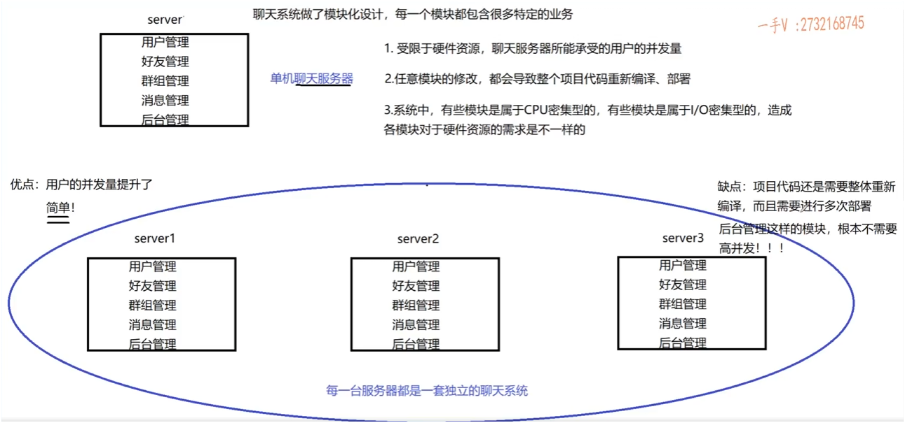

## 分布式系统介绍

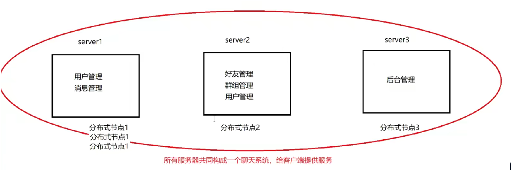


**定义与特点**：将**一个工程拆分为多个模块**，每个模块**独立部署**为可运行的服务进程，多台服务器（分布式节点）协同工作构成完整系统。与集群区别在于，集群中每台服务器运行完整系统，而分布式是多台服务器共同组成一个系统 。

**解决的问题**

- **并发与资源优化**：可根据分布式节点的并发需求**灵活扩容**，如对用户管理模块所在节点增加服务器以支持更高并发，同时合理利用其他节点空闲资源，提升资源利用率。
- **编译与部署优化**：**模块独立部署**，单个模块修改仅需重新编译和更新该模块，无需影响其他模块，大大降低编译和部署成本。
- **硬件匹配优化**：模块拆分后，可依据各模块特性（CPU 密集型或 IO 密集型）**精准匹配硬件资源**，实现资源的合理配置。

**潜在问题与应对**：分布式系统中部分节点故障可能影响整体服务，但实际生产中可通过配置主备服务器等容灾方案保障高可用性 。


## 多个模块的局限

**模块划分困难**

- 模块之间的边界不清晰，容易出现功能重叠或代码重复。
- 模块耦合度高，修改难、维护难。
- 若划分不当，容易造成大量**重复代码**、逻辑冗余、维护成本高。

**模块之间的通信复杂**--重点

- 分布式部署后，模块间通信需**跨进程、跨机器**。
- 函数调用从本地调用变为远程调用，需涉及：
  - **函数名、参数传输**
  - **网络通信、序列化/反序列化**
  - **异常处理、响应返回等机制**

## 引入分布式 RPC 通信框架的意义

**核心作用**

> **让“跨主机远程调用函数”像“调用本地函数”一样简单透明**

**解决的核心问题**

1. **统一通信流程，屏蔽底层复杂性**
   - 请求封装 + 网络传输 + 响应处理全部自动完成。
2. **提高模块间调用效率与开发体验**
   - 用户**感知不到远程调用**的差异，只需像本地函数一样使用接口。
3. **支持参数序列化与传输**
   - 使用 Protobuf 进行高效的数据结构序列化。
4. **自动服务发现与定位**
   - 通过 **ZooKeeper** 注册中心**查找服务位置**，实现动态服务绑定。

## 三大形态对比--**重点**

| 系统形态         | 特点               | 优势                       | 局限性                      |
| ---------------- | ------------------ | -------------------------- | --------------------------- |
| 单机服务器       | 所有模块在一个进程 | 开发简单                   | 扩展性差、耦合高            |
| 集群服务器       | 多台相同服务器     | 水平扩展、简单粗暴         | 不是线性扩展、资源浪费      |
| 分布式模块化系统 | 各模块独立部署     | 高可维护性、易扩展、低耦合 | 设计复杂、通信困难（需RPC） |

# RPC 通信原理讲解整理

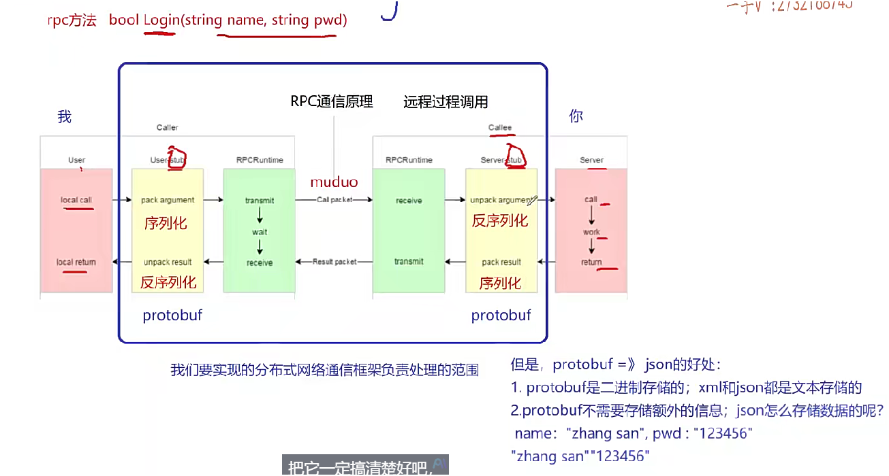

## 为什么要使用 RPC？

1. **为了解耦与扩展：**
   - 大型系统按需模块化（不同模块对硬件/并发等要求不同），分布式部署成为必然。
   - 模块分布在不同进程、甚至不同机器上，**相互之间**仍需调用方法 —— 就**必须跨进程/跨机器通信**。
2. **屏蔽底层通信细节：**
   - 本质是“远程函数调用”，但不同于本地函数调用的直接跳转和传参。
   - 不希望每个开发者都去手动处理 socket、序列化、反序列化、错误码等细节。
   - **引入“框架”来自动完成**这些通信细节，开发者只专注于业务逻辑即可。

## RPC 通信的完整过程（调用链）

举例：用户模块调用好友模块的 `getUserFriendList(userId)` 方法（模块部署在不同服务器）

```
Caller（调用方）          →         Stub（客户端代理）          →         网络层
        ↓                                          ↓                                     ↓
  发起调用（方法名+参数） → 序列化（打包）         → 网络发送
        ↑                                          ↑                                     ↑
  接收返回（结果/错误） ← 反序列化（解包） ← 网络接收

```

| 步骤                   | 说明                                                         |
| ---------------------- | ------------------------------------------------------------ |
| 1. 调用方发起函数调用  | 比如：`getUserFriendList(userId)`，但这个方法实际存在于另一台机器。 |
| 2. Stub 代理类拦截调用 | 替你处理所有 RPC 通信细节。                                  |
| 3. 参数序列化（打包）  | 方法名、参数 → 序列化成字节流（如 JSON、Protobuf）           |
| 4. 网络传输            | 使用网络库（如 muduo）将字节流发送到目标服务器               |
| 5. 服务端接收          | 网络层接收到请求后交给服务端的 Stub 处理                     |
| 6. 参数反序列化        | 字节流 → 方法名 + 参数                                       |
| 7. 执行远程函数        | 找到目标函数（如 `getUserFriendList`），执行逻辑处理         |
| 8. 返回结果处理        | 执行结果、错误码、错误信息 → 序列化返回                      |
| 9. 调用方接收响应      | 解包结果 → 返回给应用层，像本地函数一样使用返回值            |

## 关键模块说明（图中重要角色）

| 角色                 | 功能简述                                         |
| -------------------- | ------------------------------------------------ |
| **Caller**           | 发起方（如用户模块），调用远端方法               |
| **Stub（客户端桩）** | 代理模块，封装参数、处理序列化、发送请求等       |
| **网络层**           | 通信基础设施（如 muduo 库），负责字节流的收发    |
| **Stub（服务端桩）** | 接收数据并反序列化，请求转发到本地业务模块       |
| **Callee**           | 被调方（如好友模块），真正执行业务方法           |
| **结果返回路径**     | 与调用路径对称，同样涉及打包、网络传输和反序列化 |

## 返回结果的组成与处理

- 返回值通常包括：
  1. **错误码（errorCode）**
  2. **错误信息（errorMessage）**
  3. **业务数据（result）**
- 如果错误码为非零，说明远程执行出错，**不应使用返回值，仅使用错误信息**。

------

## 框架的作用与实现目标

1. **由框架来完成：**
   - 参数/返回值的序列化与反序列化
   - 方法名的标识与分发
   - 网络通信（请求发送/接收）
   - 错误处理与返回机制
2. **开发者只需写业务逻辑函数，像调用本地函数一样调用远程服务**

------

## 举例巩固（Login 方法调用）

- 示例函数：`login(string name, string password)`
- 发起调用：`login("zhangsan", "123456")`
- 步骤：
  - Stub 序列化请求（函数名 + 参数）
  - 网络发送请求
  - 远端反序列化 + 调用 login()
  - 执行返回 `true/false` + 错误码 + 信息
  - 远端再次序列化发送
  - 调用方反序列化，判断错误码再处理返回值

------

## protobuf优点

**高效的序列化性能**

- **体积小**：二进制格式，比 JSON、XML 更精简，节省网络带宽。
- **速度快**：序列化和反序列化速度远快于 JSON/XML，适合高频数据传输场景。
- 示例：1000 条用户消息用 JSON 可能几百 KB，而 Protobuf 仅几十 KB。

**跨语言支持**

- 支持多种语言自动生成代码（C++、Java、Python、Go 等）。
- 不同平台、语言之间通信无需手写解析逻辑，提高开发效率。
- 示例：后端使用 C++，前端用 JavaScript，通过 proto 文件即可对接。

**支持rpc描述**!!!

## 总结

- **RPC 的目标**：让远程调用就像本地函数调用一样简单
- **框架解决的是“通信”本质问题，而不是业务逻辑问题**
- **图中的每一步都需要代码支持，RPC 框架的核心就是实现这些自动化处理**

**zookeeper服务配置中心（专门做服务发现）**


# 集群和分布式rpc再对比-自己加

## **单体式集群架构（所有服务器功能一样）**

### 特点：

- 每台服务器都有完整的功能（登录、聊天、好友、群聊等）。
- 通过 **负载均衡（如 LVS/Nginx）** 均衡客户端连接。
- 各服务器之间用 **Redis 发布订阅** 来广播消息，完成跨服务通信。

### 网络连接结构图：

```
lua复制编辑        +------------+
        |            |
        |  客户端    |
        |            |
        +-----+------+
              |
        TCP连接（1个，长连接）
              |
        +-----v------+
        | 负载均衡器 |
        +-----+------+
              |
    +---------+---------+
    |         |         |
+---v---+ +---v---+ +---v---+
| Srv1  | | Srv2  | | Srv3  |  （全功能服务器）
+---+---+ +---+---+ +---+---+
    |         |         |
  Redis发布订阅中间件（共享）
```

### 优点：

- 客户端只连一台服务器。
- 逻辑简单，易于部署。
- 利用 Redis Pub/Sub 实现跨服务通知（如聊天消息同步）。

------

## **2. 微服务式分布式架构（功能拆分，RPC 框架）**

### 特点：

- 每个服务 **职责单一**（比如 LoginService、ChatService、FriendService）。
- 客户端只连接入口服务（如 API Gateway 或 Gateway Server）。
- 各功能服务间通过 **RPC 框架（如 brpc、grpc、自研 RPC）通信**。
- 服务注册与发现一般通过 etcd/zookeeper/nacos。

### 网络连接结构图：

```
lua复制编辑        +-------------+
        |             |
        |   客户端    |
        |             |
        +------+------+
               |
        TCP连接（长连接）
               |
         +-----v-----+
         | Gateway或 |
         | ChatServer|
         +--+----+---+
            |    |（本地调用/或RPC）
    RPC连接 |    |
         +--v---+------+
         | LoginService |
         +-------------+
         +--v---+------+
         | ChatService  |
         +-------------+
         +--v---+------+
         | UserService  |
         +-------------+
```

### 通信说明：

- 客户端只连一个 Gateway（WebSocket/TCP）。
- Gateway 内部根据逻辑调用后端服务。
- 各后端服务之间使用 RPC 框架调用（也需 TCP 网络连接）。
- 通信链路多了，但模块清晰、可扩展、易维护。

## 每个模块服务器都需要 Muduo 网络层？

是的，如果你自己实现 RPC 框架，每个服务间调用实际上就是：

- **一个 RPC 客户端（发起方）用 Muduo 建 TCP 连接**
- **一个 RPC 服务端（接收方）用 Muduo 启动 TcpServer 来监听**

------

## 总结比较：

| 架构             | 客户端连接 | 服务职责 | 服务器间通信     | 拓展方式       |
| ---------------- | ---------- | -------- | ---------------- | -------------- |
| 单体式集群       | 1 个       | 全功能   | Redis 发布订阅   | 扩容同构服务器 |
| 分布式微服务架构 | 1 个       | 职责单一 | RPC 框架 (Muduo) | 扩容单一模块   |


------

## 建议设计思路：

- 如果你是个人项目或小团队，**先用单体式集群+Redis Pub/Sub** 架构，简单易维护。
- 如果要走微服务、模块清晰、便于多人协作，**分布式架构 + RPC 通信 + 服务注册发现** 是更长期的方案。

# 环境配置

## 类似于集群项目

## protobuf

github 进行下载安装  `https://github.com/protocolbuffers/protobuf`

**一定要 下载 包里面 有 autogen.sh 的版本**

**没有的 就是 高版本, bazel 和 cmake 都不好用, bug特别多!!**  

折腾了 半天, 高版本 一个是 安装步骤变了, 一个是 bug一堆!!

不要安装 21 版本之上, 一堆bug,  就装 21版本及以下

```c++
sudo apt-get update
sudo apt-get install autoconf automake libtool curl make g++ unzip
```

```c++
git clone 下来
```

```c++
./autogen.sh
./configure
make && sudo make install
sudo ldconfig
```


# 项目目录结构

不同于 聊天项目!!

> bin：可执行文件
> build：项目编译文件
> lib：项目库文件
> **src：框架的源文件**
> test：测试代码
> **example：框架代码使用范例**
> CMakeLists.txt：顶层的cmake文件
> README.md：项目自述文件
> autobuild.sh：一键编译脚本


# protobuf使用(一)

> 内容并不多, 后续 从实践中 学习

## 安装vscode插件

`vscode-proto3`

## 简单使用

在 **Protobuf** 中，`package` 后面跟的就是 **包名**，表示该 `.proto` 文件中定义的所有消息、服务、枚举等都属于这个“命名空间”，称为 **包名**。

包名是你自己定义的一个标识符，用来给这组 protobuf 定义加上“命名空间”。

## 代码

**test/protobuf/test.proto**------proto 配置文件

```c++
syntax = "proto3"; //声明protobuf的版本

package hzhpro; // 声明代码所在的包(例如c++就是namespace)

// 定义登录请求消息类型 name pwd
message LoginRequest
{
    string name = 1;
    string pwd = 2;
}

// 定义登录响应消息类型
message LoginResponse
{
    int32 errcode = 1;
    string errmsg = 2;
    bool success = 3;
}


```

## protoc编译

  --cpp_out=OUT_DIR           Generate C++ header and source.

```c++
protoc test.proto --cpp_out=./
```

生成

```c++
test.pb.cc  test.pb.h
```


**messgae 相当于 class类,  里面的 相当于 成员变量**


## 序列化和反序列化使用

**test/protobuf/main.cc**

```c++
#include "test.pb.h"
#include <iostream>
#include <string>
using namespace hzhpro;  // 实际开发 要少用命名空间

int main()
{
    // 封装了login请求对象的数据
    LoginRequest req;
    req.set_name("zhang san");
    req.set_pwd("123123");

    // 对象数据序列化=>char*
    std::string send_buf;   
    if(req.SerializeToString(&send_buf))
    {
        std::cout<< send_buf.c_str()<<std::endl;
    }

    // 从send_buf反序列化
    LoginRequest reqB;
    if(reqB.ParseFromString(send_buf))
    {
        std::cout<<reqB.name()<<std::endl;
        std::cout<<reqB.pwd()<<std::endl;
    }

    return 0;
}
```

## 编译注意

必须加 pthread-----因为 **Protobuf 内部使用了线程相关的功能**（如 `std::thread`, `pthread_create`）

```c++
g++ main.cc test.pb.cc -lprotobuf -pthread
```


# protobuf使用(二)

## string和**bytes**

在 Protobuf 中，`bytes` 是一种字段类型，表示**原始二进制数据**，用途非常广泛。


### `bytes` 类型的作用:

> 它可以用来存储：
>
> - 二进制数据（图片、文件内容、压缩数据）
> - 自定义序列化的结构体
> - 加密密钥、哈希值
> - 或者就是一个 UTF-8 编码的字符串（但不推荐当字符串来用）


### 与 `string` 的区别:

| 类型     | 内容编码 | 是否可包含 `\0` | 推荐用途           |
| -------- | -------- | --------------- | ------------------ |
| `string` | UTF-8    | ❌ 不可包含      | 正常文本（人读的） |
| `bytes`  | 原始数据 | ✅ 可以包含      | 任意二进制数据     |


### 注意事项

- 使用 `bytes` 时不能用 `set_content("str")` 来设置包含 `\0` 的数据，否则会截断。
- 应使用 `set_content(const void* data, size_t size)`。


## protobuf的枚举

`.proto` 中每个枚举成员 **必须指定数值**（不自动递增）。

**必须用分号 `;` 结束每一行**，这和 C++ 是不同的。

枚举成员名建议用 **全大写字母**，符合 protobuf 的命名习惯。


## repeated(重复)

```c++
repeated 类型 字段名 = 编号;
```

```c++
message FriendList {
    repeated string friends = 1;
}

```


下面这个是 基本类型

```c++
FriendList list;
list.add_friends("Tom");
list.add_friends("Jerry");

for (int i = 0; i < list.friends_size(); ++i) {
    std::cout << list.friends(i) << std::endl;
}

```

## repeated常用方法（C++）

- `add_字段()`     → 添加一个元素
- `字段_size()`     → 获取数量
- `字段(index)`    → 获取第 index 个元素（从 0 开始）
- `mutable_字段()`  → 获取可修改的容器（高级操作）


## message嵌套message

**test/protobuf/test.proto**

```c++
syntax = "proto3"; //声明protobuf的版本

package hzhpro; // 声明代码所在的包(例如c++就是namespace)

message ResultCode
{
    int32 errcode = 1;
    bytes errmsg = 2;
}


// 定义登录请求消息类型 name pwd
message LoginRequest
{
    bytes name = 1;
    bytes pwd = 2;
}

// 定义登录响应消息类型
message LoginResponse
{
    ResultCode result = 1;
    // int32 errcode = 1;
    // bytes errmsg = 2;
    bool success = 3;
}

message GetFriendListsRequest
{
    uint32 userid = 1;  // 获取谁的请求
}

message User
{
    bytes name =1;
    uint32 age = 2;
    enum  Sex  // 枚举写法注意
    {
        MAN=0;
        WOMAN=1;
    }
    Sex sex=3;
}

message GetFriendResponse
{
    // int32 errcode = 1;  // 代码重复
    // bytes errmsg = 2;
    ResultCode result = 1;
    repeated User friend_list=2; // 定义了一个列表类型,  这个_list没啥特殊意义
}


```


> 重新编译,  **注意 vscode 缓存**, 容易没反应, **重新拉一下 头文件**


## mutable_字段--**重点**

通过查找 pb.h 的 result 函数  ===== 这个result 就是 那个ResultCode 类对象

result 返回 const 引用, 不能修改值

mutable_result 返回指针, 可以修改值

```c++
const ::hzhpro::ResultCode& result() const;
::hzhpro::ResultCode* mutable_result();
void set_allocated_result(::hzhpro::ResultCode* result);
```

| 函数名                              | 返回类型            | 用途                                   |
| ----------------------------------- | ------------------- | -------------------------------------- |
| `result()`                          | `const ResultCode&` | **只读**访问                           |
| `mutable_result()`                  | `ResultCode*`       | **可写**访问                           |
| `set_allocated_result(ResultCode*)` | void                | **设置**已存在对象的所有权（高级用法） |

## add_成员和()

```c++
::hzhpro::User* add_friend_list();
```

```c++
const ::hzhpro::User& friend_list(int index) const;   //查看第几个,  index 根据上面 
```


## main使用

```c++
LoginResponse rsp;
ResultCode *rc = rsp.mutable_result();
rc->set_errcode(1);
rc->set_errmsg("登录处理失败");
```


自定义类型的 add_

```c++
int main()
{
    // LoginResponse rsp;
    // ResultCode *rc = rsp.mutable_result();
    // rc->set_errcode(1);
    // rc->set_errmsg("登录处理失败");

    GetFriendListsResponse rsp;
    ResultCode *rc = rsp.mutable_result();
    rc->set_errcode(0);
    User *user1 = rsp.add_friend_list();
    user1->set_name("zhang san");
    user1->set_age(26);
    user1->set_sex(User::MAN);

    User *user2 = rsp.add_friend_list();
    user2->set_name("zhang san-2");
    user2->set_age(26);
    user2->set_sex(User::MAN);

    User *user3 = rsp.add_friend_list();
    user3->set_name("zhang san-3");
    user3->set_age(26);
    user3->set_sex(User::WOMAN);
    
    std::cout<<rsp.friend_list_size()<<std::endl;

    User user = rsp.friend_list(2);
    std::string userstr;
    if(user.SerializeToString(&userstr))
    {
        // std::cout<<userstr.c_str()<<std::endl;// 这个有问题, 序列化后是二进制数据流, 本身是 字符串能打印出来, 要是有别的 类型, 就不好说了
    }

    User userB;
    if(userB.ParseFromString(userstr))
    {
        std::cout<<userB.name()<<std::endl;
        std::cout<<userB.age()<<std::endl;
        std::cout<<userB.sex()<<std::endl;
    }

    return 0;
}

```

```c++
3
zhang san-3
26
1
```


## 重要的是-学会看**.h**里面的函数

## 错误及知识:紧凑二进制编码

### **1. Protobuf 二进制编码的核心规则**

#### **(1) 基于字段编号（Tag-Length-Value 格式）**

每个字段的编码格式为：
`[Tag] [Length] [Value]`（其中 `Length` 仅对字符串/字节/嵌套消息等变长类型存在）。

- **Tag**：由字段编号和数据类型（Wire Type）组合而成，使用 **Varint 编码**。

  - **Wire Type** 决定值的编码方式：

    | Wire Type | 类型               | 编码方式        |
    | :-------- | :----------------- | :-------------- |
    | 0         | Varint（int32/64） | 变长整数        |
    | 1         | 64-bit（fixed64）  | 固定8字节       |
    | 2         | Length-delimited   | 长度前缀 + 数据 |
    | 5         | 32-bit（fixed32）  | 固定4字节       |

- **Length**：仅对 Wire Type=2（字符串、字节、子消息）存在，表示后续数据的字节数。

- **Value**：字段的实际值，编码方式由 Wire Type 决定。

#### **(2) 变长整数编码（Varint）**

- 用于：`int32`、`int64`、`uint32`、`uint64`、`enum`、`bool`。
- **规则**：
  - 每个字节的最高位（MSB）是标志位：`1` 表示后续还有字节，`0` 表示结束。
  - 剩余7位存储实际数据（小端序排列）。
- **示例**：
  - `26` → `0x1A`（二进制 `00011010`，MSB=0）。
  - `300` → `0xAC 0x02`（二进制 `10101100 00000010`）。

#### **(3) 字符串/字节/嵌套消息编码**

- 格式：`[Tag] [Length] [Data]`。
- **示例**：
  - 字段 `name: "abc"`（字段编号=1）：
    - Tag: `0x0A`（`(1 << 3) | 2`）。
    - Length: `0x03`（长度=3）。
    - Data: `0x61 0x62 0x63`（ASCII "abc"）。

### **2. 为什么字符串部分可见，而整型不可见？**

- **字符串**：存储为 UTF-8 字节序列，若内容为 ASCII 字符（如英文、数字），则打印时可能显示为可读文本。
- **整型**：使用 Varint 编码后的二进制字节（如 `0x1A`）通常不对应可打印 ASCII 字符，显示为乱码或空白。

**示例**：

```
message Example {
  string name = 1;  // "abc" → 0x0A 0x03 0x61 0x62 0x63（"abc"可见）
  int32 age = 2;    // 26    → 0x10 0x1A（不可见）
}
```

### **3. 编码效率对比（示例）**

| 字段             | JSON 编码        | Protobuf 编码             | 节省 |
| :--------------- | :--------------- | :------------------------ | :--- |
| `{"name":"abc"}` | 12字节（含引号） | 5字节（`0A 03 61 62 63`） | ~58% |
| `{"age":26}`     | 8字节            | 2字节（`10 1A`）          | ~75% |

### **4. 如何手动解析 Protobuf 二进制？**

#### **(1) 查看原始字节（Hex 格式）**

```
#include <iomanip>
#include <sstream>

std::string toHex(const std::string& binary) {
    std::ostringstream oss;
    for (unsigned char c : binary) {
        oss << std::hex << std::setw(2) << std::setfill('0') << (int)c << " ";
    }
    return oss.str();
}

// 输出示例：0a 03 61 62 63 10 1a
```

#### **(2) 使用 `protoc --decode_raw`**

```
echo "0A 03 61 62 63 10 1A" | xxd -r -p | protoc --decode_raw
```

```
1: "abc"
2: 26
```


## protobuf详细对比-知识

### **1. 字段 `{"name":"abc"}` 的存储对比**

#### **(1) JSON 编码（12字节）**

```
{"name":"abc"}
```

- **实际字节**（UTF-8 编码，16进制表示）：

  ```
  7B 22 6E 61 6D 65 22 3A 22 61 62 63 22 7D
  ```

  - `7B` `{`
  - `22` `"`
  - `6E` `n`, `61` `a`, `6D` `m`, `65` `e` → `"name"`
  - `22` `"`, `3A` `:`
  - `22` `"`, `61` `a`, `62` `b`, `63` `c` → `"abc"`
  - `22` `"`, `7D` `}`

#### **(2) Protobuf 编码（5字节）**

假设 `.proto` 定义为：

```
message Data {
  string name = 1;
}
```

- **二进制编码**：

  ```
  0A 03 61 62 63
  ```

  - `0A`：Tag（字段编号=1，Wire Type=2）
    - `(1 << 3) | 2` = `0x0A`
  - `03`：字符串长度（3字节）
  - `61 62 63`：UTF-8 编码的 `"abc"`

------

### **2. 字段 `{"age":26}` 的存储对比**

#### **(1) JSON 编码（8字节）**

```
{"age":26}
```

- **实际字节**：

  ```
  7B 22 61 67 65 22 3A 32 36 7D
  ```

  - `7B` `{`
  - `22` `"`, `61` `a`, `67` `g`, `65` `e` → `"age"`
  - `22` `"`, `3A` `:`
  - `32` `2`, `36` `6` → `26`
  - `7D` `}`

#### **(2) Protobuf 编码（2字节）**

假设 `.proto` 定义为：

```
message Data {
  int32 age = 2;
}
```

- **二进制编码**：

  

  ```
  10 1A
  ```

  - `10`：Tag（字段编号=2，Wire Type=0）
    - `(2 << 3) | 0` = `0x10`
  - `1A`：`26` 的 Varint 编码
    - `26` → `0x1A`（二进制 `00011010`，MSB=0）

------

### **3. Protobuf 编码的节省来源**

1. **省略字段名**：
   - JSON 需存储 `"name"`、`"age"` 等键名（重复占用空间）。
   - Protobuf 用字段编号（如 `1`、`2`）替代，通过 `.proto` 文件映射。
2. **紧凑的数值编码**：
   - JSON 的 `26` 存储为字符 `"2"` `"6"`（2字节）。
   - Protobuf 的 `26` 用 Varint 压缩为 `0x1A`（1字节）。
3. **无冗余符号**：
   - JSON 需引号、冒号、花括号等语法符号。
   - Protobuf 仅存储必要元数据（Tag + Length）

# protobuf使用(三)

## 复习

**推荐用 bytes 替代 string**：减少字符编码开销，提高性能。

**message 支持复杂嵌套结构**：

- **基本类型**（string、int32、bool...）；
- **组合对象**（message 嵌套 message）；
- **列表类型**：`repeated`；
- **映射表类型**：`map<key_type, value_type>`（注意不是 C++ STL 的 map）；
- **枚举类型**（enum）；
- **RPC 服务描述**（service）：这是本节新增重点。

**注意**：Protobuf 的 `map` 类型与 C++ STL 中的 `map` 是不同的，仅为消息结构的语法糖。

“语法糖”是编程语言里的一个术语，意思是：

> 一种**让代码更好写、更好读**的语法形式，**本质上没有引入新功能**，只是更简洁或直观。


> [!TIP]
>
> `Protobuf` 的 `map` 和 `C++ STL` 的 `map` 的区别:
>
> **相同点：**
>
> - 都是**键值对**的数据结构。
> - 都能用来表示：`key -> value` 的映射关系。
> - 都可以通过 `key` 查找对应的 `value`。

------

**不同点（关键）：**

| 项目         | Protobuf 中的 `map`                      | C++ STL 中的 `map`                     |
| ------------ | ---------------------------------------- | -------------------------------------- |
| 类型         | 一种**消息字段的语法糖**                 | 一个真正的容器类                       |
| 底层实现     | 被编译成一个隐藏的 `repeated message`    | 基于平衡二叉树或哈希表                 |
| 功能限制     | 不能做复杂操作（如排序、自定义比较函数） | 支持全功能，如插入、排序、自定义比较等 |
| 使用目的     | 用来在消息中表达键值对结构               | 用来在内存中管理数据关系               |
| 支持语言广度 | 统一跨语言序列化格式                     | 仅限于 C++ 标准库                      |

## Protobuf 与 RPC 的关系

- **Protobuf 本身不具备 RPC 能力**，仅提供：
  - 参数的序列化
  - 响应的反序列化
- RPC 框架使用 Protobuf 是为了**结构化传输参数和结果**


## 为什么要用 ProtoBuf

- ProtoBuf 用于结构化数据的序列化与反序列化，提升网络传输效率；
- 在 **分布式通信（RPC）框架** 中，ProtoBuf 可以用于描述**调用的参数和返回值**；
- 本质上：**ProtoBuf 不负责通信，只负责消息格式的定义**。


## service定义rpc

`service` 表示定义一个服务类；

`rpc 方法名 (参数类型) returns (返回类型)`；

对应业务逻辑中的远程函数。

```protobuf
// 在protobuf 定义描述 rpc类型
service UserServiceRpc {
    rpc Login(LoginRequest) returns (LoginResponse);
    rpc GetFriendList(GetFriendListsRequest) returns (GetFriendListsResponse);
  }
```


## **必须启用** service 的生成：

只写 service 类, 进行protoc 编译, 是不会生成 service类的

```c++
option cc_generic_services = true;
```

- 默认不会生成 `service` 相关的类（包括 stub 类）；
- 必须加上该 option 才会生成带有 rpc 方法声明的类。


开启并编译后, 将会生成 以下

```c++
class UserServiceRpc_Stub;

class UserServiceRpc 
```


## protobuf代码结构--**重点**

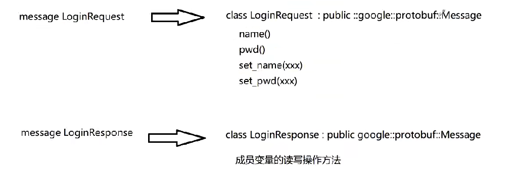


以 `Login` 为例，会生成如下内容：

> [!TIP]
>
> 新版`messgae`结构加了一个小东西---`final`
>
> ```c++
> class LoginRequest final :
> 
>   public ::PROTOBUF_NAMESPACE_ID::Message{}
> ```
>
> 在 C++ 中，`final` 是一个**限定符（specifier）**，它的作用是：
>
> > **禁止类被继承，或禁止虚函数被重写（override）**。

#### 1. Message 类型：

```c++
class LoginRequest : public google::protobuf::Message {
  // 提供 GetName(), SetName(), GetPwd(), SetPwd()
};


class LoginResponse : public google::protobuf::Message {
  // 同样提供成员变量的读写方法
};
```

#### 2. Service 类型（抽象类）：

```c++
class UserServiceRpc_Stub;

class UserServiceRpc : public ::PROTOBUF_NAMESPACE_ID::Service
{
public:
	virtual void Login(::PROTOBUF_NAMESPACE_ID::RpcController *controller,
	const ::hzhpro::LoginRequest *request,
	::hzhpro::LoginResponse *response,
	::google::protobuf::Closure *done);
	
	
	virtual void GetFriendList(::PROTOBUF_NAMESPACE_ID::RpcController *controller,
	const ::hzhpro::GetFriendListsRequest *request,
	::hzhpro::GetFriendListsResponse *response,
	::google::protobuf::Closure *done);
	
	
	const ::PROTOBUF_NAMESPACE_ID::ServiceDescriptor *GetDescriptor();
    .....
}
```

#### 3. Stub 类型（代理类）：

```c++
class UserServiceRpc_Stub : public UserServiceRpc {
  // 提供 Login 方法的远程代理实现
};
```

- **Stub 就是客户端代理类**，封装了底层网络通信细节；
- 实现原理类似于我们 RPC 框架图中讲的 `stub -> channel -> codec -> network`。


## 理解service类

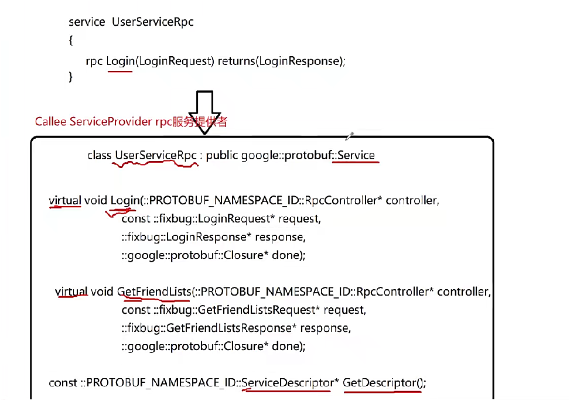

先简单了解

> [!IMPORTANT]
>
> 这在 以后 写 rpc 项目 很有用, 是重点
>
> 尤其是  **service类**

#### 1. `getDescriptor()` 方法的作用

- **返回值**：一个指向 `ServiceDescriptor` 的指针。
- **含义**：`ServiceDescriptor` 是对一个服务的描述对象。
- **描述内容**：
  - 服务名（如 `UserService`）
  - 服务中包含的 RPC 方法名（如 `Login`, `GetFriendList`）

#### 2. 为什么需要 `ServiceDescriptor`

- 在进行 **RPC 调用** 时，需要知道：
  - 调用的是哪个服务（哪个类的对象）
  - 调用的是哪个方法（方法名）
- `ServiceDescriptor` 就提供了这种“元信息”，可以让框架动态识别服务与方法，进行 RPC 调度。

#### 3. service 类是如何生成的

- 由 `protoc` 工具根据 `.proto` 文件生成。
- 默认生成的类不是 `UserServiceRpc`，而是 `UserService`。
- 这个生成类用于服务端（**provider / callee**）(**配合理论图**)实现接口，是 **RPC 服务的提供者端**。

#### 4. protobuf 中的两个核心抽象

- `message`：表示消息结构（数据）
- `service`：表示服务接口（方法）

#### 5. RPC 方法结构统一

- 每个 RPC 方法最终都以统一形式出现（一般4个参数）
- 如：请求参数、响应参数都封装在对应的 `xxxRequest` 和 `xxxResponse` 中。


# protobuf使用(四)

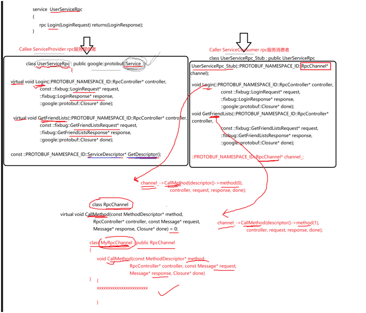

## Protobuf 生成的两个核心类

1. **UserServiceRpc 类**

   - 是 **RPC 服务提供者** 端使用的类。
   - 继承自 `::google::protobuf::Service`。
   - 包含 RPC 方法（如 `Login`、`GetFriendList`）的 **虚函数声明**，供服务端进行 **具体业务实现**。
   - **构造函数无参**，是服务端主动注册服务对象时使用的。

2. **UserServiceRpc_Stub 类（桩类）**

   - 是 **RPC 服务消费者（调用者）** 使用的代理类。
   - 继承自 `UserServiceRpc`。
   - 实现了基类中的虚函数（比如 `Login`），但**实现方式不是执行业务**，而是调用底层 `RpcChannel::CallMethod`。
   - **构造函数必须接收一个 `RpcChannel\*` 指针**，这是关键点。

   ```c++
   // .h
   class UserServiceRpc_Stub : public UserServiceRpc
     {
     public:
       UserServiceRpc_Stub(::PROTOBUF_NAMESPACE_ID::RpcChannel *channel);
       UserServiceRpc_Stub(::PROTOBUF_NAMESPACE_ID::RpcChannel *channel,
                           ::PROTOBUF_NAMESPACE_ID::Service::ChannelOwnership ownership);
       void Login(::PROTOBUF_NAMESPACE_ID::RpcController *controller,
                  const ::hzhpro::LoginRequest *request,
                  ::hzhpro::LoginResponse *response,
                  ::google::protobuf::Closure *done);
       void GetFriendList(::PROTOBUF_NAMESPACE_ID::RpcController *controller,
                          const ::hzhpro::GetFriendListsRequest *request,
                          ::hzhpro::GetFriendListsResponse *response,
                          ::google::protobuf::Closure *done);
   	....
       
     private:
       ::PROTOBUF_NAMESPACE_ID::RpcChannel *channel_;
       ....
   }
   ```

   ```c++
   // .cc  具体实现
   
   void UserServiceRpc_Stub::Login(::PROTOBUF_NAMESPACE_ID::RpcController* controller,
                                 const ::hzhpro::LoginRequest* request,
                                 ::hzhpro::LoginResponse* response,
                                 ::google::protobuf::Closure* done) {
     channel_->CallMethod(descriptor()->method(0),
                          controller, request, response, done);
   }
   void UserServiceRpc_Stub::GetFriendList(::PROTOBUF_NAMESPACE_ID::RpcController* controller,
                                 const ::hzhpro::GetFriendListsRequest* request,
                                 ::hzhpro::GetFriendListsResponse* response,
                                 ::google::protobuf::Closure* done) {
     channel_->CallMethod(descriptor()->method(1),
                          controller, request, response, done);
   }
   ```

   > [!IMPORTANT]
   >
   > 具体实现 的 函数------>  没有实现业务, 而是调用 **channel**
   >
   > **channel** 又是 `::PROTOBUF_NAMESPACE_ID::RpcChannel *` 类型

```c++
class PROTOBUF_EXPORT RpcChannel {
 public:
 	....
  virtual void CallMethod(const MethodDescriptor* method,
                          RpcController* controller, const Message* request,
                          Message* response, Closure* done) = 0;
	....
 private:
  GOOGLE_DISALLOW_EVIL_CONSTRUCTORS(RpcChannel);
};
```


## RpcChannel 的作用与机制

- `RpcChannel` 是一个 **抽象类**，定义了纯虚函数 `CallMethod`。

- 所有 RPC 方法最终都通过 `CallMethod` 转发出去，实现 **序列化、网络发送、响应接收与反序列化**。

- 桩类方法中调用的是：

  ```
  _channel->CallMethod(method, controller, request, response, done);
  ```

## 自定义 RpcChannel 实现

为了真正执行 RPC 远程调用，需要**开发者自己实现一个类**

```c++
class MyRpcChannel : public RpcChannel {
public:
    void CallMethod(...) override {
        // 1. 对 request 序列化
        // 2. 构造 RPC 请求包
        // 3. 发送网络请求
        // 4. 接收响应并反序列化到 response
    }
};
```

该类实现了 CallMethod 的逻辑，真正完成 RPC 通信。

## 调用流程总结

1. 客户端构造一个桩类对象：

   ```
   UserServiceRpc_Stub stub(new MyRpcChannel());
   ```

2. 调用 RPC 方法：

   ```
   stub.Login(controller, &request, &response, nullptr);
   ```

3. 实际执行：

   - 并不会执行业务逻辑。
   - 而是调用 `MyRpcChannel::CallMethod`，由你自定义实现网络通信和序列化逻辑。

## 理解的重点建议

- 理解 **Stub 类 ≠ 业务逻辑**，它是一个 **代理类**，所有调用都重定向到 `RpcChannel`。
- 理解 Protobuf 提供的 **类结构层次：Service → Stub → Channel**。
- 理解 **继承 + 多态 + 虚函数重写** 在其中的作用机制。
- 最终所有复杂的远程通信都被隐藏在了 `RpcChannel::CallMethod` 背后。

> [!TIP]
>
> 此时 再去 看 rpc那个 理论图,  会很清晰, 会明白 什么是代理类(stub)


> [!IMPORTANT]
>
> 最好有项目实践, 不然很难理解


# 本地服务发布rpc(一)

## 项目目标

- 不是做业务系统，而是做一个**RPC 框架**
- 框架核心职责：**让上层应用的本地方法变成 RPC 远程可调用方法**
- 框架不做具体业务，服务于业务
- 但是 不能脱离 业务

## 开发方式

- **业务驱动框架设计**：先引出具体业务需求，再倒推需要框架提供哪些功能
- 以 UserService（登录 + 获取好友列表）为示例贯穿开发过程

## 项目结构说明

```
项目根目录/
├── bin/            # 存放最终生成的可执行文件（服务提供者/消费者）
├── build/          # CMake 构建过程中的中间文件
├── example/        # 业务代码：使用框架的服务端/客户端示例
│   ├── callee/     # 服务提供者：提供 RPC 方法（如 login）
│   └── caller/     # 服务消费者：远程调用 RPC 方法
├── lib/            # 框架本身编译后的动态库
├── src/            # 框架核心代码
├── test/           # 示例代码（如 protobuf、zookeeper 测试）
├── CMakeLists.txt  # 顶级构建脚本
├── README.md       # 项目说明
└── autogen.ac      # 自动化构建脚本
```


## **CMakeLists.txt**

```c++
# 设置cmake最低版本 和 项目名称
cmake_minimum_required(VERSION 3.0)
project(mprpc-hzh)

# 设置项目可执行文件输出的路径
set(EXECUTABLE_OUTPUT_PATH ${PROJECT_SOURCE_DIR}/bin)
# 设置项目库文件输出的路径
set(LIBRARY_OUTPUT_PATH ${PROJECT_SOURCE_DIR}/lib)
# 设置编译头文件搜索路径 -I
include_directories(${PROJECT_SOURCE_DIR}/src)
# 设置项目库文件搜索路径 -L
link_directories(${PROJECT_SOURCE_DIR}/lib)

add_subdirectory(src) 
# 放 使用 rpc服务的 使用者 caller和 消费者callee
add_subdirectory(example)   

```

## 错误1:

> ```c++
> set(EXECUTABLE_OUTPUT_PATH ${PROJECT_SOURCE_DIR}/bin)
> ```
>
> 注意宏名, 第二个 **不是EXECUTABLE_OUTPUT_PATH ** 
>
> 是`PROJECT_SOURCE_DIR`----> 是本项目的bin
>
> **写错会是 usr/bin**里面

## 错误2

> ```c++
> LIBRARY_OUTPUT_PATH   和  LIBRARY_OUTPUT_DIRECTORY
> ```
>
> 也要区分!!!
>
> #### 1. `LIBRARY_OUTPUT_PATH`（全局，**不推荐**）
>
> - 设置所有库的输出目录（但不分 Debug/Release）。
> - **已过时**，不灵活，建议不用。
>
> #### 2. `LIBRARY_OUTPUT_DIRECTORY`（**推荐**）
>
> - 针对某个 target 设置库文件输出目录。
> - 可细分配置：
>   - `LIBRARY_OUTPUT_DIRECTORY_DEBUG`
>   - `LIBRARY_OUTPUT_DIRECTORY_RELEASE`

## 业务示例 - UserService

把一个原本本地类的方法 `UserService::Login(name, pwd)` 变成一个可以远程调用的 RPC 方法

```c++
#include <iostream>
#include <string>


/*
UserService 原来是一个 本地服务, 提供了 两个进程内的本地方法, Login和GetFriendLists
*/
class UserService 
{
    public:
    bool  Login(const std::string username, const std::string password) 
    {
        std::cout << "doing local service : Login" << std::endl;
        std::cout<<"username: " << username << " password: " << password << std::endl;
    }
};

int main(int argc, char* argv[])
{

    
    return 0;
}
```


## RPC 方法定义（Protobuf）

`example/user.proto`

```c++
syntax = "proto3";
package example;

option cc_generic_services = true; // 生成服务类和rpc方法描述, 默认不生成

message ResultCode
{
    int32 errcode = 1;
    bytes errmsg = 2;
}


// 定义登录请求消息类型 name pwd
message LoginRequest
{
    bytes name = 1;
    bytes pwd = 2;
}

// 定义登录响应消息类型
message LoginResponse
{
    ResultCode result = 1;
    bool success = 3;
}

service UserServiceRpc {
    rpc Login(LoginRequest) returns (LoginResponse);
}
```

> 编译---->在cmake 加 头文件搜索路径

**example/CMakeLists.txt**

```c++
add_subdirectory(callee)
```

**example/callee/CMakeLists.txt**

```c++

set(SRC_LIST userservice.cc ../user.pb.cc)

add_executable(provider ${SRC_LIST})


```


## 修改业务代码-加rpc

```c++
#include <iostream>
#include <string>
#include "user.pb.h"

/*
UserService 原来是一个 本地服务, 提供了 两个进程内的本地方法, Login和GetFriendLists
*/
class UserService : public UserServiceRpc
{
    public:
    bool  Login(const std::string username, const std::string password) 
    {
        std::cout << "doing local service : Login" << std::endl;
        std::cout<<"username: " << username << " password: " << password << std::endl;
    }
};

int main(int argc, char* argv[])
{


    return 0;
}
```

 

## 错误-1:

add_subdirectory(src) ,  src里面必须有 cmake配置文件, 哪怕是空的

`add_subdirectory()` 会递归调用指定目录下的 `CMakeLists.txt`，如果这个文件不存在，CMake 配置过程就会报错，提示找不到构建脚本。

## 错误-2:

> [!WARNING]
>
> proto 相关的 命名空间!!!

```c++
#include <iostream>
#include <string>
#include "user.pb.h"
// using namespace hzhrpc;

/*
UserService 原来是一个 本地服务, 提供了 两个进程内的本地方法, Login和GetFriendLists
*/
class UserService : public hzhrpc::UserServiceRpc
{
    public:
    bool  Login(const std::string username, const std::string password) 
    {
        std::cout << "doing local service : Login" << std::endl;
        std::cout<<"username: " << username << " password: " << password << std::endl;
        return true;
    }
};

int main(int argc, char* argv[])
{


    return 0;
}
```


## 重写基类的虚函数(部分)

```c++
// 重写  UserServiceRpc 里的 Login方法
    void Login(::google::protobuf::RpcController* controller,   // 这里命名空间不写hzhrpc::, 直接写google::protobuf   特别注意
        const ::hzhrpc::LoginRequest* request,
        ::hzhrpc::LoginResponse* response,
        ::google::protobuf::Closure* done);
```

## 各参数理解

1. `::google::protobuf::RpcController* controller`

- **作用**：用于控制整个 RPC 调用过程，包括处理错误、取消、设置/获取错误信息等。
- **说明**：客户端和服务器都可以使用它来反映 RPC 状态（如失败信息）。如果你需要反馈 RPC 错误，比如请求格式不对、认证失败，可以通过它设置错误。

------

2. `const ::hzhrpc::LoginRequest* request`

- **作用**：客户端发来的请求数据，封装成了 `LoginRequest` 对象。
- **说明**：这是 protobuf 自动生成的请求结构体，包含用户登录所需的信息，比如用户名、密码等。服务器通过读取它来处理登录逻辑。

------

3. `::hzhrpc::LoginResponse* response`

- **作用**：用于将服务端处理结果返回给客户端。
- **说明**：服务器会填充这个响应结构体，比如设置登录是否成功、用户ID、错误信息等，然后通过 RPC 框架发回客户端。

------

4. `::google::protobuf::Closure* done`

- **作用**：这是一个回调函数指针，表示 RPC 方法处理完成时需要执行的操作。
- **说明**：
  - 服务端逻辑处理完成后，**必须调用 `done->Run()`** 来触发后续操作，如将 `response` 发回客户端。
  - 如果不调用 `done->Run()`，客户端将一直等待响应，造成阻塞或超时。

------

## 补充说明：

命名空间为什么用 `::google::protobuf::` 而不是 `hzhrpc::`

这是因为：

- `RpcController` 和 `Closure` 是 **Google Protobuf 官方定义的基类接口**，属于 `google::protobuf` 命名空间；
- `LoginRequest` 和 `LoginResponse` 是你自定义的 protobuf 服务结构体，位于 `hzhrpc` 命名空间。

# 本地服务发布rpc(二)

## 背景说明

- 我们希望**把本地的 login 函数变成远程可以调用的 RPC 服务**。
- 整个过程基于 Protobuf 的序列化能力 + 自定义 RPC 框架的流程控制实现。
- 客户端通过网络发送了 `LoginRequest` 请求，服务器框架接收到后会自动触发业务方实现的 `Login` 方法。


## 两个rpc类->proto后

`UserServiceRpc`：服务端实现继承这个类，重写 RPC 方法。

`UserServiceRpc_Stub`：客户端通过它调用 RPC 方法。


## 再次回顾四个参数

| 参数         | 作用                                                         |
| ------------ | ------------------------------------------------------------ |
| `controller` | 控制器对象，可用于传递额外的控制信息（如超时、取消、错误处理等，暂不关注） |
| `request`    | 已经**被框架反序列化**好的请求对象（从客户端发来的 LoginRequest） |
| `response`   | 框架提前创建的响应对象，业务方填写响应结果即可               |
| `done`       | 回调对象，框架用于发送响应的关键机制：调用 `done->Run()` 触发序列化 + 网络发送 |

## 把本地服务变成远程服务流程-总结

> #### 1. **定义 proto 文件**
>
> - 写明：
>   - rpc方法名（如 `Login`）
>   - 请求参数类型（`LoginRequest`）
>   - 响应参数类型（`LoginResponse`）
> - **作用**：这是客户端与服务端的通信约定，客户端只需按这个约定调用即可。
>
> 举例:
>
> ```c++
> service UserServiceRpc {
>     rpc Login(LoginRequest) returns (LoginResponse);
> }
> ```
>
> 
>
> #### 2. **从生成的服务类中继承**
>
> - 编译 proto 后会生成一个 `UserServiceRpc` 类（或类似）
> - 在你的业务代码中继承这个类，并**重写其中的方法**（如 `Login` 方法）
> - 也可以使用 **lambda 表达式** 来传递函数对象实现方法逻辑
>
> #### 3. **业务处理逻辑**
>
> - `Login` 方法会由**框架自动调用**：
>   - 框架接收到客户端请求后，会通过方法名匹配调用相应函数
>   - 请求参数会通过函数参数传入
>   - 在函数内：
>     - 解析请求数据
>     - 进行本地业务处理（比如验证用户名密码）
>     - 构造响应对象 `LoginResponse`
>     - **填写响应内容**
>
> #### 4. **发送响应数据-run实现**
>
> - 响应对象必须通过 **序列化** 变成字节流再通过网络发送
> - 序列化方式：`SerializeToArray()`、`SerializeToString()`（由 protobuf 提供）
> - 最后一步是调用 `done->Run()`，由框架统一处理序列化与网络发送


## callee代码整体

**注意一下, Login 函数有两个, 名字没起好, 要明白 各个Login的含义**

```c++
#include <iostream>
#include <string>
#include "user.pb.h"
// using namespace hzhrpc;

/*
UserService 原来是一个 本地服务, 提供了 两个进程内的本地方法, Login和GetFriendLists
*/
class UserService : public hzhrpc::UserServiceRpc  // 这个rpc类使用在 rpc服务发布端(rpc服务提供者) 
{
    public:
    bool  Login(const std::string username, const std::string password) 
    {
        std::cout << "doing local service : Login" << std::endl;
        std::cout<<"username: " << username << " password: " << password << std::endl;
        return true;
    }


    // 重写  UserServiceRpc 里的 Login方法
    // 1. caller ====> 发起请请求 Login(request)  ==> 通过 muduo  ==> callee
    // 2. callee ====> 收到请求 Login(request)  ==> 交到下面重写的 Login方法
    void Login(::google::protobuf::RpcController* controller,   // 这里命名空间不写hzhrpc::, 直接写google::protobuf   特别注意
        const ::hzhrpc::LoginRequest* request,
        ::hzhrpc::LoginResponse* response,
        ::google::protobuf::Closure* done)
        {

            // 1. 框架给业务上报了请求参数LoginRequest, 应用 获取相应数据做本地业务
            std::string username = request->name();
            std::string password = request->pwd();


            // 2. 做本地业务
            bool login_result = Login(username, password); 

            // 3. 业务处理完毕, 设置响应参数
            // 包括 设置返回码, 提示信息, 以及业务处理结果
            hzhrpc::ResultCode* code = response->mutable_result();  // 可修改的
            code->set_errcode(0);  // 0表示成功
            code->set_errmsg("success");  // 成功的提示信息
            response->set_success(login_result);  // 设置成功与否的标志

            // 4. 执行回调函数
            // 通过查看 Closure 类, run是个 纯虚函数, 即回调函数, 需要重写
            // 这里的done是个回调函数, 由框架提供, 业务上不需要关心
            // 任务: 执行响应对象数据的序列化和网络发送 (都是由 框架来完成的)
           done->Run();  

        }
};

int main(int argc, char* argv[])
{


    return 0;
}
```


# 阶段大总结-实现流程

## 目标

将业务层的本地方法（如用户登录）发布成 **RPC 服务**，供远程客户端调用。

## 实现步骤

> #### 1. **编写 `.proto` 文件**
>
> - 定义 RPC 方法签名（例如 `rpc Login(...) returns (...)`）
> - 定义请求消息类型（如 `LoginRequest`）
> - 定义响应消息类型（如 `LoginResponse`）
> - **注意**：这是与远程调用方的通信协议，必须明确方法名、入参、出参
>
> #### 2. **使用 `protoc` 生成代码**
>
> - 使用 `protoc` 编译 `.proto` 文件，生成 C++ 代码
> - 生成两个关键类：
>   - `UserServiceRpc`：服务提供方继承并实现的类
>   - `UserServiceRpc_Stub`：服务调用方使用的类（Stub）
> - 当前仅关注服务端：我们要实现 并 发布服务
>
> #### 3. **从 `UserServiceRpc` 继承并重写方法**
>
> - 在业务代码中继承该类
> - 重写 `.proto` 中定义的 RPC 方法（如 `Login`）
>   - **参数说明**：
>     - 第一个参数, 不是很重要
>     - `const LoginRequest* request`：请求参数对象
>     - `LoginResponse* response`：用于填写响应内容
>     - `Closure* done`：框架提供的回调，调用后会执行序列化并发送响应（通过 `done->Run()`）
>
> #### 4. **框架负责调用逻辑**
>
> - 框架在收到远程请求后：
>   - 根据方法名匹配对应函数
>   - 填充参数并调用你实现的 `Login` 方法
>   - 最终执行 `done->Run()`，序列化响应并通过网络发出

# 后续将进行如何发布

# mprpc框架基础类设计

## 目标

将本地 `UserService::Login()` 方法发布成一个远程可调用的 RPC 方法，形成一个“可独立部署、可多实例扩展”的微服务节点。


## 初始化框架

- 创建类：`MprpcApplication`

- 提供接口： ---- 本身是个服务器, 传参 不写死, ip/port

- ```
  void Init(int argc, char **argv);
  ```

- 功能：**读取配置文件**（如ip/port），初始化日志模块等

- 推荐设计：**单例模式**，方便在全局共享框架信息

- 传参 读 配置文件----[框架初始化函数-文件读取](# 框架初始化函数-文件读取)


## 创建 服务发布 对象

- 类名：`RpcProvider`
- 核心功能：
  - `NotifyService(google::protobuf::Service* service)`
     注册 RPC 服务对象（不能依赖具体业务类，只接受抽象基类）
  - `Run()`
     启动 RPC 网络服务，等待远程调用

## 业务代码中使用框架发布服务

从业务入手, 看框架

直接看框架 是学不明白的

```c++
int main(int argc, char* argv[])
{
    // 1. 初始化框架
    MprpcApplication::Init(argc, argv);

    // 2. 创建 provider 并注册服务
    RpcProvider provider;
    provider.NotifyService(new UserService());  // 注册并发布服务, 这里的UserService是个本地服务, 不是rpc服务

    // 3. 启动rpc服务发布 节点
    provider.Run();  // 启动服务, 这里的Run是阻塞状态, 一直监听rpc调用请求

    return 0;
}
```

## 为什么这么设计？

- **解耦服务**：login 是一个独立服务模块，改动后只需重新部署 login，不影响其他功能。
- **易于扩展**：未来可以部署多个 login 节点，支持分布式部署、负载均衡。
- **易用性强**：框架使用简单，封装复杂逻辑，让用户只需关注服务发布即可。
- **面向抽象设计**：框架接受 protobuf 的基类 `Service*`，支持任意 rpc 服务，而不是绑定某个业务类。


## 框架目录结构

```c++
src/
├── include/
│   ├── mprpcapplication.h    // 初始化类头文件
│   └── rpcprovider.h         // 服务发布类头文件
├── mprpcapplication.cc
├── rpcprovider.cc

```

CMake 配置中记得加上：

```
include_directories(${PROJECT_SOURCE_DIR}/src/include)
```


## 框架类为什么设计成单例?

> #### 1. **只需要初始化一次**
>
> - 配置信息（如ip、端口、日志级别）只在程序启动时读取一次，之后整个程序生命周期内共享使用。
> - 不需要每次调用服务都重复读取配置，节省资源、避免重复初始化。
>
> #### 2. **全局访问方便**
>
> - 一旦初始化完成，后续任意模块都可以通过 `MprpcApplication::GetInstance()` 获取到配置信息。
> - 避免传递多个参数或对象，提高代码整洁度与可维护性。
>
> #### 3. **确保状态一致**
>
> - 使用单例可以避免多个实例产生不同的状态副本（如多个日志配置、多个端口号），保证全局行为一致。


> 网络服务模块可以直接通过单例获取配置，如绑定地址、端口。
>
> 日志系统可以读取框架统一配置，决定是否输出调试信息。
>
> RPC 调用封装中可以依赖框架统一的超时时间、协议设置等。


## 框架类.h-code

回顾单例 设计模式!!

```c++
#pragma once

// mprpc框架的基础类, 负责框架的初始化工作
class MprpcApplication {
    public:
        static void Init(int argc, char **argv);
        static MprpcApplication& GetInstance();
       
    
    private:
        MprpcApplication() {}                         // 禁止外部构造
        MprpcApplication(const MprpcApplication&) = delete; // 禁止拷贝构造
        MprpcApplication& operator=(const MprpcApplication&) = delete; // 禁止赋值构造
    
    };
    

```


## `RpcProvider`：RPC 服务发布者

> [!TIP]
>
> 由于 这是一个 服务类,  就会被许多人 请求这个 rpc调用
>
> 因此, 必须是 **高并发的**, 所以要使用 **muduo 网络库**


> [!IMPORTANT]
>
> 不要写死 框架类!!

> 在 `RpcProvider` 中直接写 `UserService*` 这样的指针，是严重不合理的。
>
> 因为：
>
> - 框架的本质是**通用性**：它应该支持任意业务服务的注册，而不仅仅是 `UserService`。
> - 如果在框架代码里依赖了业务类，就会导致框架**无法复用**，一旦业务变了，框架也得改 —— 完全违背“高内聚、低耦合”的设计原则。


> #### **框架应该是通用的服务容器**
>
> - 例如 `RpcProvider` 提供一个接口叫 `NotifyService(service)`。
> - 传进来的 `service`，可能是 `UserService`、`FriendService`、`OrderService` 等等。
> - 所以框架必须设计成**能够接收任意 service 的注册**，而不是依赖于具体类。


> 通过 查看 pb.h 
>
> UserSeviceRpc 源于
>
> ```c++
> class UserServiceRpc : public ::PROTOBUF_NAMESPACE_ID::Service{}
> ```
>
> ```c++
> Service--->google::protobuf::Service
> ```
>
> 

## 设计理念总结

- **从“怎么用”出发设计框架类结构**
- 强调**解耦**、**易用性**与**扩展性**
- 框架代码避免依赖业务代码，支持任意服务注册


## 服务发布者类.h-code

```c++
#pragma one
#include "google/protobuf/service.h" // 这个头文件里有 RpcController, Closure, Service

// 框架提供的专门服务发布 rpc 服务的类对象
class RpcProvider {
    public:

    // 这里是框架提供给外部使用的, 可以发布rpc方法的函数接口
        void NotifyService(google::protobuf::Service *server); // 注册服务  
        // 传参那边是 new UserService() 这个对象, 这里是个指针, 传递给框架, 不能用引用

        // 启动rpc服务发布 节点, 开始提供rpc远程网络调用服务
        void Run(); 
    };
    
```


# mprpc框架项目动态库编译

## 框架生成动态库

**src/CMakeLists.txt**

```cmake
aux_source_directory(. SRC_LIST)
add_library(mprpc SHARED ${SRC_LIST})  # 生成动态库
```

**example/callee/CMakeLists.txt**

```cmake

set(SRC_LIST userservice.cc ../user.pb.cc)

add_executable(provider ${SRC_LIST})

target_link_libraries(provider mprpc protobuf)  # 链接动态库

```

正常编译即正确

## 框架初始化函数-文件读取

（`MprpcApplication::Init()`）

> ### 1. 为什么要传入 `argc, argv`
>
> - 为了支持从命令行读取配置文件路径（如 `./provider -i config.conf`）
> - 这样可以让多个部署节点通过**不同的配置文件**指定自己的网络参数、ZooKeeper地址等
>
> ### 2. 读取参数逻辑
>
> - 使用 `getopt`（需引入 `<unistd.h>`）
> - 支持参数格式：`-i config.conf`
> - 如果参数错误或缺失，调用 `ShowArgsHelp()` 提示用户正确格式，并 `exit(EXIT_FAILURE)`
>
> ### 3. 配置文件设计
>
> 格式为 key=value 的文本文件，包含 4 项内容，例如：
>
> ```
> rpcserverip=127.0.0.1
> rpcserverport=8000
> zookeeperip=127.0.0.1
> zookeeperport=2181
> ```

## init部分实现

getopt函数 自行查看 man 3 

```c++
RETURN VALUE
       If an option was successfully found, then getopt() returns the option character.  If all command-line  options
       have  been  parsed, then getopt() returns -1.  If getopt() encounters an option character that was not in opt‐
       string, then '?' is returned.  If getopt() encounters an option with a missing argument, then the return value
       depends on the first character in optstring: if it is ':', then ':' is returned; otherwise '?' is returned.
```


```c++
void MprpcApplication::Init(int argc, char **argv)
{
    if (argc < 3)
    {
        // std::cout << "error: argc < 3" << std::endl;
        // exit(1);
        ShowArgsHelp();
        exit(EXIT_FAILURE); // EXIT_FAILURE 是一个宏，表示程序异常退出
    }

    std::string config_file; // 配置文件
    // 解析命令行参数
    int c = 0;
    while ((c = getopt(argc, argv, "i:")) != -1) // getopt函数解析命令行参数
    {
        switch (c)
        {
        case 'i':
            config_file = optarg; // optarg是一个全局变量，存储当前选项的参数
            break;
        case '?':  // '?'表示没有找到对应的选项
        std::cout << "invalid option: " << (char)c<< std::endl;
            ShowArgsHelp();
            exit(EXIT_FAILURE);
        case ':':  // ':'表示选项缺少参数
            std::cout << "need config_file " << std::endl;
            ShowArgsHelp();
            exit(EXIT_FAILURE);
        default:
            ShowArgsHelp();
            exit(EXIT_FAILURE);
        }
    } 

    // 读取配置文件----单独写 .h和.cc文件----解耦-且 代码 也不是很少

}
```

> 编译测试一下, 


# mprpc配置文件加载(一)

## 配置文件加载类 

> ### 成员变量
>
> - 使用 `std::unordered_map<std::string, std::string>` 存储配置项的键值对。
>
> ### 主要方法
>
> - ```
>   load_config_file(const char* config_file)
>   ```
>
>   - 打开配置文件，逐行读取内容。
>   - 处理注释行（以 `#` 开头）、空行、以及前后多余的空格。
>   - 解析合法的键值对（通过 `=` 分隔）。
>   - 将键值对存入 `unordered_map`。
>
> - ```
>   load(const std::string& key)
>   ```
>
>   - 根据键查询配置项的值。
>   - 如果键不存在，返回空字符串。
>
> ### **src/include/mprpcconfig.h**
>
> ```c++
> #pragma once
> 
> #include <unordered_map>
> #include <string>
> 
> 
> // 框架读取配置文件的类
> class MprpcConfig
> {
>     public:
>     // 负责解析加载配置文件
>     void LoadConfigFile(const char* config_file);
> 
>     // 查询配置项
>     std::string Load(const std::string& key);
> 
>     private:
>     std::unordered_map<std::string, std::string> m_configMap; // 存储配置文件的键值对
> };
> ```
>
> 

## 配置文件

> ### **bin/test.conf**
>
> ```c++
> # rpc节点的ip地址
> rpcserverip=127.0.0.1
> # rpc节点的端口
> rpcserverport=8000
> # zk节点的ip地址
> zookeeperip=127.0.0.1
> # zk节点的端口
> zookeeperport=5000
> ```

## 实现配置文件加载类

> ### **src/include/mprpcapplication.h**
>
> ```c++
> #include "mprpcconfig.h"
> 
> ....
>  static MprpcConfig m_config; // 配置文件对象
> ```
>
> > **类内的静态成员函数不能直接访问普通的成员变量。**
> >
> > 静态成员函数不依赖于类的具体实例，而是属于类本身，因此它不能访问实例成员变量，因为实例成员变量是与具体对象实例相关联的。
>
> 
>
> 多了解字符串类型, 面试问的很多, 要熟悉其各种方法,多运用 
> 见知识补充
>
> ### 注意substr第二个参数的自动截断
>
> 
>
> ### **src/mprpcconfig.cc**
>
> ```c++
> #include "mprpcconfig.h"
> #include <iostream>
> 
> // 负责解析加载配置文件
> void MprpcConfig::LoadConfigFile(const char* config_file)  
> {
>     FILE* pf = fopen(config_file, "r");
>     if(pf == nullptr)
>     {
>         std::cout << "error: config file is not exist" << std::endl;
>         exit(EXIT_FAILURE);
>     }
> 
>     while(!feof(pf)) // feof函数判断文件是否到达末尾
>     {
>         char buffer[512] = {0}; // 定义一个字符数组, 用于存储一行数据
>         fgets(buffer, sizeof(buffer), pf); // 读取一行数据
> 
>         // 去掉多余空格
>         std::string src_buf(buffer); // 将字符数组转换为字符串
>         int idx = src_buf.find_first_not_of(" \t"); // 查找第一个不是空格或制表符的位置
>         if(idx != std::string::npos)
>         {
>             src_buf = src_buf.substr(idx, src_buf.size() - idx); // 截取字符串
>         }
>         // 去掉注释
>         if(src_buf[0] == '#' || src_buf.empty()) // 如果是注释或空行
>         {
>             continue; // 跳过 这一行
>         }
> 
>         // 解析配置项
>         idx = src_buf.find('='); // 查找第一个等号的位置
>         if(idx!= std::string::npos)
>         {
>             std::string key = src_buf.substr(0, idx); // 截取键
>             std::string value = src_buf.substr(idx + 1, src_buf.size() - idx - 1); // 截取值
>             // 可以考虑conf书写不规范, 去掉多余空格
>             
>             // 存储配置项
>             m_configMap.insert({key, value}); // 将键值对插入到map中
>         }
> 
>     }
> 
> }
> 
> // 查询配置项
> std::string MprpcConfig::Load(const std::string& key)
> {
>     // return m_configMap[key]; // 错误的, 不要用中括号, 不存在 会自动插入一个空值
> 
>     auto it = m_configMap.find(key); // 查找键
>     if(it == m_configMap.end()) // 如果没有找到
>     {
>         std::cout << "error: key is not exist" << std::endl;
>         return "";
>     }
>     return it->second; // 返回值
> }
> ```
>
> 


## 补充测试框架类init

```c++
MprpcConfig MprpcApplication::m_config;  // 静态成员变量, 需要在类外初始化


void MprpcApplication::Init(int argc, char **argv)
{
    if (argc < 3)
    {
        // std::cout << "error: argc < 3" << std::endl;
        // exit(1);
        ShowArgsHelp();
        exit(EXIT_FAILURE); // EXIT_FAILURE 是一个宏，表示程序异常退出
    }

    std::string config_file; // 配置文件
    // 解析命令行参数
    int c = 0;
    while ((c = getopt(argc, argv, "i:")) != -1) // getopt函数解析命令行参数
    {
        switch (c)
        {
        case 'i':
            config_file = optarg; // optarg是一个全局变量，存储当前选项的参数
            break;
        case '?':  // '?'表示没有找到对应的选项
            ShowArgsHelp();
            exit(EXIT_FAILURE);
        case ':':  // ':'表示选项缺少参数
            ShowArgsHelp();
            exit(EXIT_FAILURE);
        default:
            ShowArgsHelp();
            exit(EXIT_FAILURE);
        }

        m_config.LoadConfigFile(config_file.c_str()); // 加载配置文件, config_file是一个std::string类型的变量, 文件名字
        
        std::cout<<"rpcserverip:"<<m_config.Load("rpcserverip")<<std::endl;
        std::cout<<"rpcserverport:"<<m_config.Load("rpcserverport")<<std::endl;
        std::cout<<"zookeeperip:"<<m_config.Load("zookeeperip")<<std::endl;
        std::cout<<"zookeeperport:"<<m_config.Load("zookeeperport")<<std::endl;
       
    } 

    // 读取配置文件----单独写 .h和.cc文件----解耦-且 代码 也不是很少
    // rpcserver_ip   rpcserver_port  zookeeper_ip zookeeper_port 

}

```

## 问题1

直接进行cmake 编译, 会报错!!

```c++
[build] /usr/bin/ld: ../../src/libmprpc.so: undefined reference to `MprpcApplication::m_config'
[build] collect2: error: ld returned 1 exit status
[build] gmake[2]: *** [example/callee/CMakeFiles/provider.dir/build.make:114: ../bin/provider] Error 1
[build] gmake[1]: *** [CMakeFiles/Makefile2:157: example/callee/CMakeFiles/provider.dir/all] Error 2
[build] gmake: *** [Makefile:91: all] Error 2
```

> ### 问题描述：新增源文件后，没重新生成 Makefile，编译器“看不到”新文件
>
> 场景如下：
>
> - CMake 使用了 `file(GLOB ...)` 或 `aux_source_directory(...)` 收集源文件；
> - 然后你手动在代码目录中添加了新的 `.cpp` 文件；
> - **但是你没有清除 CMake 缓存或重新运行 `cmake` 命令**；
> - 结果：Makefile 没更新，新文件不会被编译，也不在目标构建中。

## 问题2:

> [!WARNING]
>
> MprpcConfig MprpcApplication::m_config;  // 静态成员变量, 需要在类外初始化

# mprpc配置文件加载(二)

## cmake添加

> ###  `-g` 是什么？
>
> - `-g` 是 GCC/Clang 的编译器选项，用于**生成调试信息**（供 GDB 等调试器使用）。
> - 编译出来的程序体积更大，但可以逐行调试、查看变量值等。
>
> ------
>
> ### `Debug` 模式在 CMake 中
>
> ```
> set(CMAKE_BUILD_TYPE "Debug")
> ```
> 
> 这条语句告诉 CMake 使用 **Debug 配置**，其效果通常是：
> 
> - 自动添加 `-g`
>- 开启 `-O0`（不优化，便于调试）
> - 设置调试宏（如 `_DEBUG`）
>
> ```c++
> set(CMAKE_BUILD_TYPE "Debug")  # 设置 Debug 模式并开启调试信息
> ```
>
> 

## gdb调试exe的某个源文件

```c++
gdb ./provider
```

```c++
break mprpcconfig.cc:<行数>
```

## 优化读取

为了 适应 更多不规范的 conf 文件

封装一下 去除前后空格---> **不仅可以一行前后去空格, 还可以取出 = 前后 再去空格**

```c++
void MprpcConfig::Trim(std::string &src_buf);
```

```c++
// 去除前后空格
void MprpcConfig::Trim(std::string &src_buf)
{
    int idx = src_buf.find_first_not_of(" "); // 查找第一个不是空格的位置
    if (idx != std::string::npos)
    {
        src_buf = src_buf.substr(idx, src_buf.size() - idx); // 截取字符串
    }
    idx = src_buf.find_last_not_of(" "); // 查找最后一个不是空格的位置
    if (idx != std::string::npos)
    {
        src_buf = src_buf.substr(0, idx + 1); // 截取字符串
    }
}

```


**src/mprpcconfig.cc**

```c++
// 负责解析加载配置文件
void MprpcConfig::LoadConfigFile(const char *config_file)
{
    FILE *pf = fopen(config_file, "r");
    if (pf == nullptr)
    {
        std::cout << "error: config file is not exist" << std::endl;
        exit(EXIT_FAILURE);
    }

    while (!feof(pf)) // feof函数判断文件是否到达末尾
    {
        char buffer[512] = {0};            // 定义一个字符数组, 用于存储一行数据
        fgets(buffer, sizeof(buffer), pf); // 读取一行数据

        // 去掉多余空格
        std::string read_buf(buffer); // 将字符数组转换为字符串
        Trim(read_buf);              // 去掉前后空格

        // 去掉注释
        if (read_buf[0] == '#' || read_buf.empty()) // 如果是注释或空行
        {
            continue; // 跳过 这一行
        }

        // 解析配置项
        int idx = read_buf.find('='); // 查找第一个等号的位置
        if (idx != std::string::npos)
        {
            std::string key = read_buf.substr(0, idx);                              // 截取键
            Trim(key); // 去掉前后空格

            // 先去\n
            int endidx = read_buf.find_last_not_of("\r\n", read_buf.size()-1); // 查找最后一个不是回车或换行的位置
            std::string value;
            if (endidx != std::string::npos)
            {
                value = read_buf.substr(idx+1, endidx-idx); // 截取字符串
            }
            Trim(value); // 再去掉前后空格

            // 下面这段不对, \n本身就是最后一个, 要是 \n之前紧挨着空格呢
            /*
            // 还有换行
            idx = value.find_last_not_of("\r\n"); // 查找最后一个不是回车或换行的位置
            if (idx != std::string::npos)
            {
                value = value.substr(0, idx); // 截取值
            }
            */

            // 存储配置项
            m_configMap.insert({key, value}); // 将键值对插入到map中
        }
    }
}
```


## 测试

自行测试

可能还不是最好的 处理 所有情况, 但是 要给用户  一定容错!!

## 错误

出现错误, 不要着急解决,  先去定位!!!

# rpc网络服务

## 简介

> 从 配置文件 读取 ip和port 后, 就需要 进行连接 传输 了
>
> 也就是 rpc框架准备好了, 现在需要 网络, 服务方 才能发布 rpc, 然后 消费端 才能 连接 去调用


## RpcProvider 的设计目标

- 让**使用者只需要注册服务**即可，不暴露 `muduo` 网络细节。
- 从配置文件中自动加载 IP 和端口，避免用户手动输入。
- 封装 `muduo` 的启动流程，让 `RpcProvider::Run()` 启动网络服务。
- 使用基于 Reactor 模型的高性能网络服务。

> ## Eventloop不使用智能指针-弃用
>
> 在 muduo 网络库中，`EventLoop` 通常**不使用智能指针**管理，而是直接使用**原始指针**，主要原因如下：
>
> 1. **生命周期明确**
>    `EventLoop` 通常是长期存在的对象（如伴随整个线程或程序生命周期），其销毁时机由代码逻辑直接控制，无需智能指针自动管理。
> 2. **栈对象主导**
>    muduo 的设计中，`EventLoop` 多作为**栈对象**（如 `EventLoop loop;`），依赖作用域自动析构，无需堆内存分配和智能指针介入。
> 3. **从属关系清晰**
>    `TcpServer` 仅**持有 `EventLoop` 的指针**（表示依赖关系），而非所有权。`EventLoop` 的实际生命周期由更高层（如 `main()` 或线程函数）管理，避免所有权混乱。
> 4. **性能与简洁性**
>    原始指针更轻量，符合 muduo 高性能网络库的设计目标，同时代码更直观（智能指针在此场景无显著优势）。
>
> **总结**：`EventLoop` 的生命周期由应用逻辑显式控制，且多为栈对象，使用原始指针更符合 muduo 的设计哲学和实际使用模式。

## RpcProvider类似于集群的服务器

类似, 并不完全相同

## provider网络实现

> [!TIP]
>
> 这个 `run 函数` 就相当于  集群聊天里 的 `main` 调用 chatserver 差不多

> ### **src/include/rpcprovider.h**
>
> ```c++
> private:
> // // 组合TcpServer ----- 不写成成员了, 只有 run 会访问
> // std::unique_ptr<muduo::net::TcpServer> m_pTcpServer; // 智能指针
> // 组合 EventLoop
> muduo::net::EventLoop m_eventLoop; // 事件循环
> void OnConnection(const muduo::net::TcpConnectionPtr &conn); // 连接回调函数
> 
> void OnMessage(const muduo::net::TcpConnectionPtr &conn, // 消息回调函数
>                muduo::net::Buffer *buffer,
>                muduo::Timestamp time);
> ```
>
> 

> ### **src/include/mprpcapplication.h**
>
> ```c++
> // 获取配置文件对象
>     static MprpcConfig &GetConfig();
> ```
>
> .cc
>
> ```c++
> // 获取配置文件对象
> MprpcConfig &MprpcApplication::GetConfig()
> {
>     return m_config; // 返回配置文件对象
> }
> ```
>
> 

> [!tip] 
>
> 如果 有学过 集群项目
>
> run 里面的 `muduo部分` 将是 融合的 集群服务器的 `main, chatserver` 

> ### **src/rpcprovider.cc**
>
> ```c++
> // 启动rpc服务发布 节点, 开始提供rpc远程网络调用服务
> void RpcProvider::Run()
> {
>     std::string ip = MprpcApplication::GetInstance().GetConfig().Load("rpcserverip");
>     uint16_t port = atoi(MprpcApplication::GetInstance().GetConfig().Load("rpcserverport").c_str());
> 
>     muduo::net::InetAddress addr(ip, port); // 绑定ip和端口号
> 
>     // 创建TcpServer对象
>     muduo::net::TcpServer server(&m_eventLoop, addr, "RpcProvider");
> 
>     // 设置线程数量
>     server.setThreadNum(4);
> 
>     // 设置连接回调函数
>     server.setConnectionCallback(std::bind(&RpcProvider::OnConnection, this, std::placeholders::_1));
> 
>     // 设置消息回调函数
>     server.setMessageCallback(std::bind(&RpcProvider::OnMessage, this, std::placeholders::_1, std::placeholders::_2, std::placeholders::_3));
> 
>     std::cout << "RpcProvider start service " << std::endl;
> 
>     // 启动服务
>     server.start();
>     // 事件循环
>     m_eventLoop.loop();
> }
> 
> // 实现连接回调函数
> void RpcProvider::OnConnection(const muduo::net::TcpConnectionPtr &conn)
> {
> }
> 
> // 实现消息回调函数
> void RpcProvider::OnMessage(const muduo::net::TcpConnectionPtr &conn, // 消息回调函数
>                             muduo::net::Buffer *buffer,
>                             muduo::Timestamp time)
> {
>     // 1. 解析rpc请求数据
>     // 2. 生成响应数据
>     // 3. 发送响应数据
> }
> ```
>
> 

> 由于使用了 muduo,  因此 cmke 要添加 编译选项
>
> 

## 错误1

如果 cmake 加的编译选项是 muduo,  一般会 找不到库

```c++
find /usr -name "libmuduo*"
```

```c++
/usr/local/lib/libmuduo_base.a
/usr/local/lib/libmuduo_net.a
/usr/local/lib/libmuduo_http.a
/usr/local/lib/libmuduo_inspect.a
```

> [!important]
>
> muduo 变为 muduo_net muduo_base  
>
> **顺序必须一样, net依赖base**

一般是这些库,  没有 muduo.a

前两个最重要

| **库文件**           | **功能说明**                                                 | **典型依赖关系**         |
| :------------------- | :----------------------------------------------------------- | :----------------------- |
| `libmuduo_base.a`    | 基础核心库，包含 `EventLoop`、`Timestamp`、`Logging` 等基础工具类 | 无依赖，是其他模块的基础 |
| `libmuduo_net.a`     | 网络通信库，提供 `TcpServer`、`TcpClient`、`Buffer` 等网络相关类 | 依赖 `libmuduo_base.a`   |
| `libmuduo_http.a`    | HTTP 协议支持库，提供简单的 HTTP 服务器和客户端功能          | 依赖 `libmuduo_net.a`    |
| `libmuduo_inspect.a` | 调试监控库，支持通过 HTTP 接口查看服务器内部状态（如连接数、线程状态） | 依赖 `libmuduo_http.a`   |

## 错误2-重点

```c++
[build] /usr/bin/ld: /usr/local/lib/libmuduo_net.a(EventLoop.cc.o): relocation R_X86_64_TPOFF32 against `_ZN12_GLOBAL__N_118t_loopInThisThreadE' can not be used when making a shared object; recompile with -fPIC
[build] /usr/bin/ld: failed to set dynamic section sizes: bad value
[build] collect2: error: ld returned 1 exit status
[build] gmake[2]: *** [src/CMakeFiles/mprpc.dir/build.make:129: ../lib/libmprpc.so] Error 1
[build] gmake[1]: *** [CMakeFiles/Makefile2:131: src/CMakeFiles/mprpc.dir/all] Error 2
```

> ### **本项目的 mprpc 是动态库, muduo..是静态库**
>
> **错误的原因**：你在编译动态库时，链接了一个静态库（`libmuduo_net.a`），但是这个静态库中的对象文件（`EventLoop.cc.o`）没有使用 `-fPIC` 编译。这导致链接器出现了 "relocation can not be used when making a shared object" 错误，因为静态库中的代码是位置相关的，不能直接与动态库链接。

> [!important]
>
> ### 重点错误!
>
> 当你在构建动态库（`.so`）时，链接了一个静态库（`.a`），但是静态库中的代码没有使用 **位置无关代码（Position Independent Code，PIC）** 编译选项（即 `-fPIC`），就会出现链接错误，通常表现为类似以下的错误信息：
>
> ```
> relocation R_X86_64_TPOFF32 against `symbol` can not be used when making a shared object; recompile with -fPIC
> ```
>
> ### 详见知识补充
>
> 静态库 一般不需要 -fPIC, 一般只有动态库需要
>
> 但是, **当 静态库 需要连接到 动态库时, 静态库必须加 -fPIC 选项**


## 错误3

muduo_net muduo_base  

**顺序必须一样, net依赖base**

## 测试

自行

# RpcProvider发布服务方法(一)

> [!tip]
>
> 建议看 原视频, 过程讲的很清晰

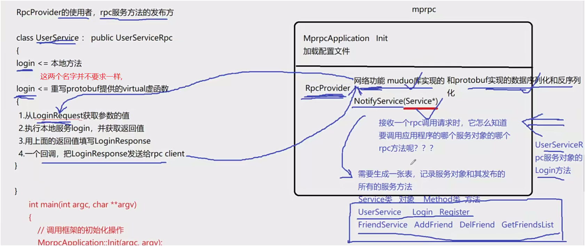

## RPC Provider的核心功能

- **已实现功能**：(run函数)
  - **网络模块**：基于Muduo库实现TCP服务器，处理网络数据收发（绿色部分）。
  - **事件循环与回调**：通过`onConnection`和`onMessage`回调处理连接和消息。
- **待实现功能**（黄色部分）：
  - **服务方法注册与映射**：通过`NotifyService`记录服务对象及其方法，供远程调用时定位。

## RPC Provider 网络模块实现

- 利用 `muduo` 网络库，实现了 RPC Provider 的网络通信能力；
- 涉及 `TcpServer` 和 `EventLoop` 以及两个核心回调函数：
  - `onConnection`：新连接建立
  - `onMessage`：接收远程调用请求（字节流）

## RPC 服务方法的发布功能

> **目的：让使用者能够将本地服务对象的方法注册为远程可调用的 RPC 方法。**

### 框架提供的接口：

```
void notifyService(::google::protobuf::Service* service);
```

- 参数：是一个继承自 `protobuf::Service` 的指针；
- 使用者将自定义的服务类（如 `UserService`）传入，即可注册它的所有 RPC 方法。

## 角色说明

| 名称         | 说明                                              |
| ------------ | ------------------------------------------------- |
| `caller`     | RPC 的调用者（客户端）                            |
| `callee`     | RPC 的提供者（服务端）                            |
| `mprpc` 框架 | 提供 `mprpcApplication`、`RpcProvider` 等功能模块 |

> [!tip]
>
> 任何 分布式节点 都可能成为一个 rpc服务器---collee, 也可能 请求调用 其他rpc方法 --- coller 

## run函数的流程

**流程示例**（以`UserService::Login`为例）：

1. **接收请求**：RPC Provider通过网络模块接收字节流。
2. **反序列化**：Protobuf将数据解析为`LoginRequest`对象。
3. **方法调用**：框架查表找到`UserService`的`Login`方法并调用。
4. **处理响应**：用户代码填充`LoginResponse`，框架序列化后通过网络返回。


## `NotifyService`的作用

- **核心目标**：建立服务对象与方法调用的**映射表**，使框架能根据请求**调用正确的本地方法**。

- **记录服务对象**（如 `UserServiceRpc`）；

  **记录该服务对象中有哪些方法**（login、register 等）；

  **使用 protobuf 提供的反射接口**，获取：

  - service 名称；
  - 每个方法的名称；
  - 方法的编号 / 反射调用方式。

## 框架帮我们做了什么？

| 步骤       | 谁来做？                  | 作用                   |
| ---------- | ------------------------- | ---------------------- |
| 接收字节流 | 网络模块（muduo）         | 收到 RPC 请求          |
| 反序列化   | protobuf                  | 还原请求对象           |
| 定位方法   | 框架内部映射表            | 找到服务和函数         |
| 反射调用   | protobuf + 注册表         | 调用我们自己重写的逻辑 |
| 回传结果   | 框架负责序列化 + 网络发送 | 客户端接收结果         |

# RpcProvider发布服务方法(二)

## 实现 `RpcProvider::NotifyService`

## 为什么这样做（目的）：

- 将用户定义的 service 对象（如 `UserService`）注册到框架中。
- 框架后续通过 service 名和 method 名即可定位到具体的服务方法，实现远程调用。
- **抽象性设计原则**：框架不依赖具体业务类，仅依赖于 protobuf 的 `Service` 基类。

## 框架中处理服务的通用做法

- 使用 **`google::protobuf::Service`** 作为服务对象的基类指针。

- 利用 `protobuf` 的 **反射机制**（通过 descriptor 描述服务和方法），实现对服务对象的动态管理。

- ```c++
  // pb.h 里面 server的子类里
  static const ::PROTOBUF_NAMESPACE_ID::ServiceDescriptor* descriptor();
  
  ```

- 至于 这个 类型里 有什么, 点进去看即可 , 挺多的,  下面这个不全

- 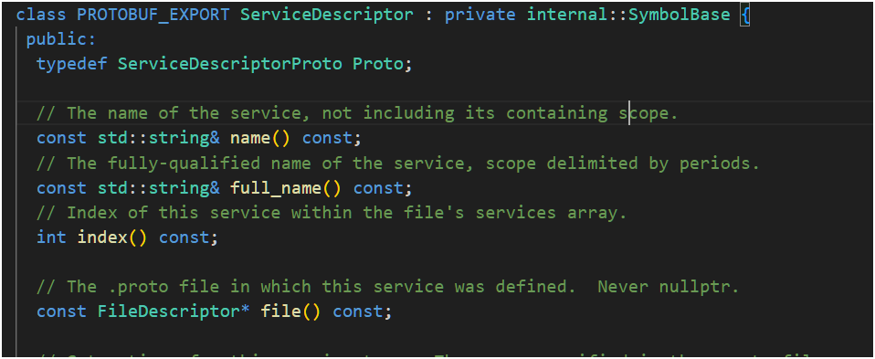

## 具体实现步骤（NotifyService 方法逻辑）

> 1. **获取服务描述信息**
>     使用 `service->GetDescriptor()` 得到服务的元数据，包括服务名称、方法个数等。
> 2. **提取服务名**
>     用 `descriptor->name()` 获取服务的唯一标识名（如 `UserServiceRpc`）。
> 3. **提取每个方法的描述信息**
>     通过循环 `descriptor->method(i)` 获取每个方法的 `MethodDescriptor`，记录方法名等。
> 4. **定义数据结构用于存储注册信息**
>     自定义一个 `ServiceInfo` 结构体：
>    - 包含一个服务对象指针 `Service*`.
>    - 包含一个 `unordered_map<string, const MethodDescriptor*>` 存储方法名与其描述对象的映射。
> 5. **维护全局服务映射表**
>     用 `unordered_map<string, ServiceInfo>`，键是服务名，值是该服务的所有信息（对象+方法表）。
> 6. **将服务及其方法插入映射表中**
>     完成注册，后续框架收到请求时即可根据服务名和方法名快速查找、调用对应的业务逻辑。

## 错误-1

> 不允许使用指向不完整类型 \"google::protobuf::ServiceDescriptor\" 的指针或引用

> 这个错误表明编译器在处理 `google::protobuf::ServiceDescriptor` 时认为它是一个**不完整类型**（incomplete type），即编译器看到了它的声明（比如前向声明），但没有看到完整的定义。这通常是因为缺少对应的头文件包含。

> ### **解决方法**
>
> \#include <google/protobuf/descriptor.h> // 这个头文件里有 ServiceDescriptor


## NotifyService实现

> [!important]
>
> 每个 `ServiceInfo` 记录一个服务及其所有方法.
>
> 整个**服务注册表**维护多个这样的服务信息，支持多服务统一管理。

```c++
服务注册表（map<string, ServiceInfo>）
└── "UserServiceRpc"  →  ServiceInfo
                        ├── service指针（UserServiceRpc*）
                        └── method_map（map<string, const MethodDescriptor*>）
                             ├── "Login"     → MethodDescriptor*
                             └── "Register"  → MethodDescriptor*
└── "FriendServiceRpc" → ServiceInfo
    ├── service_ptr: FriendServiceRpc*
    └── method_map
         ├── "AddFriend" → AddFriend 方法的描述符
         └── "GetList"   → GetList 方法的描述符

```

> 当你调用 `NotifyService(UserServiceRpc*)`：
>
> 1. **通过服务对象获取其描述信息（ServiceDescriptor）**。
> 2. 从描述信息中提取出：
>    - **服务名称**（如 "UserServiceRpc"）
>    - 每一个方法的：
>      - 方法名（如 "Login", "Register"）
>      - 输入参数类型（如 `LoginRequest`）
>      - 输出参数类型（如 `LoginResponse`）
>
> 

> 在 RPC 框架中，命名一般如下：
>
> ------
>
> ### 单个服务：**Service**
>
> 指的是一个具体的业务服务，比如 `UserService`、`OrderService`，通常是继承自 `google::protobuf::Service` 的类实例。它包含多个可以远程调用的方法（RPC 方法）。
>
> ### 所有服务的集合：**服务注册表（Service Registry）** 或 **服务映射表（Service Map）**

> ### **src/include/rpcprovider.h**
>
> ```c++
> // private 添加
> // service 服务类型信息----服务名及方法名
>     struct ServiceInfo
>     {
>         google::protobuf::Service *m_service; // 服务对象
>         std::unordered_map<std::string, const google::protobuf::MethodDescriptor *> m_methodMap; // 方法名和方法描述对象的映射关系
> 
>     };
>     
>     // 存储服务对象的容器
>     std::unordered_map<std::string, ServiceInfo> m_serviceMap; // 服务名和服务对象的映射关系
> ```
>
> ### **src/rpcprovider.cc**
>
> ```c++
> // 这里是框架提供给外部使用的, 可以发布rpc方法的函数接口
> void RpcProvider::NotifyService(google::protobuf::Service *server)
> {
>     ServiceInfo service_info; // 服务对象信息
> 
>     // 获取服务对象描述信息---- 去看看 pb.h 和 pb.cc 这个接口, 是const!!
>     const google::protobuf::ServiceDescriptor *pserviceDesc = server->GetDescriptor();  
> 
>     // 获取服务名称
>     std::string service_name = pserviceDesc->name(); // 获取服务名称
> 
>     std::cout << "service_name: " << service_name << std::endl;
>     
>     // 获取服务方法数量
>     int method_count = pserviceDesc->method_count(); // 获取服务方法数量
> 
>     // 获取服务对象指定下标的方法描述信息
>     for (int i = 0; i < method_count; ++i)
>     {
>         const google::protobuf::MethodDescriptor *pMethodDesc = pserviceDesc->method(i); // 获取服务对象指定下标的方法描述信息
> 
>         // 获取方法名称
>         std::string method_name = pMethodDesc->name(); // 获取方法名称
> 
>         service_info.m_methodMap.insert({method_name, pMethodDesc}); // 将方法名称和方法描述对象的映射关系存入容器
> 
>         std::cout << "method_name: " << method_name << std::endl;
>     }
>     service_info.m_service = server; // 将服务对象存入容器
>     // 将服务名称和服务对象存入容器
>     m_serviceMap.insert({service_name, service_info}); 
> }
> 
> ```
>
> 

## 注意

> [!warning]
>
> `NotifyService`函数  每次 **只注册一个 服务**
>
> 想要**注册多个 服务**, 就要 **多次进行调用**
>
> ### 示例
>
> ```c++
> // 用户代码：注册多个服务
> UserServiceRpc user_service;
> OrderServiceRpc order_service;
> provider.NotifyService(&user_service); // 注册 UserService
> provider.NotifyService(&order_service); // 注册 OrderService
> ```

## 总结：为什么我们选择 Protocol Buffer 而不是 JSON

> 在网络通信中，**必须选用一种数据传输协议**来进行结构化数据的交换。不能直接传输原始的字节流或字符串，因为我们需要明确区分不同的**字段、类型和结构**，这就需要一种标准化的“数据格式”。
>
> #### 常见的选择：
>
> - **XML**：过于冗长、效率低，已经很少使用。
> - **JSON**：结构清晰，易于阅读，学习成本低，**但效率偏低**。
> - **Protocol Buffer（Protobuf）**：谷歌开发的高效二进制序列化协议。
>
> #### JSON 和 Protobuf 的对比：
>
> | 项目          | JSON                 | Protobuf                            |
> | ------------- | -------------------- | ----------------------------------- |
> | 存储格式      | 文本（可读性好）     | 二进制（效率高）                    |
> | 序列化性能    | 较慢                 | 非常快                              |
> | 传输体积      | 大（包含键名）       | 小（紧凑、无额外字段名）            |
> | 类型系统      | 弱类型（依赖解析库） | 强类型（.proto 明确定义）           |
> | 支持 RPC 方法 | 不支持               | 支持 Service 定义和方法描述（gRPC） |
>
> 
>
> #### 为什么 Protobuf 更适合 RPC 场景：
>
> - 它不仅提供数据结构的序列化与反序列化功能（像 JSON 一样），
> - **还支持对服务（service）和方法（rpc method）的描述**，可以用于自动生成代码、进行远程调用处理（这是 JSON 无法做到的）。
>
> 因此，在构建聊天服务器等高性能通信系统时，我们**更倾向于使用 Protobuf** 而不是 JSON，尤其是在服务之间通过 RPC 调用的场景下，它能极大提升效率与可维护性。


# RpcProvider分发rpc服务(一)

## 本节课任务

**完成proto的反序列化**

完成 RPC 框架中 Provider 端的 **`onMessage`** 方法，实现：

1. 从网络接收 RPC 请求数据；
2. 解析出请求的目标服务、方法名、参数；
3. 找到对应方法并调用；
4. 返回结果给 Client。


## 回顾

- `notifyService()` 中已将用户发布的服务和方法注册进 Map 中（类比于“服务表”）。
- `run()` 方法完成了网络监听和服务启动。
- `onConnection()`：短连接模型下，当断开连接时关闭 socket（`shutdown(fd, SHUT_RDWR)`）。

## onMessage 中要做什么？

收到的数据本质是一个字符流（字节流），必须：

1. **拆包**：防止 TCP 粘包；
2. **反序列化**：根据协议提取出 `serviceName`、`methodName` 和 `args`；
3. **查找目标方法并调用**；
4. **序列化响应并返回给 Client**。

## 理解流程-不要混

```c++
【客户端】                              【服务端】

RPCStub::login()                        onMessage()
    ↓                                      ↓
序列化：方法名+参数            <-----   收到字节流
    ↓                                      ↓
通过 TCP 发出请求              ----->   提取数据(Buffer)
                                           ↓
                                   RPC框架反序列化
                                           ↓
                                 映射到本地的 login()
                                           ↓
                                 执行并获取返回值
                                           ↓
                                 序列化返回值，send()

```

> [!important]
>
> **RPC** 是目的，**Muduo** 是网络通信框架，**onMessage** 是 Muduo 中处理收到消息的“钩子函数”，它帮我们解包网络数据，并触发 RPC 调用。

## 理解错误

> ### **序列化后的字符串 和 传输的字节流**
>
> 你发送的是**字符串（字节数组）**，网络传输的是**流（字节流）**，收到后要自己从**流中“分段”，提取成完整字符串**，再**反序列化还原数据**。
>
> muduo 中的 **conn->send()**  使得 **序列化后的 数据 以字节流** 传输
>
> 因此, `onmessage` 基本**第一步** 都是把 收到的**字节流 转为 字符串**, 然后 再反序列化----->
>
> ### **以json为例**
>
> ```c++
> {
>   "name": "Tom",
>   "age": 18
> }
> 
> ```
>
> ```c++
> // 序列化
> std::string jsonStr = "{\"name\":\"Tom\",\"age\":18}";
> 
> ```
>
> ```c++
> // 字节流
> 0x7b 0x22 0x6e 0x61 0x6d 0x65 0x22 0x3a 0x22 0x54 0x6f 0x6d 0x22 0x2c ...
> 
> ```
>
> ```c++
> // 再转字符串, 并 反序列化
> ```
>
> 

## 英语单词

> ###  **Customer（顾客）**
>
> ### **Consumer（消费者）**

## json vs proto反序列化

> ### 1. **Proto需要预定义数据结构**
>
> - **JSON**: 通常是动态的，不需要预定义数据结构，你可以直接使用字符串和数字等常见数据类型。
> - **Proto**: 使用 **proto 文件** 定义数据结构，所有的消息格式需要事先声明和编译生成相应的代码（例如 `.proto` 文件生成 C++、Java 或 Python 代码）。这意味着你**必须严格遵循定义好的消息结构**才能正确地进行序列化和反序列化。
>
> ### 2. **Proto生成代码**
>
> - **JSON**: 不需要生成任何代码，直接通过标准库（如 `nlohmann/json`、`rapidjson`）进行处理。
> - **Proto**: 需要用 **protoc** 编译器将 `.proto` 文件转换为特定语言的类。这些类中会包含生成的 getter 和 setter 方法来访问字段。
>
> ### 3. **数据反序列化过程**
>
> - **JSON**: 在反序列化时，直接通过 JSON 库将字符串转为 JSON 对象，通常代码简洁。---- `json::parse(recvBuf);`
> - **Proto**: 反序列化时，需要将字节流（例如，网络传输的消息）解析为特定的 protobuf 对象。这个过程稍微复杂一些，通常涉及到对序列化数据流的解析，调用 `ParseFromString` 或类似的方法。
>
> ### 4. **数据格式**
>
> - **JSON**: 是文本格式，便于阅读和调试，但占用空间相对较大。
> - **Proto**: 是二进制格式，具有更高的性能和更小的消息体积，但不容易直接读取和调试。


## 数据头

> ### json也可以 数据头
>
> ```c++
> #include <iostream>
> #include <nlohmann/json.hpp>
> 
> using json = nlohmann::json;
> 
> struct Header {
>     std::string message_type;
>     size_t message_length;
>     int checksum;
>     std::string protocol_version;
> };
> 
> struct Message {
>     Header header;
>     json body;
> };
> 
> int main() {
>     // 构建 JSON 数据体
>     json body = {
>         {"userId", 1},
>         {"name", "Alice"},
>         {"age", 30}
>     };
> 
>     // 构建数据头
>     Header header = {
>         "Request",               // 消息类型
>         body.dump().size(),      // 消息体的长度
>         12345,                   // 校验和
>         "1.0"                    // 协议版本
>     };
> 
>     // 构建完整消息
>     Message message = { header, body };
> 
>     // 输出完整消息（仅示意）
>     std::cout << "Header:\n";
>     std::cout << "Message Type: " << message.header.message_type << "\n";
>     std::cout << "Message Length: " << message.header.message_length << "\n";
>     std::cout << "Checksum: " << message.header.checksum << "\n";
>     std::cout << "Protocol Version: " << message.header.protocol_version << "\n";
> 
>     std::cout << "\nBody:\n";
>     std::cout << message.body.dump() << std::endl;
> 
>     return 0;
> }
> 
> ```
>
> ### protobuf使用不太一样---具体看实现


## 粘包处理机制

> TCP 是流式协议，不能保证一次接收的数据就是一整包。为此我们必须：
>
> - 用固定长度（4字节）作为 header 长度标志；
> - 然后再根据这个长度去读取 header，再读取参数。
>
> ### **例子**
>
> 假设客户端连续发送了三个消息，每个消息的长度为 5 字节：
>
> ```
> Message 1: "Hello"
> Message 2: "World"
> Message 3: "Data"
> ```
>
> 然而，TCP 协议会将这些数据合并成一个连续的字节流进行传输，可能会变成如下形式（这仅是一个例子，实际数据可能更复杂）：
>
> ```
> HelloWorldData
> ```
>
> 接收方收到的就是一个连续的数据流：“HelloWorldData”，无法直接知道哪个部分属于哪个消息。


## 为什么不用“加竖杠分隔字符串”的做法？

> ## 上不了 台面的 玩意儿!!  太勾八垃圾了

因为：

- 不规范、性能差；
- 不支持嵌套结构；
- 不可扩展；
- 容易出错；
   正确做法是采用 protobuf 作为**结构化序列化协议**，明确字段类型和结构。


## proto反序列化

> ### **自定义协议设计（数据格式）**
>
> RPC Client 与 RPC Server 之间使用自定义协议通信。**数据格式如下**：
>
> ```
> [4字节 header size][header 字符串][args 字符串]
> ```
>
> - **header size**：4 字节整数（使用二进制形式存储，不能转字符串！）
> - **header 字符串**：使用 **protobuf 定义**的 `RpcHeader`，包含：
>   - `service_name`
>   - `method_name`
>   - `args_size`（参数部分的字符串长度）
> - **args 字符串**：参数 message 的序列化结果
>
> ### 示例
>
> | 内容类型 | 十六进制内容          | 含义                                                    |
> | -------- | --------------------- | ------------------------------------------------------- |
> | 头部长度 | `0x00 0x00 0x00 0x12` | 18 字节，表示**后面数据头部分**长度为 18 字节           |
> | 数据头   | `{"method":"Chat"}`   | 一个 JSON 字符串，18 字节，表示调用的 RPC 方法名是 Chat |
> | 消息体   | `"hello world"`       | 实际发送的消息内容                                      |


## Proto 实现

```
syntax = "proto3";
package mprpc;

message RpcHeader {
  string service_name = 1;
  string method_name = 2;
  uint32 args_size = 3;
}
```

生成对应 `.pb.h`、`.pb.cc` 后在 `onMessage` 中使用。


## 数据处理流程总结（onMessage 中）

> 一个 char 占用 1个字节(8bit)
>
> string 每个字符 就是一个字节
>
>  `std::string[index]` 操作的是字节

> ### **这是整个流程, 本节课仅完成 前三个步骤**
>
> 1. **读取前 4 字节** ➜ 得到 header 的长度；   ----- **这个长度 不能用字符串, 因为长度 就不固定了!!! "10"  "10000"**
> 2. **读取 header 字符串** ➜ `RpcHeader::ParseFromString()` 得到 service/method/args_size；
> 3. **读取 args 部分** ➜ 根据 args_size 读取参数字符串；
> 4. **从 map 中查找 service 对象**；
> 5. **通过 method_name 查找 MethodDescriptor**；
> 6. **调用 `CallMethod()` 执行目标服务逻辑**；
> 7. **将响应结果 serialize 成字符串，通过 TCP 发回 client**。

## 对protobuf字节流的理解-不一定对

> ## **重点理解**
>
> 在写好 proto 文件后, 就有了 类似于键值对的 东西, 但是 protobuf 自动完成了封装, 也就是 message类, 使用标签 就可以知道 是哪个字段
>
> 使用时, 就相当于  是是用类, 定义一个 message 对象, 进行 set_字段 赋值
>
> 序列化后 `SerializeToString`, 可能变为了 `标签:值`这样的, 1:name 2:pwd
>
> 传输可能就是  这么传输
>
> 然后 反序列化 `ParseFromString`后, 使用`.字段()` 就能直接拿到值, 这在内部 protobuf 本身进行了封装, 使得 调用 直接就拿到了 **值**


## onmessage实现-部分

**src/rpcprovider.cc**

```c++
#include "rpcheader.pb.h" // 这个头文件里有 RpcHeader


/*
在框架内部, rpcprovider 和 rpcconsumer 协商好 之间的协议, 约定好数据的格式
service_name method_name args     
UserServiceLoginzhang san123456   传这样的 肯定不行,需要拆分
定义 proto 的 message 类型, 进行 数据头的 序列化和 反序列化\

加上头部长度
16UserServiceLoginzhang san123456 
16 4个字节的头部长度
从 4个子节后 取出 16
UserServiceLoginzhang san123456
*/


// 实现消息回调函数
// 已建立连接用户的 读写事件回调, 如果远程有 rpc服务的 调用请求, 那么onMessage 就会被调用
void RpcProvider::OnMessage(const muduo::net::TcpConnectionPtr &conn, // 消息回调函数
                            muduo::net::Buffer *buffer,
                            muduo::Timestamp time)
{
    // 网络上接收的远程rpc调用请求的字符流  
    std::string recv_buf = buffer->retrieveAllAsString(); // 获取接收的字符流

    uint32_t header_len = 0; // 定义头部长度
    recv_buf.copy((char *)&header_len, 4, 0); // 本项目 自定义 是 4个字节的头部长度

    // 根据头部长度, 获取到数据头的内容 
    // recv_buf 是一个字符串, 头部长度是4个字节, 所以从第4个字节开始, 取header_len长度的内容
    std::string rpc_header_str = recv_buf.substr(4, header_len);
    // 反序列化数据, 得到rpc请求的 详细信息

    mprpc::RpcHeader rpc_header; // 定义rpc请求头对象
    std::string service_name; // 定义服务名称
    std::string method_name; // 定义方法名称
    uint32_t args_size = 0; // 调用方法所要的参数大小
    if(rpc_header.ParseFromString(rpc_header_str)) // 反序列化数据, 得到rpc请求的 详细信息
    {
        rpc_header.service_name(); // 获取服务名称
        service_name = rpc_header.service_name(); // 获取服务名称
        method_name = rpc_header.method_name(); // 获取方法名称
    }
    else
    {
        std::cout << "rpc_header parse error" << std::endl;
        return;
    }

    // 获取 rpc的方法参数 的字符流数据
    std::string args_str = recv_buf.substr(4 + header_len, recv_buf.size() - 4 - header_len); // 获取方法参数的字符流数据
    
    // 打印调试信息
    std::cout<<"============================="<<std::endl;
    std::cout<<"header_len: "<<header_len<<std::endl;
    std::cout<<"rpc_header_str: "<<rpc_header_str<<std::endl;
    std::cout<<"service_name: "<<service_name<<std::endl;
    std::cout<<"method_name: "<<method_name<<std::endl;
    std::cout<<"args_size: "<<args_str.size()<<std::endl;
    std::cout<<"args_str: "<<args_str<<std::endl;
    std::cout<<"============================="<<std::endl;

}

```

## 总结

本节完成 **proto 和 onmessage 实现**

## 小技巧：读取定长二进制整数--暂时还没遇到问题

C++ 里读取头部 4 字节为整数的方法（假设 buffer 是 std::string）：

```
uint32_t header_size = 0;
memcpy(&header_size, recv_str.data(), sizeof(uint32_t));
```

注意字节序问题（本地是小端序）——视项目需求是否使用 `ntohl()`。

# RpcProvider分发rpc服务(二)

## 回顾

> 网络层接收到的内容是经过序列化的 RPC 请求字符流（例如 TCP 字节流）。
>
> 通过解析 反序列化 字符流，得到：
>
> - `service_name`
> - `method_name`
> - 参数序列化内容 `args_str`

## 回顾一下服务注册表结构

> ```c++
> 服务注册表（map<string, ServiceInfo>）
> └── "UserServiceRpc"  →  ServiceInfo
>                         ├── service指针（UserServiceRpc*）
>                         └── method_map（map<string, const MethodDescriptor*>）
>                              ├── "Login"     → MethodDescriptor*
>                              └── "Register"  → MethodDescriptor*
> └── "FriendServiceRpc" → ServiceInfo
>     ├── service_ptr: FriendServiceRpc*
>     └── method_map
>          ├── "AddFriend" → AddFriend 方法的描述符
>          └── "GetList"   → GetList 方法的描述符
> 
> ```
>
> 跟着这个 去 查找 访问 调用 .
>
> ### **这个图 在 onmessage 和 notifuservice 很重要**


## 完善onmessage步骤


## **查找 collee 有没有 coller 需要的 服务和方法**

查找 `service_map` 中是否存在该服务对象：

- 若服务不存在，直接返回，输出错误日志。

从 `it->second.methodMap` 中查找具体方法

```c++
auto it = m_serviceMap.find(service_name); // 查找服务名称
if (it == m_serviceMap.end())              // 如果服务名称不存在
{
    std::cout << "service_name: " << service_name << " not exist" << std::endl;
    return;
}

auto mit = it->second.m_methodMap.find(method_name); // 查找方法名称
if (mit == it->second.m_methodMap.end())             // 如果方法名称不存在
{
    std::cout << "method_name: " << method_name << " not exist" << std::endl;
    return;
}

// 获取服务对象  new UserService
google::protobuf::Service *service = it->second.m_service; 

// 获取方法描述对象 Login
const google::protobuf::MethodDescriptor *method = mit->second;
```


## **request和response**

#### **查看collee提供的rpc服务**

Login 需要 中间两个参数

```c++
void Login(::google::protobuf::RpcController* controller, 
        const ::hzhrpc::LoginRequest* request,
        ::hzhrpc::LoginResponse* response,
        ::google::protobuf::Closure* done)
```

```c++
const ::hzhrpc::LoginRequest* request============> 继承自基类指针
    vs
google::protobuf::Message *request ================> 基类指针


```

```c++
message LoginRequest
{
}

// proto编译后
class LoginRequest : public ::google::protobuf::Message{}

```

> [!tip]
>
> 从**派生类指针向基类指针转换**是合法的，这是 C++ 的基础语法特性，称为 **上行转换（upcasting）**。---c++基础笔记有


## 错误及知识

## **`service->GetRequestPrototype`正确生成派生类对象**

> > [!warning]
> >
> > google::protobuf::Message 是 抽象类
> >
> > **抽象类不能被实例化!!!** 
>
> ```c++
> google::protobuf::Message *request;   // 错的  空指针
> google::protobuf::Message request;   // 错的   被实例化了
> 
> // request = new google::protobuf::Message; // 错误：不能实例化抽象类
> ptr = new ConcreteClass; // 正确：指向实现了所有纯虚函数的派生类对象
> ```
>
> 这个 request **只是一个未初始化的指针**，**没有指向任何有效对象**，你不能调用 ParseFromString()，程序会崩溃（野指针解引用）。
>
> ## **service->GetResponsePrototype(method).New()**
>
> 类似于 ptr = new ConcreteClass; // 正确：指向实现了所有纯虚函数的派生类对象
>
> `google::protobuf::Message *request = service->GetRequestPrototype(method).New();`
>
> ## **基类指针**
>
> > [!important]
> >
> > **仍然是基类指针**，但它指向派生类对象，因此可以触发多态行为。


## 反序列化数据

```c++
// 生成rpc方法调用的 request和response对象
// 用于 从 request对象中获取参数 传给collee的本地业务--并不知道proto文件message类型指针, 所以用基类 指针 代替
google::protobuf::Message *request = service->GetRequestPrototype(method).New(); // New 是 生成一个新对象 

if(!request->ParseFromString(args_str)) // 反序列化数据, 得到rpc请求的 详细信息
{
    std::cout << "request parse error" << std::endl;
    return;
}


// collee的本地业务 需要将结果返回给response对象
google::protobuf::Message *response = service->GetResponsePrototype(method).New(); 
```


## 调用具体服务方法CallMethod

```
service->CallMethod(method, nullptr, request, response, done);
```

- `method`: 方法描述符
- `nullptr`: 暂时不用 `RpcController`
- `request`: 反序列化后的参数
- `response`: 框架生成的空响应对象
- `done`: 回调函数（用于发送响应）-- 需要自己完成函数

## 构造回调 done ：发送 RPC 响应

> ### 回调函数用处
>
> **Closure 机制**：使用 `Closure` 让框架可以灵活控制调用完成后的后续操作，比如发送响应、写日志、处理错误等。
>
> ### 使用 自带的 `google::protobuf::NewCallback` 构造一个回调对象，例如：
>
> ```c++
>  google::protobuf::Closure* done = google::protobuf::NewCallback<YourClass, TcpConnectionPtr, google::protobuf::Message*>(
>     this, &YourClass::SendRpcResponse, conn, response);
> ```
>
> 
>
> ### 下节课完成!!


# RpcProvider的rpc响应回调函数

## 回调函数的绑定
> - RPC Provider 的回调函数是一个普通方法，需要绑定到对象上。
> - 使用 `NewCallback` 方法绑定回调函数，传入以下参数：
>   1. `this`：当前对象。
>   2. 回调方法的地址（如 `SendRpcResponse`）。
>   3. 回调方法的两个参数：`TCPConnection` 和 `Message`。
>
> ### **NewCallback**函数
>
> ```c++
> inline Closure* NewCallback(Class* object, void (Class::*method)(Arg1, Arg2),
>                             Arg1 arg1, Arg2 arg2) {
>   return new internal::MethodClosure2<Class, Arg1, Arg2>(
>     object, method, true, arg1, arg2);
> }
> ```
>
> ### 错误
>
> 注意上面 函数原型返回值
>
> **模板类型参数 要指明!!!**
>
> 


## 编译错误分析与解决

- **问题描述**：
  - 编译报错：`error: no matching function for call to ...`。
  - 原因是 `NewCallback` 的模板类型推导失败，导致参数类型不匹配。
  - 具体表现为：
    - 函数指针的第二个参数类型是 `google::protobuf::Message*`。
    - 传入的参数类型是 `google::protobuf::Message*&`（指针的引用）。
- **解决方法**：
  - 显式指定模板类型参数，避免模板推导错误。
  - 指定模板类型为：
    1. 当前对象类型（如 `RpcProvider`）。
    2. 回调方法的参数类型（如 `const muduo::net::TcpConnectionPtr&` 和 `google::protobuf::Message*`）。

## 命名空间问题
- **问题描述**：
  - 编译报错：`identifier 'TCPConnectionPtr' is undefined`。
  - 原因是缺少命名空间前缀。
- **解决方法**：
  - 在类型前添加命名空间（如 `muduo::net::TCPConnectionPtr`）。

## 回调函数的作用
- 回调函数的**主要功能：**
  1. 将响应对象序列化为字符串。
  2. 通过网络发送序列化后的响应数据。
  3. **模拟 HTTP 短连接**，由 RPC Provider 主动断开连接。

## 序列化与发送响应
- **序列化**：
  - 使用 `SerializeToString` 方法将响应对象序列化为字符串。
  - 如果序列化失败，打印错误日志。
- **发送响应**：
  - 使用 `connection->send` 方法将序列化后的字符串发送给 RPC 调用方。
  - 发送完成后，主动断开连接。

## RPC Provider 的功能总结
- **主要功能**： 
  1. **服务注册**：通过 `NotifyService` 注册服务对象和方法。
  2. **启动服务**：通过 `Run` 方法启动 RPC 服务，监听客户端连接。
  3. **处理请求**：通过 `onMessage` 方法接收并解析 RPC 请求。
  4. **发送响应**：通过 `SendRpcResponse` 方法将结果返回给调用方。
- **实现方式**：
  - 借助 Muduo 网络库实现高效的网络通信。
  - 使用 Protobuf 进行数据的序列化和反序列化。
  - 通过回调机制动态调用服务方法。

## 代码量与效率
- 总代码量约 180 行，完成了完整的 RPC 服务发布功能。
- 借助 Muduo 和 Protobuf，大幅减少了代码量，提高了开发效率。


- 

# RpcChannel的调用过程

## RPC服务端（Provider）回顾

- RPC服务端通过`RpcProvider`类生成服务节点，处理客户端请求。
- 请求处理流程：
  1. 从网络接收字符流数据（通过`onMessage`回调）。
  2. 反序列化字符流，解析出`service_name`、`method_name`和参数。
  3. 动态生成`request`和`response`消息。
  4. 通过`service->CallMethod`调用具体的RPC方法（由protobuf生成的服务类实现）。

## RpcChannel是什么--**重点**

**Channel 是客户端与服务端之间的连接抽象，负责网络通信。**

- 可以把 `Channel` 看成客户端与服务器之间的一条“管道”。
- 所有的 RPC（远程过程调用）都是通过这个 `Channel` 发起的。
- gRPC 客户端使用 `Channel` 来向指定的服务器地址发送请求。

```c++
客户端代码 --> stub（由 protobuf 生成） --> Channel --> 网络 --> 服务端

stub 使用 protobuf 定义的方法和数据结构
Channel 负责建立连接和发送请求

```


## RPC客户端（Caller）实现关键-桩类

> ### 客户端调用（Consumer）通过 RpcChannel 发起调用
>
> 客户端使用 `.proto` 生成的 `xxxService_Stub` 类对象（stub 类），这类对象的每个方法调用都**会转发到底层**的 `RpcChannel::CallMethod` 方法。
>
> 你需要传入一个实现了 `RpcChannel` 的派生类对象。
>
> ### 结合源码看
>
> 这是之前rpc服务的proto
>
> ```c++
> service UserServiceRpc {
>     rpc Login(LoginRequest) returns (LoginResponse);
> }
> ```
>
>  **桩类 构造函数** 如下:
>
> ```c++
> UserServiceRpc_Stub(::PROTOBUF_NAMESPACE_ID::RpcChannel* channel);
> ```
>
> 其内部的 **Login 方法**实现如下:--要调用的
>
> ```c++
> void UserServiceRpc_Stub::Login(::PROTOBUF_NAMESPACE_ID::RpcController* controller,
>                               const ::hzhrpc::LoginRequest* request,
>                               ::hzhrpc::LoginResponse* response,
>                               ::google::protobuf::Closure* done) {
>   channel_->CallMethod(descriptor()->method(0),
>                        controller, request, response, done);
> }
> ```
>
> ### 注意,最终全部**转到channel的callmethod**上
>
> ### 调用方发送后会进入**wait状态**, 等待回应----看理论图
>
> ### **RpcChannel**不能直接用, 是个抽象类--**需要自行实现**
>
> ### **example/caller/calluserservice.cc**
>
> ```c++
> // 示例, 不能用, 伪代码
> #include <iostream>
> #include "mprpcapplication.h"
> #include "user.pb.h"
> 
> int main(int argc, char* argv[])
> {
>     // 1. 初始化框架----必须的, 但只初始化一次
>     MprpcApplication::Init(argc, argv);
> 
>     hzhrpc::UserServiceRpc_Stub stub(RpcChannel); // 创建rpc服务对象
>     stub.Login(); // rpcchannel->rpcchannel::callMethod 集中来做所有rpc方法调用的参数序列化和网络发送
> 
>     return 0;
> }
> ```
>
> 


## rpc服务端和客户端, 都要进行一次 rpc初始化吗?

> ### 是的，**无论是 RPC 服务端（Provider）还是客户端（Caller / Consumer）**，**都需要进行一次 RPC 框架的初始化**。
>
> ### 为什么服务端要初始化？
>
> 服务端需要：
>
> - 读取配置文件（如监听 IP、端口号等）
> - 启动 RPC 服务监听（例如 `start()` 方法）
> - 注册本地的业务 service 到框架中，供客户端调用
> - 初始化与 ZooKeeper 等注册中心的连接（如果使用）
>
>  所以服务端必须初始化框架，否则无法发布服务、监听请求。
>
> ### 为什么客户端也要初始化？
>
> 客户端需要：
>
> - 读取配置文件（如服务发现地址、**ZooKeeper 地址**等） **配置文件有这个, 所以初始化进行读取**----具体实现后面讲
> - 初始化网络组件，准备向服务端发起请求
> - 构造 RPC 通道（`RpcChannel`），发起远程调用
> - 实现服务发现：根据服务名从注册中心获取 IP + 端口
>
>  所以客户端同样需要初始化，否则你构造的 `RpcStub` 和 `RpcChannel` 都无法正常工作。
>
> | 角色       | 是否需要初始化 | 原因                                   |
> | ---------- | -------------- | -------------------------------------- |
> | RPC 服务端 | 是             | 用于启动监听、注册服务、连接注册中心等 |
> | RPC 客户端 | 是             | 用于读取配置、服务发现、准备网络通信等 |


## `RpcChannel`的核心作用

- **调用流程**：
  1. 客户端通过`UserServiceRpc_Stub`调用RPC方法（如`Login`）。
  2. `Stub`将所有调用转发到`RpcChannel`的`CallMethod`方法。
  3. `CallMethod`统一处理：-- **重点**
     - 参数序列化。
     - 网络发送（同步阻塞等待响应）。
     - 响应反序列化并返回结果。

## **`RpcChannel`的实现**：-不完整

- 继承`google::protobuf::RpcChannel`，**重写`CallMethod`**。
- 在`CallMethod`中完成数据的序列化、网络通信和响应处理。

> ### **src/include/mprpcchannel.h**
>
> ```c++
> #pragma once
> 
> #include <google/protobuf/service.h>
> 
> class MpRpcChannel : public google::protobuf::RpcChannel
> {
> public:
>     // 重写父类的函数
>     // 所有通过stub代理对象调用的rpc方法, 都会走到这里, 统一做rpc方法调用的数据序列化和网络发送
>     void CallMethod(const google::protobuf::MethodDescriptor *method,
>                     google::protobuf::RpcController *controller,
>                     const google::protobuf::Message *request,
>                     google::protobuf::Message *response,
>                     google::protobuf::Closure *done) override;
> 
> private:
> };
> 
> ```
>
> ### **src/mprpcchannel.cc**
>
> ```c++
> #include "mprpcchannel.h"
> 
> // 重写
> void MpRpcChannel::CallMethod(const google::protobuf::MethodDescriptor *method,
>                               google::protobuf::RpcController *controller,
>                               const google::protobuf::Message *request,
>                               google::protobuf::Message *response,
>                               google::protobuf::Closure *done)
> {
>     
> }
> ```
>
> ### caller的cmakelist自行添加


# 实现rpc方法的调用过程(一)


## 代理对象的创建与调用
>    - 创建一个**代理对象(stub)**，传入实现了`RpcChannel`抽象类的对象。
>    - 调用RPC方法时，**传递必要的参数**，包括`Controller`、`Request`、`Response`和`Done`（通常为空）。
>    - 这段 仅是 逻辑, 实际的 channel 还没有写
>
> > [!important]
> >
> > `Stub`将所有调用转发到`RpcChannel`的`CallMethod`方法
> >
> > 不要忘记这个!!!
>
> **example/caller/calluserservice.cc**
>
> ```c++
> int main(int argc, char* argv[])
> {
>     // 1. 初始化框架----必须的, 但只初始化一次
>     MprpcApplication::Init(argc, argv);
> 
>     hzhrpc::UserServiceRpc_Stub stub(new MpRpcChannel()); // 创建rpc服务对象
>     hzhrpc::LoginRequest request; // 创建请求对象
>     request.set_name("xing huai"); // 设置请求参数
>     request.set_pwd("123456"); // 设置请求参数
> 
>     hzhrpc::LoginResponse response; // 创建响应对象
>     
>     stub.Login(nullptr, &request, &response, nullptr); // rpcchannel->rpcchannel::callMethod 集中来做所有rpc方法调用的参数序列化和网络发送
> 
>     // 此时, stub.Login()方法已经返回, response对象中已经有了值
>     if(response.result().errcode() == 0)  // proto生成的messgae成员, 想访问得是函数 
>     {
>         std::cout << "login success" << std::endl;
>     }
>     else
>     {
>         std::cout << "login failed, errcode: " << response.result().errcode() << ", errmsg: " << response.result().errmsg() << std::endl;
>     }
> 
>     return 0;
> }
> 
> ```


## 请求与响应的处理-channel实现
>    - 构造请求对象并设置参数，例如用户名和密码。
>    - 构造响应对象，用于接收远程调用的结果。
>    - 发起RPC调用，通过`RpcChannel`的`CallMethod`方法完成**序列化、网络发送、等待响应**等操作。
>
> ### CallMethod的方法名的传递路径：
>
> ```
> 客户端调用 stub->MyRpcMethod()
>      ↓
> stub 内部调用 CallMethod()，传入 method_descriptor（包含方法名）
>      ↓
> Channel 使用方法名和参数，序列化成 protobuf 消息
>      ↓
> 通过网络发送给服务器
>      ↓
> 服务器根据方法名调度到对应服务逻辑
> 
> ```
>
> ### 从源码角度
>
> ```c++
> static const google::protobuf::ServiceDescriptor *hzhrpc::UserServiceRpc::descriptor()
> ```
>
> 里面 有
>
> ```c++
> inline const google::protobuf::MethodDescriptor *google::protobuf::ServiceDescriptor::method(int index) const
> ```
>
> 可以直接根据索引找到 rpc 方法, 并且, 这个 index 是在proto编译时, 自己就会填上, 无序关注 
>
> 
>
> 因此, **在实现callmethod时, method 参数 已经给好了, 直接用就行** 
>
> 
>
> ### 为什么不直接用 `method->name()`？
>
> 因为 **方法名可能重复**，不同服务中可以有同名方法，例如：
>
> ```
> service UserService {
>   rpc Login(...);
> }
> 
> service AdminService {
>   rpc Login(...);
> }
> ```
>
> ### 所以需要：
>
> ```
> method->service()->name()  // 获取服务名
> method->name()             // 获取方法名
> ```
>
> 合在一起构造 `"UserService.Login"`，这样才能 **唯一标识要调用的方法**，服务器才能正确路由。
>
> ------
>
> 简而言之：
>  **`服务名 + 方法名` 才能唯一标识 RPC 方法，不能只用 `method->name()`。**
>
> > [!tip]
> >
> > 知识补充
> >
> > #### rpc调用端组织字符串使用 **insert -- 能插入二进制数据!!--重点**
> >
> > #### rpc服务端接受请求字符串使用 copy
>
> 
>
> ### 序列化与数据组织
>
>    - 请求头的格式包括：`header size`、`service name`、`method name`、`args size`和具体的`args`数据。
>    - 使用序列化方法将请求头和参数序列化为字符串。
>    - 将序列化后的数据组织成一个完整的RPC请求字符串，准备通过网络发送。
>
> ### 网络通信--类似于客户端,写一个简单的tcp即可
>
>    - 使用TCP编程完成RPC调用的网络部分：
>      - 创建Socket。
>      - 设置远程服务器的IP地址和端口号。
>      - 连接服务器并发送序列化后的请求数据。
>
> 

```c++
void MpRpcChannel::CallMethod(const google::protobuf::MethodDescriptor *method,
                              google::protobuf::RpcController *controller,
                              const google::protobuf::Message *request,
                              google::protobuf::Message *response,
                              google::protobuf::Closure *done)
{
    const google::protobuf::ServiceDescriptor *service = method->service(); // 获取该方法对应的 服务

    std::string service_name = service->name(); // 获取服务名称
    std::string method_name = method->name(); // 获取方法名称

    // 获取请求参数的 序列化后的 字符串的长度
    uint32_t args_size = 0; // 获取请求参数的序列化字符串的长度
    std::string args_str; // 请求参数序列化后的字符串

    if(!request->SerializeToString(&args_str)) // 将请求参数序列化为字符串
    {
        // 序列化失败
        std::cout << "request serialize error" << std::endl;
        return;
    }
    else
    {
        args_size = args_str.size(); // 获取请求参数的序列化字符串的长度
    }

    // 定义rpc请求头header
    mprpc::RpcHeader rpc_header; // 定义rpc请求头
    rpc_header.set_service_name(service_name); // 设置服务名称
    rpc_header.set_method_name(method_name); // 设置方法名称
    rpc_header.set_args_size(args_size); // 设置请求参数的序列化字符串的长度

    std::string rpc_header_str; // 定义rpc请求头的字符串
    uint32_t header_len = 0; // 获取rpc请求头的长度
    if(!rpc_header.SerializeToString(&rpc_header_str)) // 将rpc请求头序列化为字符串
    {
        // 序列化失败
        std::cout << "rpc_header serialize error" << std::endl;
        return;
    }
    else
    {
        header_len = rpc_header_str.size(); // 获取rpc请求头的长度
    }

    // 组织待发送的 rpc 请求字符串
    std::string send_rpc_str; // 定义待发送的字符串
    send_rpc_str.insert(0, (const char *)&header_len, sizeof(uint32_t)); // 插入头部长度
    send_rpc_str += rpc_header_str; // 插入rpc请求头
    send_rpc_str += args_str; // 插入请求参数的序列化字符串

    // 打印调试信息
    std::cout<<"============================="<<std::endl;
    std::cout<<"header_len: "<<header_len<<std::endl;
    std::cout<<"rpc_header_str: "<<rpc_header_str<<std::endl;
    std::cout<<"service_name: "<<service_name<<std::endl;
    std::cout<<"method_name: "<<method_name<<std::endl;
    std::cout<<"args_size: "<<args_size<<std::endl;
    std::cout<<"args_str: "<<args_str<<std::endl;
    std::cout<<"============================="<<std::endl;
    
    ...
}
```


# 实现rpc方法的调用过程(二)

## 进行简单的tcp连接


## 回顾string初始化

知识补充


## 完整channel

**src/mprpcchannel.cc**

```c++
#include "mprpcchannel.h"
#include "google/protobuf/descriptor.h"
#include <google/protobuf/message.h>
#include "rpcheader.pb.h"

#include <unistd.h>
#include <sys/types.h>
#include <sys/socket.h>
#include <netinet/in.h>
#include <arpa/inet.h>
#include <errno.h>

#include "mprpcapplication.h"


/*
服务端收到的数据格式为:
header_size + service_name + method_name + args_size + args
*/
// 重写
void MpRpcChannel::CallMethod(const google::protobuf::MethodDescriptor *method,
                              google::protobuf::RpcController *controller,
                              const google::protobuf::Message *request,
                              google::protobuf::Message *response,
                              google::protobuf::Closure *done)
{
    const google::protobuf::ServiceDescriptor *service = method->service(); // 获取该方法对应的 服务

    std::string service_name = service->name(); // 获取服务名称
    std::string method_name = method->name(); // 获取方法名称

    // 获取请求参数的 序列化后的 字符串的长度
    uint32_t args_size = 0; // 获取请求参数的序列化字符串的长度
    std::string args_str; // 请求参数序列化后的字符串

    if(!request->SerializeToString(&args_str)) // 将请求参数序列化为字符串
    {
        // 序列化失败
        std::cout << "request serialize error" << std::endl;
        return;
    }
    else
    {
        args_size = args_str.size(); // 获取请求参数的序列化字符串的长度
    }

    // 定义rpc请求头header
    mprpc::RpcHeader rpc_header; // 定义rpc请求头
    rpc_header.set_service_name(service_name); // 设置服务名称
    rpc_header.set_method_name(method_name); // 设置方法名称
    rpc_header.set_args_size(args_size); // 设置请求参数的序列化字符串的长度

    std::string rpc_header_str; // 定义rpc请求头的字符串
    uint32_t header_len = 0; // 获取rpc请求头的长度
    if(!rpc_header.SerializeToString(&rpc_header_str)) // 将rpc请求头序列化为字符串
    {
        // 序列化失败
        std::cout << "rpc_header serialize error" << std::endl;
        return;
    }
    else
    {
        header_len = rpc_header_str.size(); // 获取rpc请求头的长度
    }

    // 组织待发送的 rpc 请求字符串
    std::string send_rpc_str; // 定义待发送的字符串
    send_rpc_str.insert(0, (const char *)&header_len, sizeof(uint32_t)); // 插入头部长度
    send_rpc_str += rpc_header_str; // 插入rpc请求头
    send_rpc_str += args_str; // 插入请求参数的序列化字符串

    // 打印调试信息
    std::cout<<"============================="<<std::endl;
    std::cout<<"header_len: "<<header_len<<std::endl;
    std::cout<<"rpc_header_str: "<<rpc_header_str<<std::endl;
    std::cout<<"service_name: "<<service_name<<std::endl;
    std::cout<<"method_name: "<<method_name<<std::endl;
    std::cout<<"args_size: "<<args_size<<std::endl;
    std::cout<<"args_str: "<<args_str<<std::endl;
    std::cout<<"============================="<<std::endl;

    // 发送数据
    // 通过网络发送数据---不需要高并发, 相当于 客户端

    int clientfd = socket(AF_INET, SOCK_STREAM, 0); // 创建socket
    if(clientfd == -1) // 创建socket失败
    {
        std::cout << "client socket error" << std::endl;
        exit(EXIT_FAILURE);
    }

    // 获取配置文件对象
    MprpcConfig config = MprpcApplication::GetConfig(); // 获取配置文件对象
    std::string server_ip = config.Load("rpcserverip"); // 获取服务器ip
    uint16_t server_port = atoi(config.Load("rpcserverport").c_str()); // 获取服务器端口号

    // 设置服务器地址
    struct sockaddr_in server_addr; // 定义服务器地址
    memset(&server_addr, 0, sizeof(server_addr)); // 清空服务器地址
    server_addr.sin_family = AF_INET; // 设置地址族
    server_addr.sin_port = htons(server_port); // 设置端口号
    server_addr.sin_addr.s_addr = inet_addr(server_ip.c_str()); // 设置ip地址

    // 连接服务器
    if(connect(clientfd, (struct sockaddr *)&server_addr, sizeof(server_addr)) == -1) // 连接服务器失败
    {
        std::cout << "client connect error" << std::endl;
        close(clientfd); // 关闭socket
        exit(EXIT_FAILURE);
    }

    // 连接成功
    int len = send(clientfd, send_rpc_str.c_str(), send_rpc_str.size(), 0); // 发送数据
    if(len == -1) // 发送数据失败
    {
        std::cout << "client send error" << std::endl;
        close(clientfd); // 关闭socket
        exit(EXIT_FAILURE);
    }
    else if(len < (int)send_rpc_str.size()) // 发送数据不完整
    {
        std::cout << "client send incomplete" << std::endl;
        close(clientfd); // 关闭socket
        return; // 直接返回  结束一次 rpc调用
    }
    else
    {
        std::cout << "client send success" << std::endl;
        close(clientfd); // 关闭socket
        return; // 直接返回  结束一次 rpc调用
    }

    // 接收数据
    char buffer[1024] = {0}; // 定义接收缓冲区
    memset(buffer, 0, sizeof(buffer)); // 清空接收缓冲区
    int recv_len = recv(clientfd, buffer, sizeof(buffer), 0); // 接收数据
    if(recv_len == -1) // 接收数据失败
    {
        std::cout << "client recv error" << std::endl;
        close(clientfd); // 关闭socket
        exit(EXIT_FAILURE);
    }
    else if(recv_len < (int)sizeof(uint32_t)) // 接收数据不完整
    {
        std::cout << "client recv incomplete" << std::endl;
        close(clientfd); // 关闭socket
        exit(EXIT_FAILURE);
    }
    else
    {
        std::cout << "client recv success" << std::endl;
        close(clientfd); // 关闭socket
        return; // 直接返回  结束一次 rpc调用
    }

    // 解析接收数据
    std::string response_str(buffer, 0, recv_len); // 将接收的数据转换为字符串
    // 反序列化
    if(!response->ParseFromString(response_str)) // 直接填入response对象
    {
        // 反序列化失败
        std::cout << "response parse error" << std::endl;
        close(clientfd); // 关闭socket
        return;
    }
    close(clientfd); // 关闭socket
}
```


# 近三节课流程图-重点

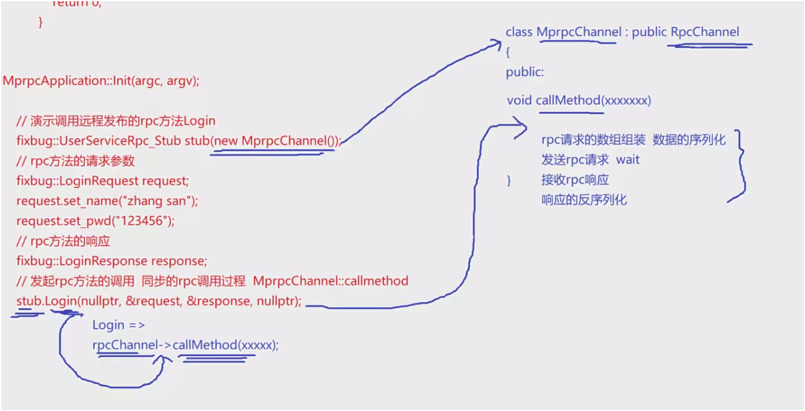

# 至此,可以进行一个简单测试

# 点对点rpc通信功能测试

## 错误-1

```c++
20250506 02:56:47.028211Z 35449 ERROR Transport endpoint is not connected (errno=107) sockets::shutdownWrite - SocketsOps.cc:191

```

客户端那边的 tcp 有些地方 return 太早, 

程序尝试关闭 socket 的写方向（`shutdown(sockfd, SHUT_WR)`），但这个 socket 已经不是“已连接”的状态，可能是：

- 对端关闭连接；
- 本地未成功连接；
- 连接已被异常中断；
- socket 使用不当（如未 `connect` 成功就调用 `shutdownWrite`）。


## 错误-2

服务端 响应一次就关闭了

> [!warning]
>
> ### **exit(EXIT_FAILURE);**  
>
> ### **这个会退出整个进程, 我们只需要断开连接!!**

```c++
// 实现连接回调函数
void RpcProvider::OnConnection(const muduo::net::TcpConnectionPtr &conn)
{
    if (!conn->connected()) // 如果连接断开
    {
        conn->shutdown(); // 关闭连接
        // exit(EXIT_FAILURE);
    }
}
```

## 错误-3

> [!warning]
>
> 

这个 bug  目前没遇到, 先记着-----因为我的字符串 不含 \0, 所以没遇到

**含 \0  会提示 反序列化失败**

```c++
// 反序列化rpc调用的响应数据
    // std::string response_str(recv_buf, 0, recv_size); // bug出现问题，recv_buf中遇到\0后面的数据就存不下来了，导致反序列化失败
    // if (!response->ParseFromString(response_str))
    if (!response->ParseFromArray(recv_buf, recv_size))
    {
        close(clientfd);
        char errtxt[512] = {0};
        sprintf(errtxt, "parse error! response_str:%s", recv_buf);
        controller->SetFailed(errtxt);
        return;
    }
```

> "\n\t\022\asuccess\030\001"---没有\0----知识补充:**转义字符识别规则**
>
> \000  才是 八进制的 \0


## 问题-3 复现-重点


> **example/callee/userservice.cc**
>
> ```c++
> hzhrpc::ResultCode* code = response->mutable_result();  // 可修改的
> code->set_errcode(0);  // 0表示成功
> code->set_errmsg("");  // 成功的提示信息
> response->set_success(login_result);  // 设置成功与否的标志
> ```
>
> ```c++
> code->set_errmsg("");  // 成功的提示信息
> ```
>
> 这个如果有值, 即使是 空格, 也不会 有 \0, 不会出现那个错误
>
> 但是 如果是`""`-----> `\n\000\030\001`
>
> 最终序列化的 字符串, 就是 \000-->0

> ## **空格和空的结果--重点**
>
> ### 第一段字节流：
>
> ```
> \n\003\022\001 \030\001
> ```
>
> 这是十六进制/ASCII 混合表示，我们转换并解析一下：
>
> | 字节（转义） | 实际含义                                                     |
> | ------------ | ------------------------------------------------------------ |
> | `\n`         | 字段号 1（field 1），类型为 **长度前缀的字符串**（wire type 2） |
> | `\003`       | 长度为 3（后面 3 个字节为内容）                              |
> | `\022`       | 十进制 18，即字段号 2（field 2），类型为 **长度前缀的字符串**（wire type 2） |
> | `\001`       | 长度为 1（后续一个字节为内容）                               |
> | ` ` (空格)   | ASCII 值为 32，实际字节值 0x20                               |
> | `\030`       | 十进制 24，即字段号 3（field 3），类型为 **Varint**（wire type 0） |
> | `\001`       | 该字段的值是 1                                               |
>
> 
>
> #### 总结：
>
> 如果使用 Protobuf 定义结构，这段字节流可能表示：
>
> ```
> message Example {
>   string field1 = 1;  // 长度为3
>   string field2 = 2;  // 长度为1，值为" "
>   int32 field3 = 3;   // 值为1
> }
> ```
>
> ------
>
> ### 第二段字节流：
>
> ```
> 
> \n\000\030\001
> ```
>
> 解析如下：
>
> | 字节（转义） | 含义                                               |
> | ------------ | -------------------------------------------------- |
> | `\n`         | 字段号 1，类型为 **长度前缀字符串**（wire type 2） |
> | `\000`       | 长度为 0（field1 是空字符串）                      |
> | `\030`       | 字段号 3，类型为 Varint（wire type 0）             |
> | `\001`       | field3 的值为 1                                    |
>
> 
>
> #### 总结：
>
> 表示：
>
> ```
> message Example {
>   string field1 = 1; // 空字符串
>   int32 field3 = 3;  // 值为1
> }
> ```
>
> 

> ## **至于为什么 \n 表示 第一字段?**
>
> **看不明白**
>
> 这是因为在 **Protocol Buffers (Protobuf)** 中，每个字段在序列化后会变成一个“**key**”，这个 key 编码包含两个信息：
>
> - 字段编号（field number）
> - 线缆类型（wire type）
>
> 这个“key”是用 **Varint** 编码的，它的计算公式是：
>
> > ```
> > key = (field_number << 3) | wire_type
> > ```
>
> ------
>
> ### 示例：`\n`
>
> `\n` 是一个转义字符，表示 **十六进制 0A**，也就是十进制 **10**。
>
> 我们来还原这个字节：
>
> - `0A` (十进制 10)
> - 二进制表示是：`00001010`
> - 解释为：`00001 010`
>   - 前 5 位：字段号 = `1`
>   - 后 3 位：wire type = `2`，表示 **length-delimited（变长字段）**
>
> 所以：
>
> > `\n` 表示的是：**字段号为 1，类型为 length-delimited（常用于字符串、字节数组、嵌套消息）**
>
> ------
>
> ### 补充：常见的 wire type 对照表
>
> | wire type | 含义             | 常用于                        |
> | --------- | ---------------- | ----------------------------- |
> | 0         | Varint           | int32, int64, bool            |
> | 1         | 64-bit           | double, fixed64               |
> | 2         | Length-delimited | string, bytes, nested message |
> | 5         | 32-bit           | float, fixed32                |
>
> 
>
> ------
>
> 所以你看到的 `\n`（也就是字节 `0x0A`），实际上是：
>
> > `字段号 1` + `wire type 2` ⇒ 长度前缀的字符串或嵌套结构字段。


## parsefromarray-无\0问题

> `ParseFromArray` 是 Protocol Buffers 提供的一个函数，用于将 **字节数组反序列化** 成一个 protobuf 对象。在 C++、Java、Python、Go 等多种语言的 protobuf 实现中都可以看到类似的函数。
>
> ------
>
> ### 举个例子（C++）：
>
> 假设你定义了一个 Protobuf 消息：
>
> ```
> message Person {
>   string name = 1;
>   int32 id = 2;
> }
> ```
>
> 你从网络或文件读取到了一段二进制数据，现在你想反序列化它：
>
> ```
> Person person;
> person.ParseFromArray(data, length);
> ```
>
> #### 参数说明：
>
> - `data`：一个字节数组指针，表示 protobuf 序列化后的数据。
> - `length`：这个数组的长度。
> - 返回值：`true` 表示解析成功，`false` 表示失败（数据格式不匹配或损坏）。

| 方法         | `ParseFromArray`                           | `ParseFromString`                         |
| ------------ | ------------------------------------------ | ----------------------------------------- |
| 输入类型     | `const void* data, int size`               | `const std::string& data`                 |
| 使用场景     | 网络、文件读取的二进制缓冲区（裸字节数组） | 已存储在 `std::string` 中的 protobuf 数据 |
| 是否拷贝数据 | 不拷贝，直接读取指针                       | 拷贝到内部 buffer                         |
| 更高效？     | ✅ 更高效（无拷贝）                         | ❌ 较慢（有拷贝）                          |
| 字节数据要求 | 你自己管理数据大小、生命周期               | 自动管理                                  |
| 易用性       | ❌ 需要小心指针和长度                       | ✅ 简单易用                                |

## 错误-代码问题

```c++
 code->set_errcode(0);  // 0表示成功   -- 这里有问题, 不能根据业务处理结果来设置返回码, 需要根据业务处理结果来设置返回码,  否则, 一直是登录成功
```

后续优化, 目前仅测试


# mprpc框架的应用示例

## 一般流程-以添加注册方法为例

> ### 1. **定义 RPC 服务**
> - 使用 `.proto` 文件定义服务接口，包括请求参数和响应参数。
> - 通过 `protoc` 工具生成对应的 C++ 源码文件。
>
> #### **example/user.proto**
>
> ```c++
> message RegisterRequest
> {
>     uint32 id = 1;
>     bytes name = 2;
>     bytes pwd = 3;
> }
> 
> message RegisterResponse
> {
>     ResultCode result = 1;
>     bool success = 2;
> }
> 
> service UserServiceRpc {
>     rpc Login(LoginRequest) returns (LoginResponse);
>     rpc Register(RegisterRequest) returns (RegisterResponse);
> }
> ```
>
> #### 编译
>
> ```c++
> protoc user.proto --cpp_out=./
> ```
>
> 
>
> ### 2. **实现服务端逻辑**
> - 继承 `proto` 文件生成的服务类，重写对应的 RPC 方法。
> - 在方法中：
>   1. 获取请求数据。
>   2. 执行业务逻辑。
>   3. 填充响应数据。
>   4. 执行回调以返回结果。
>   
> - #### **发布服务**---由于 都是userservice 下的方法, 之前已注册过 该服务
>   
> - ### **notifyservice 仅注册 服务, 而不是 服务的 方法**
>   
>   - 使用框架提供的工具，将服务注册到 RPC 框架中。
>   - 启动服务端，监听并处理远程调用请求。
>
> ### **example/callee/userservice.cc**
>
> ```c++
> bool Register(const uint32_t id, const std::string username, const std::string password) 
> {
>     // 仅演示
>     std::cout << "doing local service : Register" << std::endl;
> }
> ...
> 
>     // 重写 UserServiceRpc 里的 Register方法
>     void Register(::google::protobuf::RpcController* controller,
>                   const ::hzhrpc::RegisterRequest* request,
>                   ::hzhrpc::RegisterResponse* response,
>                   ::google::protobuf::Closure* done)
> {
>     // 1. 框架给业务上报了请求参数RegisterRequest, 应用 获取相应数据做本地业务
>     uint32_t id = request->id();
>     std::string username = request->name();
>     std::string password = request->pwd();
> 
>     // 2. 做本地业务
>     bool register_result = Register(id, username, password); 
> 
>     // 3. 业务处理完毕, 设置响应参数
>     // 包括 设置返回码, 提示信息, 以及业务处理结果
>     hzhrpc::ResultCode* code = response->mutable_result();  // 可修改的
>     code->set_errcode(0);  // 0表示成功   -- 这里有问题, 不能根据业务处理结果来设置返回码, 需要根据业务处理结果来设置返回码,  否则, 一直是登录成功
>     code->set_errmsg("register error");  // 成功的提示信息   涉及错误复现--笔记
>     response->set_success(register_result);  // 设置成功与否的标志
> 
>     // 4. 执行回调函数
>     done->Run();  
> }
> ```
>
> 
>
> #### 3. **调用远程服务**
> - 客户端通过框架提供的 `MprpcChannel` 创建代理对象。
> - 调用远程服务时，框架自动完成序列化、网络传输和反序列化。
> - 客户端接收响应并处理结果。
>
> #### **example/caller/calluserservice.cc**
>
> ```c++
> // 请求调用 该服务的 注册方法
>     hzhrpc::RegisterRequest register_request;
>     register_request.set_id(10001);
>     register_request.set_name("huai xing");
>     register_request.set_pwd("123456");
>     hzhrpc::RegisterResponse register_response;
>     stub.Register(nullptr, &register_request, &register_response, nullptr);
>     if(register_response.result().errcode()==0)
>     {
>         std::cout << "register success: " << register_response.success() << std::endl;
>     }
>     else
>     {
>         std::cout << "register failed, errcode: " << register_response.result().errcode() << ", errmsg: " << register_response.result().errmsg() << std::endl;
>     }
> ```
>
> 
>
> #### 5. **框架特点**
> - **高并发支持**：服务端能够处理大量并发请求。
> - **自动化**：框架自动完成序列化、反序列化和网络通信。
> - **模块化**：支持将本地服务轻松发布为远程服务。
> - **灵活性**：可根据业务需求定义任意服务接口。
>
> #### 6. **使用演示**
> - 演示了用户模块（登录、注册）和好友模块（获取好友列表）的实现与调用。
> - 展示了如何通过框架发布本地服务为远程服务，并成功调用。
>


## 以添加新服务为例

> ### **example/friend.proto**
>
> ```c++
>  syntax = "proto3";
> package hzhrpc;
> 
> 
> option cc_generic_services = true; // 生成服务类和rpc方法描述, 默认不生成
> 
> message ResultCode
> {
>     int32 errcode = 1;
>     bytes errmsg = 2;
> }
> 
> 
> // 定义登录请求消息类型 name pwd
> message FriendListRequest
> {
>     uint32 id = 1;
> }
> 
> // 定义登录响应消息类型
> message FriendListResponse
> {
>     ResultCode result = 1;
>     repeated bytes friends = 2; // 好友列表
> }
> 
> 
> 
> service FriendServiceRpc {
>     rpc GetFriendList_rpc(FriendListRequest) returns (FriendListResponse);
> }
> ```
>
> ### **example/callee/friendservice.cc**
>
> ```c++
> #include <iostream>
> #include <string>
> #include "friend.pb.h"
> // using namespace hzhrpc;
> #include "mprpcapplication.h"
> #include "rpcprovider.h"
> #include <vector>
> 
> /*
> UserService 原来是一个 本地服务, 提供了 两个进程内的本地方法, Login和GetFriendLists
> */
> class FriendService : public hzhrpc::FriendServiceRpc // 这个rpc类使用在 rpc服务发布端(rpc服务提供者)
> {
> public:
> 
>     // 本地服务函数-返回好友列表
>     std::vector<std::string> GetFriendLists(uint32_t id)
>     {
>         std::cout<<"GetFriendLists: " << id << std::endl;
>         std::vector<std::string> friends;
>         friends.push_back("zhang san");
>         friends.push_back("li si");
>         friends.push_back("wang wu");
>         return friends;
>     }
> 
> 
> 
>     
>     void GetFriendList_rpc(::google::protobuf::RpcController *controller, // 这里命名空间不写hzhrpc::, 直接写google::protobuf   特别注意
>                const ::hzhrpc::FriendListRequest *request,
>                ::hzhrpc::FriendListResponse *response,
>                ::google::protobuf::Closure *done)
>     {
> 
>         // 1. 框架给业务上报了请求参数LoginRequest, 应用 获取相应数据做本地业务
>         uint32_t id = request->id(); // 获取请求参数
> 
>         // 2. 做本地业务
>         std::vector<std::string> friends = GetFriendLists(id); // 获取好友列表
> 
>         // 3. 业务处理完毕, 设置响应参数
>         // 包括 设置返回码, 提示信息, 以及业务处理结果
>         hzhrpc::ResultCode *code = response->mutable_result(); // 可修改的
>         code->set_errcode(0);                                  // 0表示成功   -- 这里有问题, 不能根据业务处理结果来设置返回码, 需要根据业务处理结果来设置返回码,  否则, 一直是登录成功
>         code->set_errmsg("friend list error");                       // 成功的提示信息   涉及错误复现--笔记
>         for(auto &friend_name : friends) // 遍历好友列表
>         {
>             response->add_friends(friend_name); // 添加好友列表
>         }
> 
> 
> 
>         // 4. 执行回调函数
>         done->Run();
>     }
> 
>     
> };
> 
> int main(int argc, char *argv[])
> {
>     // 1. 初始化框架
>     MprpcApplication::Init(argc, argv);
> 
>     // 2. 创建 provider 并注册服务
>     RpcProvider provider;
>     provider.NotifyService(new FriendService()); // 注册并发布服务, 这里的UserService是个本地服务, 不是rpc服务
> 
>     // 3. 启动rpc服务发布 节点
>     provider.Run(); // 启动服务, 这里的Run是阻塞状态, 一直监听rpc调用请求
> 
>     return 0;
> }
> ```
>
> > [!warning]
> >
> > 在本次更改中:
> >
> > **每个服务,都通过rpc框架注册**
> >
> > **然后 运行又是独立的进程**
> >
> > **每个服务都是一个单独的可执行程序、一个独立进程，通过 RPC 框架注册到注册中心，并通过网络与其他服务通信。**
>
> ### cmake
>
> ```c++
> 
> set(SRC_LIST userservice.cc ../user.pb.cc)
> add_executable(provider ${SRC_LIST})
> target_link_libraries(provider mprpc protobuf)  # 链接动态库
> 
> set(FRIEND_LIST friendservice.cc ../friend.pb.cc)
> add_executable(friendlist ${FRIEND_LIST})
> target_link_libraries(friendlist mprpc protobuf)  # 链接动态库
> ```
>
> ### **example/caller/callfriendservice.cc**
>
> ```c++
> #include <iostream>
> #include "mprpcapplication.h"
> #include "friend.pb.h"
> #include "mprpcchannel.h"
> 
> int main(int argc, char* argv[])
> {
>     // 1. 初始化框架----必须的, 但只初始化一次
>     MprpcApplication::Init(argc, argv);
> 
>     hzhrpc::FriendServiceRpc_Stub stub(new MpRpcChannel()); // 创建rpc服务对象
>     hzhrpc::FriendListRequest request; // 创建请求对象
>     request.set_id(10001); // 设置请求参数
> 
>     hzhrpc::FriendListResponse response; // 创建响应对象
>     
>     stub.GetFriendList_rpc(nullptr, &request, &response, nullptr); // rpcchannel->rpcchannel::callMethod 集中来做所有rpc方法调用的参数序列化和网络发送
> 
>     // 此时, stub.Login()方法已经返回, response对象中已经有了值
>     if(response.result().errcode()==0)  // proto生成的messgae成员, 想访问得是函数 
>     {
>         std::cout << "friend list success: "  <<std::endl;
>         for(int i=0; i<response.friends_size(); ++i)
>         {
>             std::cout << response.friends(i) << std::endl;
>         }
>     }
>     else
>     {
>         std::cout << "friend list failed, errcode: " << response.result().errcode() << ", errmsg: " << response.result().errmsg() << std::endl;
>     }
> 
> 
>     return 0;
> }
> 
> 
> ```
>
> ### cmake
>
> ```c++
> 
> set(SRC_LIST calluserservice.cc ../user.pb.cc)
> add_executable(consumer ${SRC_LIST})
> target_link_libraries(consumer mprpc protobuf)  # 链接动态库
> 
> set(FRIEND_LIST callfriendservice.cc ../friend.pb.cc)
> add_executable(friend_consumer ${FRIEND_LIST})
> target_link_libraries(friend_consumer mprpc protobuf)  # 链接动态库
> 
> ```
>
> 

## 测试

> [!warning]
>
> 由于是 读取 同一份 配置文件, 不同进程, **一般**端口不能 复用 
>
> | 场景                            | 是否可以同端口                                               |
> | ------------------------------- | ------------------------------------------------------------ |
> | 不同进程默认监听同端口          | ❌ 不行，操作系统不允许                                       |
> | 设置 `SO_REUSEADDR`             | ❌ 不能解决这个问题, 是为了消除刚断开不能连的问题(TIME_WAIT 状态) |
> | 设置 `SO_REUSEPORT`（内核支持） | ✅ 可以多个进程监听同一个端口---操作系统需支持                |


> 所以按 上面的 **不同服务, 不同进程, 不能同时连接一个端口**

## 改进-自行添加

> ### 不同服务, 同一进程
>
> 就是 在一个main里, 同时注册 两个服务
>
> 充分利用 **NotifyService**函数
>
> ### 关键点：调用 `NotifyService` 多次，把多个服务注册进去。

> [!warning]
>
> 多个 pb.h 连接到一个项目, **命名空间 名字 必须不同**, 否则 如果 **两个proto** 的 **message**类 相同, 会出现**重复定义**

**collee的两个服务.cc**

删除 两个 里面的 main函数

改名 .h

**example/callee/main.cc**

```c++
#include "friendservice.h"
#include "userservice.h"

int main(int argc, char *argv[])
{
    // 1. 初始化框架
    MprpcApplication::Init(argc, argv);

    // 2. 创建 provider 并注册服务
    RpcProvider provider;
    provider.NotifyService(new FriendService()); // 注册并发布服务, 这里的UserService是个本地服务, 不是rpc服务
    provider.NotifyService(new UserService());

    // 3. 启动rpc服务发布 节点
    provider.Run(); // 启动服务, 这里的Run是阻塞状态, 一直监听rpc调用请求

    return 0;
}
```

即可  一个 rpc节点, 多个服务

## **学习建议**

- 站在框架使用者的角度，尝试定义更多服务接口并测试调用。
- 理解框架的核心流程：**定义服务 → 实现逻辑 → 发布服务 → 调用服务**。


# rpccontroller控制模块

## 为什么要用 `RpcController`

> ### 1. 原先的问题：调用方默认 RPC 一定成功
>
> - 原来的写法中，用户通过代理对象调用 RPC 方法后，**直接访问 response**。
> - 但如果 RPC 调用过程中出现序列化失败、socket 创建失败、连接失败、发送或接收失败等情况，**response 根本就不合法**。
> - 这样写逻辑上是不严谨的，调用失败却误以为成功访问响应结果。
>
> ### 2. 理想化 vs 现实情况
>
> - 理想情况：RPC 请求 → 网络发送 → 服务响应 → 返回结果。
> - 现实情况：各个阶段**都可能失败**，需要一个机制来传递“调用是否成功”的控制信息。
>
> ### 3. `RpcController` 的意义
>
> - `RpcController` 是用于记录 RPC 调用状态的“控制器”。
> - 它是 Protobuf 提供的抽象类，不能直接实例化，需要我们继承并实现相关方法。


## 怎么实现 `mprpc` 框架中的 `RpcController`

> ### 1. 自定义控制器类：`MprpcController`
>
> - **继承自** `google::protobuf::RpcController`。
> - 实现几个关键方法：
>
> | 方法                | 功能说明                       |
> | ------------------- | ------------------------------ |
> | `Reset()`           | 重置状态为初始状态             |
> | `Failed()`          | 是否失败（返回 true 表示失败） |
> | `ErrorText()`       | 获取错误信息                   |
> | `SetFailed(string)` | 设置错误标志和信息             |
> | 其他方法            | 空实现或返回 false             |
>
> 
>
> - 类中维护两个成员变量：
>   - `bool m_failed`：是否失败
>   - `std::string m_errText`：错误信息
>
> ### 2. 在 `mprpc_channel.cc` 中的使用逻辑
>
> - 在框架内部调用 RPC 方法时，若发生以下情况之一，则调用 `SetFailed()` 设置失败状态：
>   - 参数序列化失败
>   - socket 创建失败
>   - 服务连接失败
>   - 数据发送失败
>   - 响应接收失败
>   - 响应反序列化失败
> - 每处 `return` 前加 `controller->SetFailed("错误信息")`。
>
> ### 3. 在用户调用方的使用方式
>
> - 调用 RPC 方法时，传入 `MprpcController` 对象指针。
>
> - 调用后判断：
>
>   ```
>   cpp复制编辑if (controller.Failed()) {
>       std::cout << "RPC 调用失败: " << controller.ErrorText() << std::endl;
>   } else {
>       // 安全地访问 response
>   }
>   ```
>
> ### 4. 为了简化用户使用
>
> - 把所有相关头文件（包括 `mprpccontroller.h`）统一封装到 `mprpcapplication.h` 中。
> - 用户只需包含一个头文件，简洁统一。

------

## 效果验证

- 编译时，别忘了将 `mprpccontroller.cc` 加入 `CMakeLists.txt`。
- 使用示例验证时，RPC 调用失败会打印出明确错误信息，而不会继续访问非法 `response`。


# logger日志系统设计与实现(一)

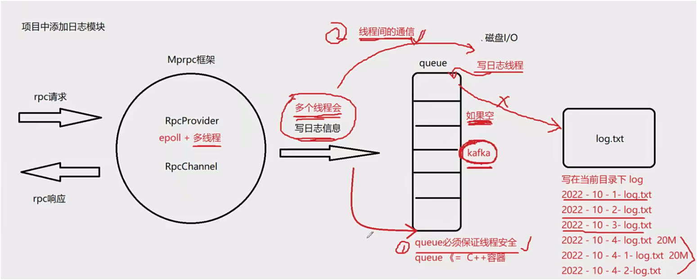

## 日志模块引入的背景和意义

- **日志在软件中的重要性**：在用户现场出问题时，无法打断点调试，日志是排查问题最有效的手段。
- **不能把日志输出直接打印到屏幕**：容易淹没有价值信息，运行时间长后难以定位问题。
- **不能在业务线程中执行磁盘 IO 写日志操作**：磁盘 IO 慢，会拖慢 RPC 请求的响应效率，影响整体性能。

------

## 日志模块的异步设计思路

- **基本思路**：
  - 业务线程把日志信息写入**内存中的缓冲队列**。
  - 单独的写日志线程从队列中**异步地写入文件**。
- **为什么这样做**：
  - 业务线程仅涉及内存写入，速度快；
  - 写日志线程做慢速的磁盘 IO；
  - 避免了磁盘 IO 拖慢业务处理效率。
- **注意并发安全问题**：
  - 多线程写入队列，要加锁保证线程安全(c++容器线程不安全)；
  - 写日志线程从队列取数据，也涉及加锁；---**-空队列 就不需要抢锁**
  - 简单的 `mutex` 容易造成性能瓶颈（比如写线程空轮询抢锁）；
  - 因此需配合 **条件变量（condition variable）** 实现线程间通信：
    - 有日志时通知写线程写日志；
    - 没有日志时写线程等待，**避免无效锁竞争**。

------

## 日志模块的组件设计

- **日志级别定义**：`INFO`, `ERROR`（可拓展为 DEBUG、WARN 等）。
- **日志文件组织方式**：
  - 按天记录，每天一个文件，命名如 `2025-05-06.log`；
  - 可考虑大小限制（例如超过 20MB 分段）；
  - 日志默认存放在项目当前目录或 `log/` 目录下。
- **日志队列类 `LockQueue<T>`**（模板类）：
  - 基于 `std::queue<T>`；
  - 内部封装了 `std::mutex`、`std::condition_variable`；
  - 提供线程安全的 `Push(T)` 和 `Pop(T&)` 接口；
  - 写线程阻塞等待新日志的到来。
- **日志管理器 `Logger`**（单例）：
  - 启动独立线程负责从队列取日志并写入磁盘；
  - 提供静态方法 `LOG_INFO(...)`, `LOG_ERROR(...)` 等供用户调用；
  - 支持配置日志文件路径、格式、刷新策略等。

## 代码合集

> ### **src/include/lockqueue.h**
>
> ```c++
> #pragma once
> #include <queue>
> #include <mutex>
> #include <thread>
> #include <condition_variable> // 条件变量
> 
> // 异步写日志的日志队列
> template <typename T>
> class LockQueue
> {
> public:
>     // 入队
>     void Push(const T &value);
> 
>     // 出队
>     void Pop(T &value);
> 
>     // 判断队列是否为空
>     bool Empty()
>     {
>         std::lock_guard<std::mutex> lock(m_mutex);
>         return m_queue.empty();
>     }
> private:
>     std::queue<T> m_queue; // 日志队列
>     std::mutex m_mutex; // 互斥锁
>     std::condition_variable m_condvariable; // 条件变量
> };
> ```
>
> ### **src/include/logger.h**
>
> ```c++
> #pragma once
> #include "lockqueue.h"
> 
> enum LogLevel
> {
>     INFO,
>     ERROR,
> };
> 
> // mprpc框架提供的 日志系统-----单例
> class Logger
> {
> public:
>     static Logger &GetInstance();
> 
>     // 设置日志级别
>    void SetLogLevel(LogLevel level);
>     
>     // 写日志
>     void Log(const std::string &message);
> 
> private:
>     int m_logLevel;                    // 日志级别
>     LockQueue<std::string> m_logQueue; // 日志缓冲队列
> 
>     Logger(); // 构造函数私有化
>     Logger(const Logger &) = delete; // 禁止拷贝构造
>     Logger(Logger &&) = delete; // 禁止移动构造
>     Logger &operator=(const Logger &) = delete; // 禁止赋值构造
> 
> };
> 
> ```
>
> 


# logger日志系统设计与实现(二)

## 日志实现

> **日志单例实现**：
>
> - 使用了设计模式中的单例模式来管理日志实例，保证日志系统只有一个实例。
> - 通过 `getInstance` 方法获取唯一的日志实例。
> - 日志类的构造函数负责初始化日志模块，并启动后台线程用于异步写日志。
>
> **日志线程的实现**：
>
> - 在日志模块中启动了一个线程，专门用于从日志队列中取出日志信息并写入日志文件。
> - 采用了分离线程（守护线程）来执行日志写入操作。
>
> **日志写入机制**：
>
> - 使用队列 (`lock queue`) 来存储待写入的日志信息。
> - 每次写入日志时，首先将日志信息从队列中取出，然后将其写入文件。
> - 采用了追加模式打开日志文件 (`a+`)，如果文件不存在则创建，若已存在则追加。
>
> **日志文件名和时间戳处理**：
>
> - 使用 `strftime` 来构造日志文件名，包含年月日，并且确保文件名以 `log.txt` 结尾。
> - 在写入每条日志时，加入当前的时间（时、分、秒），使日志信息更加详细，方便定位问题。
>
> ### **src/include/logger.h**
>
> ```c++
> // 定义宏 使用:  LOG_INFO("hello %s %d", "world", 3);
> #define LOG_INFO(logmsgformat, ...) \
>     do { \
>         Logger &logger = Logger::GetInstance(); \
>         Logger.SetLogLevel(INFO); \
>         char logmsg[1024] = {0}; \
>         snprintf(logmsg, sizeof(logmsg), logmsgformat, ##__VA_ARGS__); \
>         logger.Log(logmsg); \
>     } while (0)
> 
> #define LOG_ERROR(logmsgformat, ...) \
>     do { \
>         char logmsg[1024] = {0}; \
>         snprintf(logmsg, sizeof(logmsg), logformat, ##__VA_ARGS__); \
>         Logger::GetInstance().Log(logmsg); \
>     } while (0)
> 
> 
> ```
>
> 

## 日志宏--不太熟悉,**重点**

> ### 1. **日志宏的目的与作用**
>
> - **简化日志使用**：日志宏的主要目的是简化用户在使用日志功能时的操作，让用户无需关心日志实现细节（如实例化日志对象、调用日志方法等），而是通过简单的宏调用来写日志。
> - **提高代码可读性和可维护性**：使用宏可以让日志记录更加直观和简洁，且便于未来修改日志实现时，用户代码不需要做调整。
>
> ### 2. **宏的设计**
>
> - 我们设计了几个宏：`LOG_INFO` 和 `LOG_ERROR`，这两个宏分别用于记录普通信息日志和错误日志。
>
> ### 3. **宏的实现**
>
> 宏本质上是通过预处理器在编译时展开的，它们是 C/C++ 中的一种文本替换机制。在本例中，我们使用了 `LOG_INFO` 和 `LOG_ERROR` 宏，来实现日志的记录。
>
> 这两个宏大致的结构如下：
>
> ```
> #define LOG_INFO(format, ...) \
> 	......\
>     Logger::getInstance().log(LogLevel::INFO, format, ##__VA_ARGS__)
> 
> #define LOG_ERROR(format, ...) \
> 	......\
>     Logger::getInstance().log(LogLevel::ERROR, format, ##__VA_ARGS__)
> ```
>
> **解释**：
>
> - **`Logger::getInstance()`**：调用日志单例的 `getInstance` 方法，获取唯一的日志实例。
> - **`log`**：这是日志记录的核心方法，用于将日志信息记录到指定的目标（如文件、控制台等）。
> - **`LogLevel::INFO` 和 `LogLevel::ERROR`**：分别表示日志的级别，`INFO` 表示普通信息，`ERROR` 表示错误信息。你可以根据需求设置更多的日志级别，如 `DEBUG`、`WARN` 等。
> - **`format` 和 `__VA_ARGS__`**：这部分是宏的可变参数。`format` 是日志信息的格式字符串，类似于 `printf` 中的格式字符串，`__VA_ARGS__` 用来接收用户传入的其他参数（比如日志的具体内容）。
>
> 比如，你可以通过以下方式调用日志宏：
>
> ```
> LOG_INFO("User logged in: %s", username);
> LOG_ERROR("Failed to load configuration: %s", errorMessage);
> ```
>
> ### 4. **可变参数处理**
>
> 宏 `LOG_INFO` 和 `LOG_ERROR` 使用了可变参数（`__VA_ARGS__`），这意味着你可以**传递任意数量的额外参数给日志系统**。它的工作方式类似于 `printf` 函数，允许你**根据需要格式化日志信息**。
>
> **举个例子**：
>
> ```
> LOG_INFO("User %s logged in at %s", username, timestamp);
> ```
>
> 这个调用将会展开为：
>
> ```
> Logger::getInstance().log(LogLevel::INFO, "User %s logged in at %s", username, timestamp);
> ```
>
> 这时，日志系统将会根据给定的格式字符串和参数，把信息记录下来。
>
> 


# 异步缓冲队列实现

## 模板不能分文件编写!

## 日志模块组成

日志模块包括两个核心类：

1. **`Log` 类**：日志功能的主入口，提供日志等级（INFO/ERROR）控制、日志写入线程的启动与关闭、日志格式的封装与输出等功能。
2. **`LogQueue<T>` 模板类**：一个线程安全的阻塞队列，采用**生产者-消费者模型**，用于异步写日志。

------

## 日志队列（LogQueue）实现要点

- **模板类不能拆分到 `.cc` 文件**，只能在头文件中定义。
- **线程安全性**：使用 `std::mutex` 和 `std::condition_variable` 实现入队（`push`）和出队（`pop`）的互斥与同步。
- **push（入队）操作**：
  - 加锁（`std::lock_guard<std::mutex>`），将日志信息加入队列。
  - 调用 `notify_one()` 唤醒等待的写日志线程。
- **pop（出队）操作**：
  - 如果队列为空，调用 `wait()` 等待新日志信息。
  - 使用 `std::unique_lock` 和 `condition_variable::wait()`。
  - 防止虚假唤醒需结合 `while` 循环判断。
  - 返回值不能返回引用，应返回拷贝值。

```c++
#pragma once
#include <queue>
#include <mutex>
#include <thread>
#include <condition_variable> // 条件变量

// 异步写日志的日志队列
template <typename T>
class LockQueue
{
public:
    // 入队
    void Push(const T &value)
    {
        std::lock_guard<std::mutex> lock(m_mutex);
        m_queue.push(value);
        m_condvariable.notify_one(); // 通知一个等待线程
    }

    // 出队
    T Pop()
    {
        std::unique_lock<std::mutex> lock(m_mutex);
        while (m_queue.empty())
        {
            m_condvariable.wait(lock); // 等待条件变量
        }
        T value = m_queue.front();
        m_queue.pop();
        return value;
    }

private:
    std::queue<T> m_queue; // 日志队列
    std::mutex m_mutex; // 互斥锁
    std::condition_variable m_condvariable; // 条件变量
};
```


> [!warning]
>
> **C++ 中条件变量（`std::condition_variable`）必须搭配 `std::unique_lock<std::mutex>` 使用，不能用 `std::lock_guard`，因为：**
>
> - `std::unique_lock` 支持显式解锁和上锁，`wait()` 会自动释放锁并在唤醒后重新加锁；
> - `std::lock_guard` 不支持手动解锁，不能满足条件变量对锁操作的需求。

------

## 日志的宏封装与格式说明

> [!important]
>
> 目前写的 日志系统, 没有加入 根据限制 再生成文件, 而是 随时的

- 提供了两个宏接口：`LOG_INFO(...)` 和 `LOG_ERROR(...)`。

- 自动记录：日志等级、时间、线程ID、源文件名、函数名、行号等。

- 在消息末尾自动添加换行符 `\n`。

- 日志文件按日期命名，便于查找。

- 日志输出格式示例：

  ```
  [2025-05-07 22:13:15][INFO][main.cpp:45][main()] - first log message
  ```

------

## 日志功能测试流程

1. 编写简单日志写入测试代码（包含 `log.h`，调用 `LOG_INFO(...)`）。
2. 执行程序，检查日志文件是否按日期生成并写入正确内容。
3. 调试过程中解决了：
   - 宏调用类型转换警告（如 `std::string` 转 `const char*` 使用 `.c_str()`）。
   - 返回局部变量引用的逻辑错误（改为返回值传递）。

仅是简单测试

**example/callee/main.cc**

```c++
// 日志
    LOG_INFO("main function start");
    LOG_ERROR("%s: %s: %d", __FILE__, __FUNCTION__, __LINE__);
```


------

## 日志集成建议-自行完成

- 在各业务模块（如 RPC 框架）中使用 `log.h` 提供的日志接口。
- 替换控制台输出为日志输出：
  - 普通运行信息使用 `LOG_INFO`。
  - 错误信息使用 `LOG_ERROR`。
- 便于后期日志关键字定位（如搜索 `"ERROR"`）。

## 改进log输出格式

添加标识---info, error

```c++
sprintf(timeBuf, "%d-%d-%d %d:%d:%d ===>[%s]",
                nowtm->tm_year + 1900, nowtm->tm_mon + 1, nowtm->tm_mday,
                nowtm->tm_hour, nowtm->tm_min, nowtm->tm_sec, m_logLevel == INFO ? "INFO" : "ERROR");
```


------

## 小结

- 日志系统实现了**异步写入、线程安全、分级输出**等关键特性。
- 可扩展、可复用，适用于任意 C++ 项目。
- 相比标准输出，**日志系统更利于定位问题、维护系统稳定性**。


# 日志模块可以通用!


# zookeeper简介

https://www.cnblogs.com/xinyonghu/p/11031729.html---扩展阅读

## ZooKeeper 是什么？

> #### 核心作用：
>
> - **集中式配置管理**
> - **分布式锁**
> - **命名服务**
> - **集群管理（如 Master 选举）**
> - **分布式数据发布/订阅（类似配置推送）**
>
> #### 特点：
>
> - 提供**树状数据结构**（ZNode）
> - 所有操作是**原子性**
> - **强一致性**（保证客户端读到的数据是最新）
> - 支持**watcher**机制（监听数据节点变化）

## ZooKeeper 的核心功能与应用场景

> > zoo--动物园     keeper-- 协调管理者   
> > **ZooKeeper** 是一个**分布式协调服务**，主要用于**分布式系统中多个节点之间的协调工作**。以下是它的核心功能及应用场景：
>
> ### **1.1 服务配置中心**
> - **作用**：在分布式环境中，**服务的提供者（RPC 服务节点）**需要将自己的 IP 和端口**注册到一个中心位置**，消费者（调用者）通过查询这个中心位置来找到服务。
> - **ZooKeeper 的角色**：作为服务配置中心，ZooKeeper **记录了所有服务节点的注册信息，并提供查询功能。**
> - **项目中的应用**：
>   - 解决了分布式环境中服务调用者无法直接知道服务提供者位置的问题。
>   - 提供**动态服务发现功能**，当服务节点**上下线**时，ZooKeeper 会**自动更新**注册信息。
>
> ### **1.2 分布式锁**
>
> - **作用**：在分布式环境中，多个节点可能需要访问同一个共享资源，而**这个资源不能被同时访问**。
> - **ZooKeeper 的角色**：通过其**节点（ZNode）的特性**，ZooKeeper 可以实现分布式锁，确保同一时刻只有一个节点访问共享资源。
> - **项目中的应用**：
>   - 例如，多个 RPC 节点需要访问同一个数据库表或文件时，可以通过 ZooKeeper 实现分布式锁，避免数据冲突。
>
> ### **1.3 主备切换**
>
> - **作用**：在分布式系统中，某些服务可能需要一个**主节点来处理核心任务，其他节点作为备份节点。**
> - **ZooKeeper 的角色**：通过**选举机制，**ZooKeeper 可以动态选出主节点，并在主节点故障时快速切换到备份节点。
> - **项目中的应用**：
>   - 例如，在分布式数据库中，ZooKeeper 可以用来管理主从节点的切换。
>
> ### **1.4 其他功能**
> - **分布式队列**：管理任务队列，确保任务按顺序执行。
> - **全局配置管理**：存储和分发分布式系统的全局配置。
>

---

## **学习与面试的平衡**
在学习和面试中，如何平衡技术的深度和广度是一个关键问题。以下是具体建议：

> > [!tip]
> >
> > 会用就行---不要深挖, 关键在于 会用
>
> ### **2.1 学习时的策略**
>
> - **掌握核心功能**：对于项目中使用的技术，重点掌握其核心功能和应用场景。例如：
>   - 为什么选择 ZooKeeper？
>   - 它解决了什么问题？
>   - 如果不用 ZooKeeper，会遇到什么困难？
> - **了解技术的扩展功能**：虽然项目中可能只用到了 ZooKeeper 的服务配置中心功能，但你需要知道它还可以做分布式锁、主备切换等。这些知识可以在面试中展示你的技术广度。
>
> ### **2.2 面试时的策略**
> - **清晰表达项目需求**： 为什么需要 zk?
>   - 例如：“在我们的分布式 RPC 框架中，我们需**要一个服务配置中心来记录所有服务节点的信息**，ZooKeeper 恰好提供了这样的功能。”
> - **坦诚但不局限**：
>   - 如果被问到 ZooKeeper 的其他功能（如分布式锁），可以坦诚说明项目中未使用，但可以补充你对这些功能的理解。
>   - 例如：“**虽然项目中没有用到 ZooKeeper 的分布式锁功能，但我知道它可以通过临时节点和顺序节点实现分布式锁，确保多个节点对共享资源的互斥访问**。”
>

---

## **简历的撰写与面试技巧**
> #### **3.1 简历撰写**
> - **展示技术广度**：在项目描述中，可以**提到使用了哪些技术**（如 ZooKeeper、Redis、MySQL 等），但**不需要每一项都深入**。
> - **突出核心技术**：重点描述项目中用到的核心技术及其解决的问题。例如：
>   - “使用 ZooKeeper 作为服务配置中心，解决了分布式环境中服务发现的问题。”
>   - “**通过 Redis 实现缓存，优化了数据库查询性能**。”
>
> #### **3.2 面试技巧**
> - **引导话题**：
>   - 如果被问到不熟悉的问题，可以通过引导话题，将讨论引向你熟悉的领域。
>   - 例如：“虽然我对 ZooKeeper 的分布式锁功能了解有限，但我在项目中用到了 Redis 的分布式锁，可以详细讲讲它的实现方式。”
> - **展示逻辑思维**：
>   - 即使对某些技术不熟悉，也可以通过逻辑推导展示你的思维能力。
>   - 例如：“我知道分布式锁的核心是确保资源的互斥访问，但我知道它可以通过临时顺序节点实现锁机制。”
>

---

## **沟通的重要性**--重点
沟通能力在面试中至关重要，以下是一些具体建议：

> #### **4.1 面试中的沟通技巧**
> - **不要直接说“不知道”**：
>   - 如果被问到不熟悉的问题，可以先承认不熟悉，然后补充相关知识。
>   - 例如：“我对 ZooKeeper 的分布式锁功能了解不多，但我知道它可以通过创建临时顺序节点来实现锁机制。”
> - **主动引导**：
>   - 如果面试官问到你不熟悉的领域，可以主动引导到你熟悉的领域。
>   - 例如：“虽然我对 ZooKeeper 的分布式锁了解有限，但我在项目中用到了 Redis 的分布式锁，可以详细讲讲它的实现方式。”
>
> #### **4.2 面试前的准备**
> - **梳理项目细节**：确保对简历中提到的每个技术点都有基本的了解，尤其是它在项目中的作用。
> - **模拟面试**：通过模拟面试，练习如何回答不熟悉的问题。
>

---

## **学习策略与面试经验**
> #### **5.1 学习策略**
> - **聚焦项目需求**：优先学习项目中用到的技术及其核心功能。
> - **扩展知识面**：了解项目中未用到的功能，尤其是面试中可能被问到的高频问题。
>   - 例如，ZooKeeper 的分布式锁是一个常见的面试问题，可以提前研究其实现原理。
>
> #### **5.2 面试经验**
> - **总结高频问题**：通过几次面试，总结面试官关注的重点问题，并针对性地准备。
> - **不断优化表达**：每次面试后，反思自己的回答，优化表达方式。
>

---

## **示例回答**
以下是一些可能的面试问题及示例回答：

> #### **6.1 为什么在项目中使用 ZooKeeper？**
> - 示例回答：
>   ```text
>   在我们的分布式 RPC 框架中，需要一个服务配置中心来记录所有服务节点的信息。ZooKeeper 提供了可靠的分布式数据存储和通知机制，可以很好地满足这一需求。通过 ZooKeeper，我们实现了动态服务发现，解决了服务调用者无法直接定位服务提供者的问题。
>   ```
>
> #### **6.2 你对 ZooKeeper 的分布式锁了解吗？**
> - 示例回答：
>   ```text
>   我知道 ZooKeeper 的分布式锁是通过创建临时顺序节点来实现的。每个节点尝试创建一个锁节点，只有第一个节点可以获得锁。其他节点会监听锁节点的变化，当锁释放时，其他节点会被通知并尝试获取锁。虽然项目中没有用到这个功能，但我对它的基本原理有所了解。
>   ```
>
> #### **6.3 如果不用 ZooKeeper，可以用什么替代？**
> - 示例回答：
>   ```text
>   如果不用 ZooKeeper，可以考虑使用其他服务注册与发现工具，比如 Consul 或 Eureka。不过，ZooKeeper 提供了更强的分布式协调能力，比如分布式锁和主备切换，这些功能在某些场景下是其他工具无法替代的。
>   ```
>


# zk配置中心和znode节点

## ZooKeeper 的核心功能
ZooKeeper 是一个分布式协调服务，主要通过以下两大核心机制对外提供服务：
1. **ZNode 数据节点**：ZooKeeper 的数据存储结构，类似于一个特殊的文件系统。
2. **Watcher 机制**：ZooKeeper 的事件监听机制，用于监控节点的变化。


## Zookeeper配置和开启

> ### **安装与启动**
>
> 1. **下载与解压**：
>
>    - 从官网或提供的资源下载 ZooKeeper，解压后即可使用。
>    - 解压命令：`tar -zxvf zookeeper-x.x.x.tar.gz`
>
>    > [!warning]
>    >
>    > 自己官网下载的话, 注意问题
>    >
>    > **需要 jdk 环境**, 自行安装 
>    >
>    > 下载  zookeeper.....bin.tar.gz,   不需要自己编译,  但是 不带 c的api
>    >
>    > 不带bin 需要自己编译
>    >
>    > **apt install maven**
>    >
>    > ```
>    > // 编译安装   跳过测试-问题多
>    > mvn clean install -DskipTests
>    > ```
>
> 2. **配置文件**：
>
>    - 配置文件路径：`conf/zoo.cfg`
>    - 需要修改的配置项：
>      - `dataDir`：ZooKeeper 数据存储目录，建议设置为非临时目录。
>      - `clientPort`：ZooKeeper 默认监听端口（2081）。
>
> 3. **启动服务**：
>
>    - 进入 bin 目录，运行 `zkServer.sh start` 启动服务。
>    - 查看服务状态：`zkServer.sh status`
>    - 停止服务：`zkServer.sh stop`
>
> #### **5.2 客户端操作**
>
> - 启动客户端：`zkCli.sh`
> - 连接 ZooKeeper 服务：默认连接 `localhost:2181`。
> - 使用命令操作节点（如 `ls`、`get`、`create` `stat`等）。


> [!important]
>
> 修改 znode 存储位置, 这个是存在 磁盘的-----**默认在 /tmp 里**, **关机重启都会丢失!!!**
>
> 在zookeeper 的 解压目录
>
> ```c++
> zookeeper/conf/zoo().cfg
> ```
>
> 修改 dataDir 目录即可 

> 进入 bin 目录
>
> 里面有 服务端  和 客户端 .sh
>
> 类似于 mysql的 mysqld 是打开服务端
>
> mysql -u -p 是 打开客户端
>
> **打开服务端 .sh, 根据提示 继续**

> netstat -tanp  看到 java  就是 zookeeper   **默认:2181 端口**

## 编译安装问题解决

```c++
// 编译报错
Unable to find javadoc command: The environment variable JAVA_HOME is not correctly set.

```

 **`JAVA_HOME` 没有正确设置**

```c++
java -version
javac -version
    

//  找到你的 JDK 安装路径
/usr/lib/jvm/java-11-openjdk-amd64

// 设置 JAVA_HOME（临时生效）-- 永久生效 自行查阅
export JAVA_HOME=/usr/lib/jvm/java-11-openjdk-amd64
export PATH=$JAVA_HOME/bin:$PATH


// 验证
echo $JAVA_HOME
which javadoc
```


## ZNode 数据节点--结合pdf

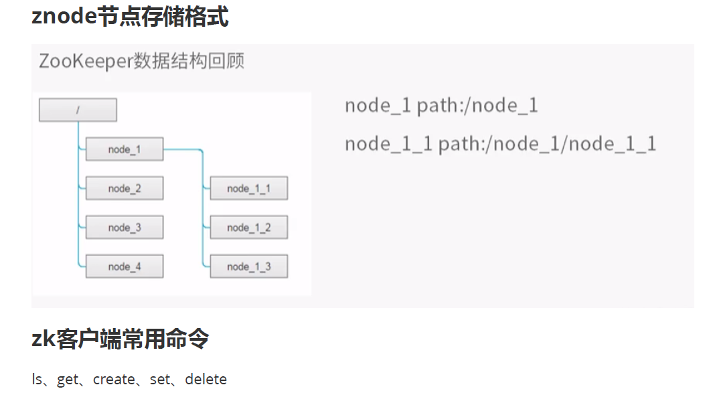

> #### **2.1 数据存储结构**
> - **树形结构**：ZooKeeper 的数据以树形结构存储，根节点为 `/`，每个节点称为 **ZNode**。  - **此 / 非 彼 /**
> - **节点路径**：每个节点都有唯一的路径，例如 `/node1/node1-1`。
> - **节点数据**：
>   - 每个 ZNode 节点可以存储数据，默认大小为 1MB。
>   - 数据存储**适合小型配置信息（如服务地址、状态等**），而**不是大规模数据**。---不要当做 数据库 用
> - **节点类型**：
>   - **永久性节点（Persistent Node）**：节点创建后即使客户端断开连接或服务挂掉，节点仍然存在。
>   - **临时性节点（Ephemeral Node）**：节点与客户端会话绑定，客户端断开或挂掉时，节点会自动删除。
>
> 
>
> ### **2.2 服务端和客户端都打开看看**
>
> `zkServer.sh`  和  `zkCli.sh`
>
> ### **2.3 客户端常用命令**
> - **查看节点**：
>   - `ls /`：列出指定路径下的子节点。   **只能看子节点**
>   - `get /node`：**查看节点的数据**。   **元信息 - 字段 多了解了解**
>   - `stat` /node: 查看 **元信息**
> - **创建节点**：
>   - `create /node data`：创建节点并存储数据。  **访问也是 路径必须 从根节点 开始**
>   - 注意：父节点必须存在，才能创建子节点。   **每个节点 都能创建新节点**
> - **修改节点**：
>   - `set /node new_data`：修改节点的数据。
> - **删除节点**：
>   - `delete /node`：删除节点。 
>   - 如果节点有子节点，必须先删除子节点。
>
> #### **2.3 ZNode 的应用**
> - **服务注册中心**：
>   - 每个服务在 ZooKeeper 中注册为一个节点，节点存储服务的 IP 和端口。
>   - 客户端通过查询节点获取服务地址，实现动态服务发现。
> - **分布式锁**：
>   - 利用临时顺序节点实现分布式锁，确保资源的互斥访问。
>

---

## `get或stat` 出来的字段解释

> 假设你使用命令：
>
> ```
> get /my-node
> 或者是 stat 可能改了
> ```
>
> 输出可能如下：
>
> ```
> hello world
> cZxid = 0x500000002
> ctime = Wed Apr 24 15:10:14 CST 2024
> mZxid = 0x500000002
> mtime = Wed Apr 24 15:10:14 CST 2024
> pZxid = 0x500000002
> cversion = 0
> dataVersion = 0
> aclVersion = 0
> ephemeralOwner = 0x0
> dataLength = 11
> numChildren = 0
> ```
>
> #### 字段含义说明：
>
> | 字段名           | 含义                                                         |
> | ---------------- | ------------------------------------------------------------ |
> | `cZxid`          | 节点创建时的事务 ID（Zxid 是 ZooKeeper 的事务编号，越大越新） |
> | `ctime`          | 节点创建时间（Unix 时间戳或日期格式）                        |
> | `mZxid`          | 节点最后修改数据的事务 ID                                    |
> | `mtime`          | 节点最后修改数据的时间                                       |
> | `pZxid`          | 最后一次对子节点列表修改（增加/删除子节点）的事务 ID         |
> | `cversion`       | 子节点列表变更次数（version of children）                    |
> | `dataVersion`    | 节点数据被修改的次数                                         |
> | `aclVersion`     | 节点访问控制列表（ACL）变更次数                              |
> | `ephemeralOwner` | 临时节点的拥有者 session ID，永久节点为 0                    |
> | `dataLength`     | 节点存储的数据字节数                                         |
> | `numChildren`    | 子节点数量                                                   |


## 分布式系统的问题

看扩展阅读那个网页---有图解

> ### **为什么需要服务配置中心？**
>
> - 在分布式环境中，服务的提供者和消费者需要解耦。
> - 服务提供者动态注册服务，消费者通过配置中心查询服务地址。
>
> ### **ZooKeeper 的实现**
>
> - **服务注册**：
>   - 服务节点启动后，将服务名称、IP 和端口注册到 ZooKeeper 的 ZNode 节点。
>   - 例如，`/user_service/login` 节点存储服务的 IP 和端口。
> - **服务发现**：
>   - 客户端通过查询 ZooKeeper 获取服务地址。
>   - 例如，查询 `/user_service/login` 节点，获取服务的 IP 和端口。
>
> ### **动态更新**
>
> - **心跳机制**：
>   - 服务节点定期向 ZooKeeper 发送心跳，**维持会话**。
>   - 如果服务节点挂掉，ZooKeeper 会自动删除对应的临时节点。
> - **临时性节点的作用**：
>   - 临时性节点确保服务节点挂掉时，ZooKeeper 自动清理无效的服务信息，避免客户端访问失效的服务。


## 心跳机制与会话管理

> #### **心跳机制**
>
> - **作用**：确保服务节点的在线状态。
> - **原理**：
>   - 服务节点定期向 ZooKeeper 发送心跳消息。
>   - 如果 ZooKeeper 在特定时间内未收到心跳，则认为服务节点已挂掉。
> - **实现**：
>   - **ZooKeeper 与每个服务节点维持一个会话（Session）**。
>   - **会话超时时**，ZooKeeper 自动删除服务节点的临时节点。
>
> #### **临时性节点与永久性节点**
>
> - **临时性节点**：
>   - 与会话绑定，**服务节点挂掉时，ZooKeeper 自动删除节点**。
>   - 适用于动态服务注册。
> - **永久性节点**：
>   - 节点创建后**即使服务节点挂掉，节点仍然存在**。
>   - 适用于存储固定配置信息。
>
> ### **本项目是 临时性节点**

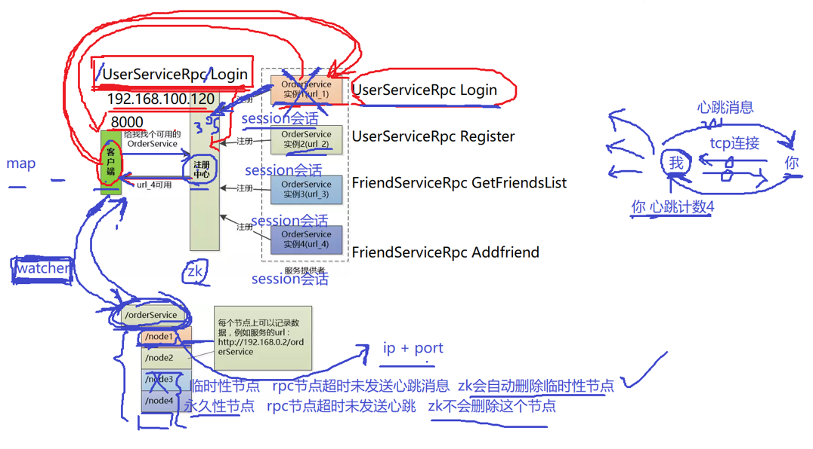

## 心跳-老师

> ### 一、什么是心跳消息？
>
> 心跳消息就是在客户端与服务器之间**定期发送的一种轻量级消息**，用来**确认连接是否还活着**。
>
> 它像一个“我还在”的小信号，哪怕双方没有业务数据要传输，也要定期互相打个招呼。
>
> ------
>
> ### 二、为什么需要心跳消息？
>
> 虽然我们使用的是 **TCP连接**，它是**可靠连接**，理论上断了连接一定会收到**四次挥手**的断开通知。
>
> 但是！在复杂的网络环境中，会出现一种非常尴尬的情况：
>
> > 实际上我俩已经无法通信，但我这边还是觉得“你在线”，因为我根本没收到断开通知。
>
> 这时候，TCP连接看似还在，但实际上已经“假死”了——不能发消息，也不能收消息。
>
> 于是我们引入**心跳机制**，来解决“假死连接无法及时检测”的问题。
>
> ------
>
> ### 三、心跳机制是怎么做的？
>
> 1. **客户端（或服务端）每隔一段时间发一个心跳包**，比如 1 秒发一次。
> 2. **接收方收到心跳，就更新一下最后通信时间，或者“心跳计数”清零**。
> 3. **如果连续几次都没收到对方的心跳，就认为连接断了**，强制关闭连接并清理资源。----**不管4次挥手, 强制**
>
> 你可以想象成下面这种逻辑：
>
> ```
> 服务端每秒检查一次：
> - 如果3秒内没收到客户端的心跳 => 客户端掉线，断开连接。
> ```
>
> 也可以用你说的“加加减减”的方式来理解：
>
> ```
> text复制编辑- 初始心跳计数为 0；
> - 每秒加 1；
> - 收到一个心跳就减 1；
> - 超过3（也就是3秒没收到心跳） => 判定掉线。
> ```
>
> ------
>
> ### 四、TCP 为什么不能自动帮我们判断？
>
> TCP 本身确实有一些“保活”机制（如 TCP KeepAlive），但：
>
> - 它启动较慢，默认可能是 2 小时才检测一次；
> - 各个平台配置不同；
> - 不够灵活、不可控、不适合高并发服务器。
>
> 因此我们通常**自己在应用层实现心跳机制**，更灵活、响应更快。
>
> ------
>
> ### 五、心跳机制应用场景举例
>
> - 聊天系统（检测用户是否掉线）
> - 游戏服务器（检测玩家是否在线）
> - RPC 服务注册中心（Zookeeper、Nacos）检测服务节点状态
>
> 比如 Zookeeper 跟每个 RPC 节点也要维持一个 session 会话，如果心跳超时没发上来，它就会从注册列表里移除这个服务节点。
>
> ------
>
> ### 六、易混淆小提醒
>
> - “心跳消息”是一种**主动发送的应用层消息**，和 TCP 四次挥手、握手是底层协议层面的行为，不一样。
> - 心跳是为了检测“看不见的断线”（如网络阻塞、NAT超时），是为了更快做“断线感知”。
>
> ------
>
> ### ✅ 一句话总结
>
> > **心跳消息是你定期对对方说“我还在”，如果你一直没说话，我就当你掉线了**

## 心跳机制详解-deepseek

> ## **1. 心跳机制概述**
>
> 心跳机制（Heartbeat Mechanism）是一种**周期性信号检测技术**，广泛应用于**分布式系统、网络通信、服务监控**等领域。其核心目的是**检测节点或服务的存活状态**，确保系统的高可用性和容错能力。
>
> ### **1.1 基本工作原理**
>
> - **发送方**（客户端/从节点）定期向**接收方**（服务端/主节点）发送**心跳包**（小型数据包或信号）。
> - **接收方**如果在**超时时间（Timeout）**内未收到心跳，则认为发送方**可能故障**，并触发相应的容错机制（如重连、切换主节点等）。
>
> ------
>
> ## **2. 心跳机制的主要作用**
>
> | **作用**     | **说明**                                 | **典型应用场景**                      |
> | :----------- | :--------------------------------------- | :------------------------------------ |
> | **连接保活** | 防止长时间空闲的连接被防火墙或路由器断开 | TCP长连接、WebSocket、MQTT            |
> | **故障检测** | 快速发现节点或服务不可用                 | 分布式系统（如ZooKeeper、Kubernetes） |
> | **健康检查** | 判断服务是否可处理请求                   | 负载均衡（如Nginx、HAProxy）          |
> | **主从切换** | 检测主节点是否存活，触发故障转移         | Redis Sentinel、MySQL主从复制         |
> | **资源回收** | 自动清理失效的连接或会话                 | 游戏服务器、即时通讯（IM）            |
>
> ------
>
> ## **3. 心跳机制的实现方式**
>
> ### **3.1 传输层心跳（TCP Keepalive）**
>
> - **操作系统级别**的保活机制，由TCP协议栈实现。
> - **参数**（可通过`sysctl`或`setsockopt`调整）：
>   - `tcp_keepalive_time`（默认7200秒）：多久无数据后开始发送心跳
>   - `tcp_keepalive_intvl`（默认75秒）：心跳间隔
>   - `tcp_keepalive_probes`（默认9次）：超时前重试次数
> - **优点**：无需应用层实现，系统自动维护。
> - **缺点**：默认时间较长，不适合快速故障检测。
>
> ### **3.2 应用层心跳（自定义协议）**
>
> - **由应用程序主动发送心跳包**（如`PING`/`PONG`）。
> - **典型协议**：
>   - **HTTP**：通过定期请求（如`GET /health`）维持连接。
>   - **WebSocket**：使用`Ping`帧和`Pong`帧进行保活。
>   - **MQTT**：通过`CONNECT`报文中的`Keep Alive`字段设定心跳间隔。
>   - **gRPC**：基于HTTP/2的`PING`帧实现心跳。
> - **优点**：灵活可控，适应不同业务需求。
> - **缺点**：需额外代码实现，可能增加网络开销。
>
> ### **3.3 混合型心跳（TCP + 应用层）**
>
> - 同时使用**TCP Keepalive**和**应用层心跳**，提高可靠性。
> - 例如：数据库连接池（如MySQL JDBC）通常同时支持两种机制。
>
> ------
>
> ## **4. 心跳参数优化**
>
> | **参数**                 | **说明**                 | **推荐值（示例）**            |
> | :----------------------- | :----------------------- | :---------------------------- |
> | **心跳间隔（Interval）** | 两次心跳之间的时间       | 30s（长连接）、5s（关键服务） |
> | **超时时间（Timeout）**  | 多久无心跳视为故障       | 3×Interval（如90s）           |
> | **重试次数（Retries）**  | 超时后重试几次再判定故障 | 3次                           |
> | **抖动（Jitter）**       | 随机延迟，避免同时发送   | ±10% Interval                 |
>
> **优化建议**：
>
> - **短间隔 + 低超时**：适用于高可用系统（如金融交易）。
> - **长间隔 + 高容错**：适用于弱网络环境（如IoT设备）。
> - **动态调整**：根据网络状况自动调节心跳频率（如Kubernetes的`livenessProbe`）。
>
> ------
>
> ## **5. 心跳机制的挑战与解决方案**
>
> ### **5.1 误判问题（False Positive）**
>
> - **原因**：网络延迟、丢包导致心跳未及时到达。
> - **解决方案**：
>   - 增加**重试机制**（如3次丢失才判定故障）。
>   - 使用**滑动窗口**统计最近心跳成功率。
>   - 结合**其他健康检查**（如CPU/内存监控）。
>
> ### **5.2 脑裂问题（Split-Brain）**
>
> - **原因**：网络分区导致多个节点误认为对方宕机。
> - **解决方案**：
>   - **Quorum机制**（如ZooKeeper的`ZAB`协议）。
>   - **Fencing（隔离）**：强制关闭旧主节点（如Redis Sentinel）。
>
> ### **5.3 性能开销**
>
> - **原因**：高频心跳占用带宽和CPU。
> - **解决方案**：
>   - **自适应心跳**：空闲时降低频率，高负载时增加频率。
>   - **批量心跳**：多个节点合并发送（如Gossip协议）。
>
> ------
>
> ## **6. 典型应用案例**
>
> | **系统/协议**      | **心跳实现方式**              | **用途**       |
> | :----------------- | :---------------------------- | :------------- |
> | **ZooKeeper**      | 定期`PING` + `SessionTimeout` | 节点存活检测   |
> | **Kubernetes**     | `kubelet`定期上报`NodeStatus` | 节点健康检查   |
> | **Redis Sentinel** | 每秒`PING` + 投票机制         | 主节点故障转移 |
> | **MQTT**           | `Keep Alive`字段（秒级）      | IoT设备保活    |
> | **gRPC**           | HTTP/2 `PING`帧               | 长连接保活     |
>
> ------
>
> ## **7. 总结**
>
> ### **7.1 心跳机制的核心价值**
>
> ✅ **快速故障检测**：比TCP超时（默认数分钟）更快发现故障。
> ✅ **连接保活**：防止NAT/防火墙断开空闲连接。
> ✅ **高可用保障**：支撑主从切换、负载均衡等关键功能。
>
> ### **7.2 最佳实践**
>
> ✔ **合理设置心跳参数**（间隔、超时、重试）。
> ✔ **结合其他健康检查**（如端口探测、业务逻辑检查）。
> ✔ **处理误判和脑裂**（Quorum、Fencing等机制）。
> ✔ **监控心跳状态**（如Prometheus统计心跳丢失率）。
>
> 心跳机制是**分布式系统稳定性的基石**，合理设计能大幅提升系统的容错能力！ 🚀


## 应用层会话和系统层会话对比---不要混淆

> ## 一图汇总：几个关键概念对比
>
> | 名称       | 所属层级    | 关键词                     | 说明                                                         |
> | ---------- | ----------- | -------------------------- | ------------------------------------------------------------ |
> | `setsid()` | 操作系统层  | 进程控制、守护进程、终端   | 创建新的 **系统会话（Session）**，脱离控制终端，用于实现守护进程。 |
> | 系统会话   | 操作系统层  | 控制终端、会话组           | 一组共享控制终端的进程集合，用于管理 shell 登录会话或守护进程。 |
> | 应用层会话 | 应用/网络层 | 用户连接、登录状态、超时等 | 用户与服务之间的一段逻辑连接，用于标识“某个用户还在”，维持通信状态。 |
> | 心跳机制   | 应用/网络层 | 保活、检测掉线             | **用于维护应用层会话状态**的一种机制，确保客户端/服务端彼此“活着”。 |
>
> 
>
> ------
>
> ## 重点回答问题
>
> ### 🔸 心跳机制 是 **应用层会话**的一部分吗？
>
> **是的！**
>
> > 心跳机制本质上是“维持一个应用层会话”的方式之一。
> >  它让服务器知道“这个客户端还活着，还在线，还在通信”。
>
> 如果没有心跳，网络断开时服务器可能无法及时发现“客户端其实已经掉线了”。
>
> ------
>
> ## 举个例子就不乱了：
>
> | 层级       | 举例                                                         |
> | ---------- | ------------------------------------------------------------ |
> | 系统会话   | `ssh` 登录 Linux 后的 shell 及其子进程组成一个系统会话；守护进程用 `setsid()` 创建新会话 |
> | 应用层会话 | 聊天客户端连上服务器后，直到你退出，这段通信就是一个应用层会话 |
> | 心跳机制   | 聊天客户端每隔10秒发个“心跳包”给服务器，告诉服务器“我还活着” |
>
> 
>
> ------
>
> ## 简要总结一句话
>
> - `setsid()` 是操作系统级别用于创建“系统会话”的系统调用；
> - 聊天程序、Web 登录使用的“会话”是**应用层会话**，和用户状态相关；
> - **心跳机制就是为了维持应用层会话的有效性**，用来检测是否掉线或超时。


## 项目中的应用
> #### **服务注册与发现**
> - **服务注册**：
>   - 服务节点启动时，将服务名称、IP 和端口注册到 ZooKeeper 的临时节点。
>   - 例如，`/user_service/login` 节点存储服务的 IP 和端口。
> - **服务发现**：
>   - 客户端通过查询 ZooKeeper 获取服务地址。
>   - 例如，查询 `/user_service/login` 节点，获取服务的 IP 和端口。
>
> #### **动态更新**
> - **服务上下线**：
>   - 服务节点挂掉时，ZooKeeper 自动删除对应的临时节点。
>   - 客户端通过 Watcher 机制感知节点变化，更新服务列表。
>

---

## 总结
> 1. **ZooKeeper 的核心机制**：
>    - ZNode 数据节点：树形结构存储数据。
>    - Watcher 机制：监听节点变化，实现动态更新。
> 2. **服务配置中心的实现**：
>    - 服务注册：服务节点将自身信息注册到 ZooKeeper。
>    - 服务发现：客户端通过查询 ZooKeeper 获取服务地址。
> 3. **动态更新与心跳机制**：
>    - 服务节点通过心跳维持会话，挂掉时 ZooKeeper 自动清理临时节点。
> 4. **ZooKeeper 的启动与操作**：
>    - 配置文件：`zoo.cfg`。
>    - 常用命令：`ls`、`get`、`create`、`set`、`delete`, stat。
>


# zk的watch机制和原生API安装

## Watcher 机制-一次性
> #### **什么是 Watcher？**
> - Watcher 是 ZooKeeper 提供的一种**事件监听机制**。
> - 客户端可以对某个节点设置 Watcher，当**节点发生变化（如数据修改、节点删除等）时**，ZooKeeper 会通知客户端。
>
> #### **Watcher 的特点**
> - **一次性**：Watcher 是**一次性的，触发后需要重新设置**。
> - **异步通知**：ZooKeeper 通过**异步回调通知**客户端。
>
> #### **Watcher 的应用**
> - **服务动态更新**：
>   - 当服务节点上下线时，Watcher 通知客户端更新服务列表。
> - **分布式协调**：
>   - 通过监听节点变化，实现分布式系统中任务的动态分配。
>
> #### **Watcher 的工作原理**
> - 客户端通过 ZooKeeper 提供的 API 注册 Watcher。
> - 当节点发生变化时，ZooKeeper 会触发 Watcher，通知客户端。
> - 客户端可以在**通知后重新注册 Watcher，以继续监听**。
>


## ZooKeeper 的原生 API--c++

> [!warning]
>
> **3.5+ 版本  不在src  而是  zookeeper-client里面**

> ### **API 编译与安装**
> - ZooKeeper 提供了 C 和 Java 的原生客户端 API。
> - **编译步骤**：
>   1. 进入 ZooKeeper 解压目录的 `apache-zookeeper-3.8.4/zookeeper-client/zookeeper-client-c` 目录。
>   2. 执行以下命令：
>      ```bash
>           
>      //进入client-c
>      autoreconf -if    -- 有错误, 看下面解决
>      ./configure
>      make
>      make install
>      ```
>   3.  编译完成后，头文件和库文件会安装到系统目录：
>      - 头文件：`/usr/local/include/zookeeper`
>      - 库文件：`/usr/local/lib/libzookeeper_mt.so`（多线程版本）
>


## **编译问题--特别恶心!!!!!!!!!!!!!!**

```c++
acinclude.m4:315: warning: macro 'AM_PATH_CPPUNIT' not found in library
configure.ac:38: error: Missing AM_PATH_CPPUNIT or PKG_CHECK_MODULES m4 macro.
acinclude.m4:317: CHECK_CPPUNIT is expanded from...
configure.ac:38: the top level
autom4te: error: /usr/bin/m4 failed with exit status: 1
aclocal: error: /usr/bin/autom4te failed with exit status: 1
autoreconf: error: aclocal failed with exit status: 1
```

不要进行 cppunit测试,  这玩意 巨恶心!!!!!!!!!!  就是傻逼   

```c++
vim  ./configure
```

38行左右

```c++
if test "$with_cppunit" = "no" ; then
   CPPUNIT_PATH="No_CPPUNIT"
   CPPUNIT_INCLUDE=
   CPPUNIT_LIBS=
else
   :  # 不使用 cppunit，但保留 else 分支结构，避免语法错误
fi
```

或者 

```c++
./configure --without-cppunit
```


## 原生 API 的缺点

1. **不会自动发送心跳消息**：  -----  这个不对, 有心跳机制 `**源码上会在1/3的Timeout时间发送ping心跳消息**`
   - 客户端**需要手动实现**心跳机制，定期向 ZooKeeper 发送心跳，维持会话。
   - 如果心跳超时，ZooKeeper 会认为客户端掉线，并删除临时节点。
2. **Watcher 是一次性的**：
   - Watcher 触发后会失效，客户端需要**手动重新注册** Watcher。
   - 这增加了开发的复杂性。
3. **数据存储仅支持字节数组**：
   - ZNode 节点只能存储字节数组，**无法直接存储对象**。
   - 开发者**需要手动实现对象的序列化和反序列化**（如使用 JSON 或 Protobuf）。


# 封装zookeeper的客户端类

会用就行, 记住那几个接口

看个 蛋的 源码, 又不开发

> [!warning]
>
> **zookeeper.h  里面, 包含各种 api 接口,  可以参考!!**

## 修改配置文件端口

5000---> 2181   zk的端口

## 修改cmake

加  zookeeper_mt   用了 人家的 这个库   多线程版本

## 使用到的api

| API 函数名        | 功能描述                                                     |
| ----------------- | ------------------------------------------------------------ |
| `zookeeper_init`  | 初始化客户端连接，返回 `zhandle_t *` 句柄。连接是**异步**的。 |
| `zoo_set_context` | 给 `zhandle_t` 设置上下文信息（例如传递信号量等参数到回调函数）。 |
| `zoo_get_context` | 从 `zhandle_t` 获取上下文信息（用于回调中获取信号量等）。    |
| `zoo_create`      | 在 Zookeeper 上创建节点，可以是**永久节点**或**临时节点**，可携带数据。 |
| `zoo_get`         | 根据路径获取某个节点的数据。                                 |
| `zookeeper_close` | 关闭连接，释放句柄资源。                                     |

## 项目中为什么用 ZooKeeper？

- 本项目中 ZooKeeper 是 **服务配置中心**，核心用途是 **服务注册与发现**。

- 服务端在启动时把它能提供的服务注册到 ZK 上，便于客户端查找。

  ```
  /service_name             ← 永久性节点
      /method_name_1        ← 临时性节点，内容是 ip:port
      /method_name_2        ← 临时性节点，内容是 ip:port
  ```

- 临时节点的好处是：**服务端下线，节点自动消失**，保证注册信息的实时性。


## ZooKeeper 客户端封装结构

封装在本项目 `zookeeperunit.h / .cc` 中的类（大致结构）：

- `ZkClient` 类

  - `start()`：连接 ZK Server
  - `create(path, data, state)`：创建节点（默认永久性，可设置为临时节点）
  - `getData(path)`：获取某个节点的数据
  - `zhandle_t* m_zhandle`：ZK 句柄
  - 使用**信号量等待异步连接**结果

- ```c++
  #pragma once
  
  #include <semaphore.h>
  #include <zookeeper/zookeeper.h>
  #include <string>
  
  // 封装的zk客户端类
  class ZkClient
  {
  public:
      ZkClient();
      ~ZkClient();
      // zkclient启动连接zkserver
      void Start();
      // 在zkserver上根据指定的path创建znode节点
      // path: znode节点路径 
      // data: znode节点的值
      // datalen: znode节点的值的长度
      // state: znode节点的状态  0表示临时节点 1表示持久节点
      void Create(const char *path, const char *data, int datalen, int state=0);
      // 根据参数指定的znode节点路径，或者znode节点的值
      std::string GetData(const char *path);
  private:
      // zk的客户端句柄
      zhandle_t *m_zhandle;
  };
  ```

  

------

## 连接 ZooKeeper 的过程（重点理解）

- 使用官方 C API 中的 `zookeeper_init()` 来连接：

  ```
  zhandle_t* zookeeper_init(
    const char *host,       // 例如 127.0.0.1:2181
    watcher_fn fn,          // 回调函数
    int recv_timeout,       // 会话超时时间
    ...
  );
  ```

- 返回值是 `zhandle_t*`，连接是**异步的**！

------

## ZooKeeper C API 的线程模型（**面试重点**）

ZooKeeper 客户端 C 库（zoo_mt）内部使用了 **三个线程**：

| 线程                    | 作用                                                         |
| ----------------------- | ------------------------------------------------------------ |
| **API 调用线程**        | 调用 `zookeeper_init()` 等函数的线程                         |
| **网络 IO 线程**        | 负责和 ZK Server 的 socket 通信（单独创建）pthread_create  poll |
| **回调线程（Watcher）** | ZK Server 通知客户端时触发对应回调处理                       |


> ZK 使用 `poll()` 而非 select/epoll，因为客户端**并不需要处理高并发**。


> zookeeper_init 函数 调用完, zkserver 并没有响应
>
> 仅是 本地资源, 内存初始化成功了
>
> watcher 回调 执行成功, 才会是 连接成功

------

## 信号量的作用

> ### 目的：
>
> 让客户端**“同步地等待”**Zookeeper 客户端真正与 Zookeeper 服务器建立连接成功。
>
> ### 背景：
>
> Zookeeper 的 `zookeeper_init()` 接口**建立连接是异步的**，即**函数调用成功 ≠ 实际连接成功**。
>  但我们希望等连接真的成功后再继续后续逻辑，所以要**人为加同步机制**。
>
> ### 实现逻辑：
>
> 1. **主线程初始化信号量：**
>
>    ```
>    sem_init(&m_sem, 0, 0); // 初始资源为 0，会阻塞 sem_wait()
>    ```
>
> 2. **主线程调用 zookeeper_init() 发起连接，并设置回调和上下文（context）：**
>
>    ```
>    m_zhandle = zookeeper_init(..., global_watcher, timeout, 0, &m_sem, 0);
>    ```
>
>    | 对比项         | 写法一（直接传）               | 写法二（先 init 后 set）           |
>    | -------------- | ------------------------------ | ---------------------------------- |
>    | 上下文设置方式 | `zookeeper_init(..., &sem, 0)` | `zoo_set_context(m_zhandle, &sem)` |
>    | 安全性与清晰度 | ✅ 更安全、清晰                 | ⚠️ 稍逊，可能引入 race 条件         |
>    | 回调中获取方式 | 相同：`zoo_get_context(zh)`    | 相同：`zoo_get_context(zh)`        |
>
> 3. **主线程阻塞等待连接成功：**
>
>    ```
>    sem_wait(&m_sem); // 阻塞等待 watcher 回调中 sem_post()
>    ```
>
> 4. **在 watcher 回调中连接成功时调用 sem_post() 唤醒主线程：**
>
>    ```
>    if (state == ZOO_CONNECTED_STATE) {
>        sem_t* sem = static_cast<sem_t*>(zoo_get_context(zh));
>        sem_post(sem); // 通知主线程连接成功
>    }
>    ```
>

## 使用同步函数--bug错误问题

> [!warning]
>
> **这是新版本问题, 3.4版本 就没有这个宏**

默认是 异步的

但是我们需要 同步的, 源码  使用 `#ifdef THREADED`  开启多线程版本

手动 添加一个 `#define THREADED`  可以使用 同步函数

**或者**

cmake 添加   `add_definitions(-DTHREADED)`-----为了防止 红色波浪线, 选择intelisence 为 camke tool

> [!tip]
>
> `add_definitions(...)` 是 CMake 中用来向编译器传递**预处理器宏定义**或**编译选项**的命令。
>
> ### 主要功能
>
> - **添加宏定义**：通过 `-D` 标志向编译器传递宏定义。
> - **设置编译选项**：可以传递一些编译器的选项，像优化、警告等。
>
> ### 语法：
>
> ```
> add_definitions([<options>...])
> ```
>
> ### 常见的用途：
>
> 1. **添加宏定义**：
>
>    - `-D` 后面跟一个宏定义，传递给预处理器。
>
>    ```
>    cmake复制编辑add_definitions(-DDEBUG)        # 相当于 #define DEBUG
>    add_definitions(-DPORT=8080)    # 相当于 #define PORT 8080
>    ```
>
> 2. **设置编译选项**：
>
>    - 传递给编译器的其他选项，如优化、警告控制等。
>
>    ```
>    add_definitions(-Wall -O2 -pthread)  # 开启所有警告，设置优化等级，使用线程库
>    ```
>
> ### 适用范围：
>
> - **全局作用**：`add_definitions()` 会对所有 CMake 项目中的目标（target）有效，意味着会影响所有目标的编译。
>
> ### 示例：
>
> ```
> # 添加宏定义
> add_definitions(-DDEBUG)  
> # 设置编译器选项
> add_definitions(-Wall -O2)   
> ```
>
> ### 注意：
>
> - **目标特定设置**：`add_definitions()` 会影响整个 CMake 项目中的所有目标。对于特定目标的编译选项，可以使用 `target_compile_definitions()` 或 `target_compile_options()` 来进行更精细的控制。
>
> ------
>
> ### 适用场景：
>
> - 添加编译时宏（例如调试宏、版本号等）。
> - 设置编译器的通用选项（如警告、优化等）。

## 使用信号量等待异步连接完成（技巧）

- 因为连接是**异步的，所以必须用信号量等待连**接成功。
- 步骤如下：
  1. `sem_init(&m_sem, 0, 0);` // 初始化信号量为 0
  2. `zoo_set_context()` 把信号量附加到句柄
  3. 回调函数中检测连接成功 `ZOO_CONNECTED_STATE` 后 `sem_post()` 放行
  4. 主线程在 `sem_wait()` 阻塞直到连接成功

## 永久性节点和临时性节点值

```c++
extern ZOOAPI const int ZOO_PERSISTENT;
extern ZOOAPI const int ZOO_EPHEMERAL;
```

```c++
const int ZOO_PERSISTENT = 0;
const int ZOO_EPHEMERAL = 1;
```


## 客户端代码实现

src/zookeeperunit.cc

```c++
#include "zookeeperunit.h"
#include "mprpcapplication.h"
#include <semaphore.h>
#include <iostream>

// 全局的watcher观察器   zkserver给zkclient的通知
void global_watcher(zhandle_t *zh, int type,
                   int state, const char *path, void *watcherCtx)
{
    if (type == ZOO_SESSION_EVENT)  // 回调的消息类型是和会话相关的消息类型
	{
		if (state == ZOO_CONNECTED_STATE)  // zkclient和zkserver连接成功
		{
			sem_t *sem = (sem_t*)zoo_get_context(zh);
            sem_post(sem);
		}
	}
}

ZkClient::ZkClient() : m_zhandle(nullptr)
{
}

ZkClient::~ZkClient()
{
    if (m_zhandle != nullptr)
    {
        zookeeper_close(m_zhandle); // 关闭句柄，释放资源  类似于MySQL_Conn
    }
}

// 连接zkserver
void ZkClient::Start()
{
    std::string host = MprpcApplication::GetInstance().GetConfig().Load("zookeeperip");
    std::string port = MprpcApplication::GetInstance().GetConfig().Load("zookeeperport");
    std::string connstr = host + ":" + port;
    
	/*
	zookeeper_mt：多线程版本
	zookeeper的API客户端程序提供了三个线程
	API调用线程 
	网络I/O线程  pthread_create  poll
	watcher回调线程 pthread_create
	*/
    m_zhandle = zookeeper_init(connstr.c_str(), global_watcher, 30000, nullptr, nullptr, 0);
	/*
	zookeeper_init 参数解释
	1. zkserver的ip和端口号
	2. watcher函数的回调函数
	3. zkclient的会话超时时间
	4. zkclient的clientid
	5. zkclient的上下文
	6. zkclient的连接标志
	*/
	// std::cout << "zookeeper_init... connstr:" << connstr << std::endl;
    if (nullptr == m_zhandle) 
    {
        std::cout << "zookeeper_init error!" << std::endl;
        exit(EXIT_FAILURE);
    }

    sem_t sem;
    sem_init(&sem, 0, 0);  // 初始化信号量
    zoo_set_context(m_zhandle, &sem);

    sem_wait(&sem);  // 等待信号量 阻塞
    std::cout << "zookeeper_init success!" << std::endl;
}

void ZkClient::Create(const char *path, const char *data, int datalen, int state)
{
    char path_buffer[128];
    int bufferlen = sizeof(path_buffer);
    int flag;
	// 先判断path表示的znode节点是否存在，如果存在，就不再重复创建了
	flag = zoo_exists(m_zhandle, path, 0, nullptr);
	
	if (ZNONODE == flag) // 表示path的znode节点不存在
	{
		// 创建指定path的znode节点了
		flag = zoo_create(m_zhandle, path, data, datalen,
			&ZOO_OPEN_ACL_UNSAFE, state, path_buffer, bufferlen);
		if (flag == ZOK)
		{
			std::cout << "znode create success... path:" << path << std::endl;
		}
		else
		{
			std::cout << "flag:" << flag << std::endl;
			std::cout << "znode create error... path:" << path << std::endl;
			exit(EXIT_FAILURE);
		}
	}
}

// 根据指定的path，获取znode节点的值
std::string ZkClient::GetData(const char *path)
{
    char buffer[64];
	int bufferlen = sizeof(buffer);  
	int flag = zoo_get(m_zhandle, path, 0, buffer, &bufferlen, nullptr);
	if (flag != ZOK)
	{
		std::cout << "get znode error... path:" << path << std::endl;
		return "";
	}
	else
	{
		return buffer;
	}
}
```


## **CMake 中的构建注意事项**

- 新增源文件 `zookeeper_util.cc` 后，别忘了加入 `CMakeLists.txt`
- 链接 ZK 官方提供的 so 库，通常是：
  - `zookeeper_mt`：多线程版本（推荐）
  - `zookeeper_st`：单线程版本

------

## 小结：你需要掌握的重点

- ZooKeeper 在服务注册/发现中的作用及节点设计
- 封装 ZK 客户端 API 的方法（尤其连接过程）
- 理解异步连接 + 信号量机制
- 熟悉 ZK 客户端的三线程模型
- 能快速排查连接问题（例如参数错误、IP:Port 格式错误、端口配置问题）


# zk在项目的实践

## 上节课内容回顾

- 上节课讲的是自封装的 `ZkClient` 类，具备三个核心功能：
  1. **连接 Zookeeper**
  2. **创建 ZNode 节点**
  3. **获取 ZNode 节点的值**

## Zookeeper 在 RPC 中的应用

Zookeeper 主要用于 **服务注册与发现**，应用在两个方面：

> ### 1. RPC 服务提供方（Provider）
>
> #### 注册服务流程（在 `RpcProvider::Run()` 里）：
>
> 1. **初始化框架**：
>
>    - 创建 `RpcProvider` 对象。
>    - 调用 `NotifyService()` 注册服务和方法（写入 `m_serviceMap` 表中）。
>
> 2. **连接 Zookeeper**：
>
>    ```
>    ZkClient zkCli;
>    zkCli.Start();  // 连接 zk server
>    ```
>
> 3. **注册服务到 Zookeeper**：
>
>    - 遍历 `m_serviceMap`：
>      - 先创建服务的永久节点（例如 `/UserServiceRpc`）。
>      - 再为每个方法创建子节点（例如 `/UserServiceRpc/Login`），**类型为临时节点**，内容为服务提供者的 IP:Port。
>
> 4. **为什么是临时节点？**
>
>    - 如果服务进程挂掉或断开与 Zookeeper 的连接，临时节点会自动删除。
>    - 避免客户端发现一个其实已经不在线的服务。
>
> #### 补充知识点：
>
> - Zookeeper Client 会定期发送心跳（Ping），**默认 session timeout 为 30s**，心跳间隔为其三分之一（即 10s）。
> - 心跳由 Zookeeper 的 IO 线程自动发送，确保连接存活。
> - 可用 `tcpdump` 工具抓包验证心跳发送行为。
>
> ### tcpdump工具
>
> ```c++
> apt install tcpdump
> ```
>
> 
>
> - `tcpdump` 是 Linux/Unix 上常用的 **命令行网络抓包工具**，用于监控、分析网络流量。
>
> - 它基于 libpcap 库，可抓取通过指定网卡传输的数据包。
>
> - `-i` 是 `tcpdump` 中的一个常用选项，用于**指定要监听的网络接口（网卡）**。
>
> - 抓取所有流量：
>    `tcpdump -i eth0`
>
>   抓取指定端口（如 HTTP）：
>    `tcpdump -i eth0 port 80`
>
>   抓取特定 IP 的流量：
>    `tcpdump host 192.168.1.1`
>
>   抓取 TCP 包：
>    `tcpdump tcp`
>
>   保存到文件：
>    `tcpdump -i eth0 -w file.pcap`
>
> - 查看当前主机所有网卡名称：
>
> ```
> tcpdump -D
> 
> eth0：有线网络接口（Ethernet）
> 
> wlan0：无线网络接口（Wi-Fi）
> 
> lo：本地回环接口（loopback）
> 
> docker0：Docker 创建的虚拟接口
> ```
>
> ------
>
> ### 2. RPC 服务调用方（Consumer）
>
> #### 查询服务地址（在 `mprpcchannel.cc::CallMethod()` 中）：
>
> 1. **通过 service name + method name 构造 zk 路径**：
>
>    ```
>    /UserServiceRpc/Login
>    ```
>
> 2. **从 Zookeeper 获取服务提供者信息**（IP:Port）：
>
>    ```
>    ZkClient zkCli;
>    zkCli.Start();
>    string host_data = zkCli.GetData(path);  // 返回如 "127.0.0.1:8000"
>    ```
>
> 3. **解析 IP 与端口并连接提供方进行远程调用**

## 错误-1

> [!warning]
>
> 在 C++ 中，函数的默认参数**只能在函数声明中指定，而不能在函数定义中重复指定默认参数**。如果你在 `.cc` 文件中定义函数时再次指定默认参数，会导致编译错误。


## 代码看提交历史

github

## 总结一下

| 角色             | 关键操作                                                   |
| ---------------- | ---------------------------------------------------------- |
| RPC 提供方       | 注册服务名与方法到 Zookeeper，方法节点为**临时节点**       |
| RPC 调用方       | 从 Zookeeper 查询方法对应的服务 IP 和端口，完成远程调用    |
| Zookeeper 客户端 | 自动发送 Ping 保持 session，服务断开连接时自动清除临时节点 |


# 项目大总结

## 貌似没有解决zk-watcher一次性问题

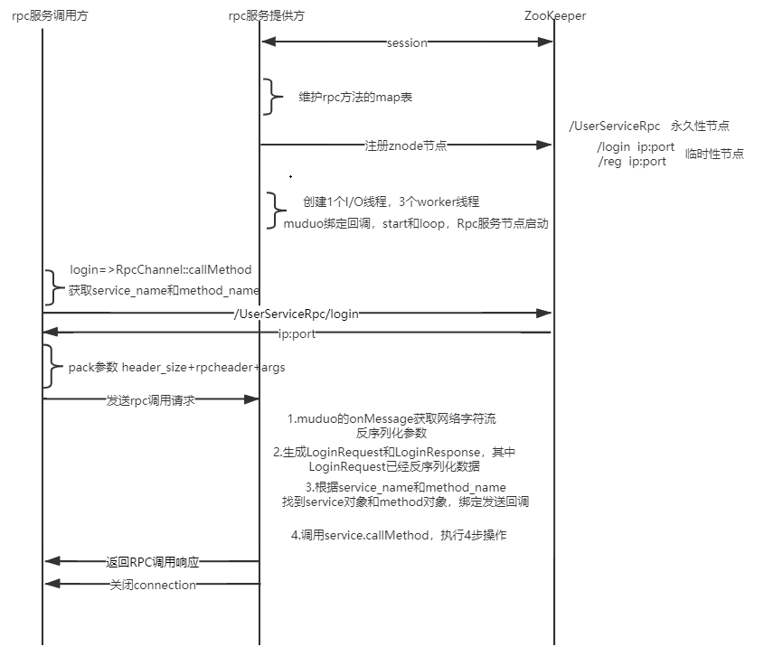

## 整体现象图 + 原理分析

- **图示重点：** 简化视图直观展示 RPC 调用全流程：包括客户端发起调用、框架层网络通信处理、服务端处理逻辑。
- **框架核心职责：**
  - 网络收发（socket 连接、事件循环）
  - 参数序列化/反序列化（支持 protobuf）
  - 服务注册与发现（基于 Zookeeper）
- **设计目的：** 保持图示简单直观，便于面试时脱稿讲解 + 手动画出核心架构。

------

## 三个核心模块构成

1. **RPC 服务调用方（Client）**
2. **RPC 服务提供方（Server）**
3. **Zookeeper 配置中心**

------

## 服务启动过程（服务端角度）

1. 启动时创建与 Zookeeper 的会话。
2. 发布服务：
   - 调用 `NotifyService()` 注册 service 与其 rpc method 到 map 表中。
   - 向 ZK 注册 `/service_name/method_name` 路径，写入当前服务节点的 IP:PORT。
3. 启动网络服务（封装 muduo）：
   - 设置 `onConnection` 和 `onMessage` 回调。
   - 调用 `start()` 与 `loop()`，开始事件循环。

------

## RPC 调用过程（客户端角度）

1. 用户通过代理类 stub 调用 rpc 方法（如 `Login()`）。

2. 框架核心逻辑进入 `mprpcChannel::CallMethod()`：

   - 参数打包序列化（protobuf）。

   - 根据 `service_name + method_name` 向 ZK 查询目标地址。

   - 构造 Header（含长度信息，防止 TCP 粘包）：

     ```
     Header size + Header 内容(service/method/args size) + args 数据
     ```

   - 建立 socket，发送 RPC 请求数据。

------

## 服务端处理请求流程

1. `onMessage()` 被触发，处理 socket 字节流。
2. 字节流反序列化为 `Request` 对象。
3. 查找对应的 `Service` 对象与 `MethodDescriptor`。
4. 设置发送回调（done->Run）。
5. 调用具体业务方法（如 Login/Register）。
6. 回调中序列化 `Response`，写入 socket 返回给客户端。
7. **服务端主动关闭连接**（一次性通信模型）。

------

## 自动构建脚本说明

- 提供一键编译脚本 `auto_build.sh`：

  ```
  chmod 777 autobuild.sh
  ./autobuild.sh
  ```

- 编译逻辑：

  - 清空 build/
  - 运行 CMake 配置 + Make 编译
  - 拷贝头文件和生成的静态库（`mprpc.a`）到 lib 和 include 目录

- **目的：** 便于其他用户快速集成框架使用

------

## 建议后的练习与巩固

- 新建项目，依赖**静态库和头文件**---lib目录下，写一个**完整的例子验证框架使用**。--- 可以尝试 **把集群 做成这样的 分布式**(不同端口, 不同服务, 不同rpc节点)
- 熟练掌握：
  - RPC 请求过程代码
  - ZK 服务注册/发现流程
  - 参数序列化处理与 TCP 通信规范

## **最终目标：** 

能脱稿画出架构图，清晰描述“这个框架是怎么支持 RPC 调用的”。
